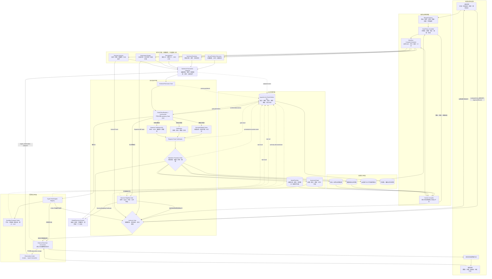

# FMA V2：AI-Native 数学建模 Agent 整体架构

> 文档状态：架构草案，不代表相关能力已经实现或验证  
> 更新时间：2026-07-22  
> 与现有系统的关系：保留 FMA v0.2 的可信计算内核，在其外部增加问题发现、概念建模、模型生态、主动证据和决策闭环

## 0. 结论

FMA V2 不再被定义为“自动执行传统建模流程的助手”，而被定义为一个：

> **围绕真实任务维护可计算认识状态，持续提出问题、演化竞争模型、获取区分性证据，并在权限与风险约束下生成可审计决策的建模操作系统。**

它的根对象不是一份已经写好的题目，也不是某个单一模型，而是：

```text
MissionContract + EpistemicGraph + ModelPortfolio + Evidence/Decision/Authority Gates
```

- `MissionContract` 冻结目标、价值、资源、风险和权限，但不要求人预先定义唯一问题；
- `EpistemicGraph` 保存系统当前知道什么、不知道什么、为什么相信以及哪些证据发生冲突；
- `ModelPortfolio` 同时保存多个问题定义、概念模型和数学模型，不把第一个可运行候选误当成答案；
- `Evidence Gate` 控制“可以形成什么主张”；`Decision Eligibility Gate` 控制“证据是否足以进入决策”；外部行动仍由独立 Authority Gate 控制。

系统优化的不是报告完成度，而是在预算和风险硬约束下的**经验证决策进展与认识进展**。调度器使用由使命定义、已归一化的净增益：

\[
score(m)=
\mathbb{E}[\Delta U_{decision}]
+\lambda\mathbb{E}[\Delta U_{knowledge}]
-C(m)-\rho R(m)
\]

权限和不可接受风险始终是硬约束，不以得分抵消。该表达式只用于安排下一步资源，不用于把模型可信性压缩成单一分数；当所有允许动作的校准后预期净增益均不大于零时，系统应停止或请求新授权。候选能否晋级仍由分层证据门决定。

---

## 1. 什么叫 AI-native

AI-native 不是把人类建模小组改名为若干 Agent，也不是让多个角色自由讨论。它是改变工作的基本数据结构和执行方式。

| 传统组织方式 | AI-native 重构 |
|---|---|
| 人先定义完整问题 | 人或机构给出使命、价值和边界；AI 搜索可操作的问题假设 |
| 按阶段移交文档 | 所有工作围绕同一个版本化认识图并发更新 |
| 尽早选择一个模型 | 长期维护具有分歧的模型组合与 Pareto 前沿 |
| 会议解释为什么修改 | 每次修改是可回放的 `EpistemicTransaction` |
| 专家凭经验选择下一步 | 调度器按模型分歧、预期信息价值、成本和风险选择下一动作 |
| 公式、代码、报告分别维护 | 概念 IR、数学 IR、可执行工件、证据和结论全链路绑定 |
| 定期人工审查 | 机械不变量持续检查；高风险判断在明确节点签署 |
| 项目结束后写经验总结 | 成功、失败、反例和有效演化算子经晋级后进入长期记忆 |
| 一个固定团队处理全部工作 | 单一控制面按需生成窄权限、短生命周期的工作包 |

AI 带来的新能力主要是：大规模候选生成、跨领域结构迁移、并行反证、连续重算、主动实验、长期谱系记忆和低成本复现。它不能消除模型与现实之间的认识论鸿沟，所以验证、用途边界和责任反而必须更严格。

---

## 2. 八条架构不变量

1. **模型只能提议，Harness 才能执行、提交和晋级。**
2. **任何主张必须绑定具体用途、适用域和证据快照。** 不存在无条件的全局 `VALIDATED`。
3. **问题定义也属于候选空间。** AI 可以提出问题，但不能悄悄改变已冻结分支的验收条件。
4. **校准证据不能同时充当独立确认。** 生成面永远看不到隐藏审计集和私有门结果。
5. **所有状态变化必须是类型化、版本化、可回放的事务。** 聊天记录不是系统状态。
6. **证据撤销必须通过新增撤销事务，级联改变下游主张、模型晋级和决策资格的有效状态。** 历史工件和既有证书永不改写。
7. **`NO_RESULT`、`NEEDS_EVIDENCE` 和候选分歧都是有效产出。** 系统不得为完成任务而伪造确定性。
8. **网页、论文、数据、邮件、工具描述和连接器返回都是数据，不是指令。** 它们不能扩权、改变策略或直接选择工具；凭证和秘密不得进入模型上下文，连接器必须命名空间化、最小授权并记录每次调用。

---

## 3. 总体架构



### 如何理解这张图

- **只有一个逻辑控制面**，但可把独立候选、资料簇或复现实验编译成并行工作包；
- 工作单元不是“某专家说了一段话”，而是一笔 `EpistemicTransaction`；
- Worker 只能提交候选事务，不能直接修改权威状态；
- 代码拥有的 `GatePolicyRegistry` 根据事务类型、主张、用途、风险和证据角色计算 mandatory Gate DAG；模型只能建议检查，不能少报或豁免硬门；
- proposal、拒绝、失败、超时、工具结果和门结果全部先写 append-only Event Bus；
- 认识主张证书与决策资格证书分离，决策价值不能反向改变经验可信性；
- `Authority Gate` 是代码拥有的最终提交点：现实决策必须同时绑定精确 `ActionIR hash`、当前有效的 `DecisionEligibilityCertificate hash`，以及覆盖该动作的已签署 `AuthorityPolicy` 或逐动作 `UseApproval`；缺一只能输出草稿，不能调用外部动作工具；
- 人类无需逐步操作，但保留使命、昂贵/危险实验和现实行动的授权权。

---

## 4. 核心状态对象

### 4.1 `MissionContract = MissionSpec + ApprovalRecord`

系统根契约回答“为什么探索”和“允许探索到哪里”，而不是预先规定唯一题目。为避免对象哈希与事后审批循环绑定，它由不可变规格和追加式审批组成。

```yaml
# Immutable MissionSpec; mission_spec_hash 只计算以下规格字段，不包含未来审批
schema_version: "2.0"
mission_id: string
version: integer
supersedes_mission_hash: string | null
knowledge_objectives: []
intended_decisions: []
stakeholders_and_value_owners: []
desired_outcomes: []
baseline_and_counterfactual: object
loss_utility_and_risk_tolerance: object
spatial_temporal_scope: object
approved_evidence_sources: []
resource_budget: object
validation_budget_reserve: object
stopping_policy: object
retry_policy: object
allowed_actions: []
approval_required_actions: []
forbidden_actions: []
completion_conditions: []
human_accountability: object
mission_spec_hash: sha256  # envelope metadata，排除自身后计算

# Append-only ApprovalRecord; 单独内容寻址
schema_version: "2.0"
approval_id: string
mission_spec_hash: sha256
supersedes_approval_hash: sha256 | null
sequence: integer
policy_version: string
decision: approved | denied | revoked
approved_scope: object
approver_ref: string
issued_at: datetime
expires_at: datetime | null
approval_record_hash: sha256  # envelope metadata，排除自身后计算
```

运行时的 `MissionContract` 是 Harness 对某个 `MissionSpec` 及其当前有效 `ApprovalRecord` 的只读解析视图。`knowledge_objectives` 与 `intended_decisions` 至少存在一项，因此系统既支持纯科学使命，也支持决策导向使命。AI 可以在已批准使命内部提出、合并、拆分或放弃 `ProblemHypothesis`。

`MissionSpec` 的任何字段变化都必须产生新版本、新 hash 和 `supersedes` 关系，绝不原位修改；**每一个新 `mission_spec_hash` 都必须有一条重新绑定该 hash 的新 ApprovalRecord，旧审批绝不能跨 hash 复用。** 对非实质且不扩权的变化，版本化组织策略可以生成可审计的自动批准记录；价值、用途、范围、证据源、预算、完成条件、责任、风险或权限的实质变化，以及任何扩权，都必须由有权责任主体重新批准。`supersedes_approval_hash`、事件序号和签发时间共同形成唯一追加链；若出现并发分叉或无法唯一解析的当前批准，状态转为 `NEEDS_AUTHORITY`，不得自行选择更宽松分支。过期是由 `expires_at` 派生的有效状态，撤销则写入新的 `revoked` 记录，均不修改旧记录。

### 4.2 `EpistemicGraph`

这是系统的中心数据库，而不是一个向量库或聊天摘要。

主要节点：

```text
Mission
EvidenceSnapshot / Observation
ProblemHypothesis
Assumption
Concept / Entity / Mechanism / MeasurementProcess
ConceptualModel
FormalModel
ExecutableArtifact
Parameter / Uncertainty
Experiment
Claim
DecisionPolicy
Approval / Revocation
```

主要边：

```text
supports / refutes / conflicts_with
depends_on / assumes / abstracts
derived_from / evolved_by / coupled_with
implements / compiled_to
calibrated_on / validated_by
in_domain_for / out_of_domain_for
predicts / discriminates_between
justifies / supersedes / revokes
```

所有 **V2 新建**节点和边都必须放入版本化 `ArtifactEnvelope`，记录来源、创建者类型、快照哈希、时间和验证状态。旧版 EvidenceGraph 通过只读兼容适配器导入；缺失元数据显式标为 `legacy_unknown`，禁止为满足新 schema 回填伪造 provenance。图中允许矛盾共存；集成器不得通过摘要把真实分歧抹平。

### 4.3 `EpistemicTransaction = TransactionProposal + append-only events`

所有模型提出的状态修改必须先成为不可变事务提案。提案 hash 不能包含执行后才出现的状态、receipt 或裁决：

```yaml
# Immutable TransactionProposal
schema_version: "2.0"
proposal_id: string
proposal_hash: sha256  # envelope metadata，排除自身后计算
idempotency_key: string
base_graph_snapshot_hash: sha256
expected_head_hash: sha256
operation: discover_problem | add_assumption | retrieve_skeleton |
           ingest_observation | evolve_model | couple_models | formalize |
           compile | calibrate | falsify | design_experiment |
           compare_decisions | commit_belief_delta |
           revoke_claim_or_evidence | monitor_outcome
operation_registry_version: "2.0"
reads: [immutable_artifact_ref]
preconditions: []
proposed_writes: []
rationale_summary: string
predictions_by_candidate: object
expected_information_gain: object
predicted_decision_impact: object
falsifiers: []
suggested_validators: []
tool_and_data_scope: []
budget_request: object
risk_class: string

# Append-only TransactionEvent; 每次状态变化产生一个新事件
proposal_hash: sha256
sequence: integer
event_type: authorized | executed | verified | committed |
            rejected | failed | conflicted | aborted
event_payload_ref: immutable_artifact_ref
previous_event_hash: sha256 | null
event_hash: sha256  # 排除自身后计算
```

`ObservationReceipt`、`Adjudication` 和 `BeliefDelta` 都是分别内容寻址、引用 `proposal_hash` 的独立工件；运行时状态由事件流解析，绝不回写 Proposal。Harness 检查 schema、读取版本、乐观并发头、权限、预算和冲突，再决定执行、拒绝、要求批准或放入隔离区；head 已改变时必须重新基于新快照提议，不能覆盖并发提交。进行比较性实验前，主要候选必须先冻结各自的事前预测；结果回来后形成 receipt 和独立验证结果，最后才允许原子追加 commit event 与 `BeliefDelta`。任何失败都要返回结构化 observation，并写入 append-only Event Bus。

### 4.4 分层 IR，而不是一个万能 IR

```text
MissionContract
  -> ProblemHypothesis
  -> ConceptualModelIR
  -> FormalModelIR[dialect]
  -> ExperimentIR / ExecutionPlan
  -> ObservationBundle
  -> ClaimSet
  -> DecisionIR
```

- `ConceptualModelIR`：实体、状态、机制、因果/流程关系、观测过程、干预、尺度、边界和排除项；
- `FormalModelIR`：共享来源追踪和单位系统，但允许优化、动力学、概率、因果、网络、仿真、ML/混合模型拥有各自 dialect；
- `ExperimentIR`：要区分的候选、操纵变量、观测量、设计、成本、安全、停止条件和预期信息价值；
- `DecisionIR`：行动、效用/损失、约束、模型平均或稳健规则、后悔、触发器和授权要求。

现有 `OptimizationModelIR` 成为 `FormalModelIR[optimization]` 的第一个成熟方言，而不是整个系统的唯一世界表示。

### 4.5 双世界模型

系统必须明确区分：

- **隐式神经世界模型**：存在于基础模型参数和当次上下文中，擅长联想、类比、语言理解和提出候选，但不是可引用证据；
- **显式认识世界模型**：存在于 `EpistemicGraph` 中，所有节点可追溯、可质疑、可撤销，才是系统允许依赖的持久知识。

LLM 的“常识”只能产生检索请求、假设或待验证事务，不能未经证据直接写成事实节点。必须维持以下链路：

```text
证据 → 经验主张 → 机制假设 → 数学项/约束
→ 可执行输出 → 决策后果
```

任一断链都进入 `NEEDS_EVIDENCE`，不能由一段更有说服力的文字补齐。

### 4.6 `BeliefDelta` 与多保真图

新证据不直接覆盖旧模型，而是提交显式认识变化：

```yaml
belief_delta:
  evidence_refs: []
  affected_claims: []
  affected_components: []
  update_method: bayesian | likelihood_free | interval |
                 robust_set | hard_refutation | qualitative
  before_state_ref: string
  after_state_proposal: object
  independence_status: string
  leakage_status: string
  downstream_revalidation: []
```

只有存在可信 likelihood 时才做 Bayesian 更新；否则保留区间、偏序、模型集合或定性证据等级，不能为了统一形式制造虚假概率。

多保真关系也不是简单的 low/high 标签，而是 `FidelityGraph`。每条跨保真桥至少保存：

```text
source_model → target_model
underlying_hypothesis_id
共享响应量
机制/空间/时间/数据/数值保真度
共享数据与代码血缘
候选间依赖/相关结构
校准证据
估计偏差与不确定性
target_use_fidelity
有效域与失败案例
```

低保真模型可以筛选候选和分配预算，但不能直接晋级高保真或现实主张；同一底层假设的多个保真副本不能被当作独立投票。Decision Gate 必须传播桥接 discrepancy；只要跨保真偏差仍可能翻转行动，就不得进入 `DECISION_ELIGIBLE`。

### 4.7 `EvidenceUseLedger`：按谱系防止自适应泄漏

隐藏最终测试集还不够。每次证据使用都必须登记：

```text
evidence_ref × claim_id × candidate_lineage × role × consumed_at
```

`role` 至少区分 `exploration`、`calibration`、`selection`、`discrimination`、`validation` 和 `audit`。一份证据一旦被用于生成、选择或修复候选，其所有知情后代都继承污染标记，不能再把同一证据当作独立 validation/audit。Promotion Gate 只能接受角色合格、独立性明确且未被该候选谱系污染的确认依据。

### 4.8 `ModelPortfolio` 不使用含义不明的统一权重

每个 Portfolio 条目显式分离：

```text
belief_representation          # posterior / interval / credal set / partial order
search_priority                # 仅控制预算分配
credibility_certificate_refs   # 已获得的独立证书
decision_aggregation_rule      # 若当前用途允许组合，说明怎样组合
dependency_and_lineage_refs    # 共享祖先、数据、代码和机制
```

搜索优先级、LLM 排名和证书数量都不是后验概率。没有合法 likelihood 和依赖模型时，禁止概率式模型平均，只能使用模型集合、偏序或稳健决策。

---

## 5. 五个同时运行的闭环

### 5.1 问题发现环

```text
现实证据 → 异常/矛盾/未满足目标 → ProblemHypothesis[]
→ 可行动性/价值/数据可得性评估 → 冻结分支或继续探索
```

AI 可以主动发现问题；人类只需拥有使命与价值边界。问题分支可以相互竞争，例如“需求预测问题”与“激励机制问题”可能解释同一个运营症状。

### 5.2 模型生态环

```text
问题签名 → 骨架/组件/失败案例检索 → 多根候选
→ 结构化演化与耦合 → 去重 → 多目标组合保留
```

候选按预测、解释、因果、计算、数据需求、复杂度和决策表现形成 Pareto 集，不通过一次语言评审选出唯一赢家。演化操作必须记录“改变了哪个假设、为什么可能改善、怎样反驳”。

### 5.3 证据与实验环

```text
候选分歧 → 可识别性分析 → 计算最有区分度的证据需求
→ 沙箱实验或现实实验提案 → 新观察 → 更新/淘汰候选
```

调度目标优先是减少**决策相关的不确定性**，而不是机械追求参数信息量。现实实验始终经过成本、安全、伦理和权限门。

### 5.4 决策与运行环

```text
候选模型组合 → 预测分布/情景 → 稳健决策与后悔分析
→ 人或策略授权 → 行动 → 真实结果 → 漂移/失效检测
```

决策输出必须包括不行动基线、关键翻转条件、模型分歧和监测触发器，而不只是一个最优解。

### 5.5 Harness 学习环

```text
失败/人工纠正/事故 → 归因到缺失 schema、工具、证据、权限或评测
→ 新 validator / skill / policy / regression case
→ 消融验证 → 进入运行时
```

系统学习的不只是模型参数，也包括哪类骨架迁移有效、哪些工作流浪费预算、哪些验证器能捕捉错误。但这些统计只影响搜索优先级，不能替代当前任务的证据。

---

## 6. 关键组件与功效

| 平面 | 组件 | 核心能力 | 直接功效 |
|---|---|---|---|
| 使命 | Mission Manager | 冻结价值、范围、风险、预算和权限 | 允许 AI 自主定义问题但不改变责任边界 |
| 控制 | Goal/Policy Controller | 选择下一认识动作、预算、停止、暂停和恢复 | 防止无限探索和权限漂移 |
| 控制 | Workflow Compiler | 把当前认识缺口编译为可检查 DAG 和工作包 | 大任务可并行、暂停、复现和独立验收 |
| 上下文 | Context Compiler | 从图中提取每个工作包所需的最小证据和工具 | 避免长聊天污染与隐藏评测泄漏 |
| 认知 | Problem Discovery | 从异常、残差、冲突和目标缺口提出问题分支 | 将问题定义纳入可评测搜索 |
| 认知 | Model Synthesizer | 检索、组合和演化模型组件 | 支持跨领域迁移和非模板化模型构造 |
| 认知 | Portfolio Manager | 保留多样性、分歧、谱系和 Pareto 前沿 | 避免第一个可运行模型锁死搜索 |
| 形式化 | IR/Compiler Registry | 概念图到各领域形式模型与执行后端 | 使自然语言、数学和代码可追踪 |
| 证据 | Experiment Planner | 可识别性、分歧分析、VOI、实验约束 | 把证据不足转为最有价值下一动作 |
| 计算 | Compute Fabric | 求解、仿真、统计、符号、定理和 ML 工具 | 提供可复现、限时、隔离的客观观察 |
| 信任 | Semantic/Model Gates | 检查事实映射、边界、假设、结构、可证伪性和可识别性 | 阻止“解错问题”和“拟合掩盖错误结构” |
| 信任 | Verification Engine | 规格、实现、数值、重放和环境检查 | 证明“算对了” |
| 信任 | Empirical Validation/UQ Engine | 经验、持出、OOD、敏感性和模型偏差 | 判断“对该用途是否足够真实” |
| 信任 | Decision Eligibility Gate | 效用、regret、极端情景、伤害、VOI 和监测条件 | 判断证据是否足以进入决策，而非授权行动 |
| 权限 | Authority Gate | 校验精确对象哈希、有效证书、审批、期限和能力令牌 | 让“值得做”与“获准做”机械分离，阻止草稿变成现实动作 |
| 信任 | Epistemic Promotion Gate | 按主张、用途、域和证据快照晋级或追加撤销 | 模型不能自我认证 |
| 决策 | Decision Engine | 模型组合、效用、稳健性、后悔和行动条件 | 从预测正确转向决策有价值 |
| 记忆 | Evidence Curator | 晋级成功、失败、反例和算子经验 | 形成不会被未验证文本污染的长期积累 |
| 运营 | Trace/Eval System | 轨迹、成本、覆盖、回放、消融和回归 | 证明架构组件是否真的带来增益 |

---

## 7. Worker 与多 Agent：动态执行拓扑

V2 可以使用多 Worker，但不建立固定的“领域专家社会”。逻辑上仍是一个目标控制器，物理上按需展开工作。

### 7.1 工作包

```yaml
packet_id: string
objective: string
input_refs: []
allowed_tools: []
forbidden_actions: []
output_schema: string
evidence_requirements: []
hidden_information_policy: string
budget: object
timeout: number
verification_strategy: string
```

Worker 只接收：使命摘要、本分支的局部状态、必需证据、允许工具、输出 schema、预算和禁止事项。它不继承全部会话、全部记忆或父控制器的授权。

### 7.2 适合并行的三类工作

1. 彼此独立的问题定义或模型家族；
2. 独立资料簇、数据切片和模拟情景；
3. 不共享生成上下文的复现与反证。

写操作、现实实验、模型晋级和外部决策串行经过权威控制面。

### 7.3 增加 Worker 的证据门

增加并行度必须先满足两个结构前提：单循环存在稳定、可归因的瓶颈；工作可拆为带 schema、预算和确定合并规则的条件独立工作包。可能的瓶颈包括：

- 单上下文导致稳定覆盖缺口；
- 候选多样性不足；
- 独立复现显著降低错误晋级；
- 并行带来的质量/时延收益超过成本；
- 不同后端确实需要隔离权限或运行环境。

随后还必须在同一模型、同一总预算和预注册隐藏任务上同时证明：成本归一化的可信进展增加、错误晋级率不劣化、增益跨任务和重复运行稳定。未满足三项时保持单 Worker。Worker 之间通过冻结工件通信，不通过自由群聊形成“共识”。集成器必须保留冲突、失败包和未覆盖区域。

---

## 8. 自主性、权限与人类责任

AI 可以高比例完成问题发现、候选生成、代码实现、模拟、统计、验证、文献连接和实验设计，但自主性必须区分**认识动作**与**现实动作**。

| 等级 | 允许行为 | 默认控制 |
|---|---|---|
| E0 认识读取 | 搜索、读取、抽取、构建问题假设 | 范围内自动 |
| E1 沙箱计算 | 生成代码、求解、仿真、校准、反证 | 资源和工具白名单内自动 |
| E2 本地工件 | 写候选、报告、测试和运行记录 | 路径受限、可回滚、全记录 |
| E3 外部证据获取 | 付费数据、实验室、传感器配置、问卷或现场采样 | 具体计划、成本和风险审批 |
| E4a 低风险现实动作 | 可逆、可监测且命中已签署 allowlist 的发布、调度或控制动作 | `AuthorityPolicy` 预授权；每次仍校验证书、精确动作哈希和能力令牌 |
| E4b 高风险现实动作 | 受监管、不可逆、超 allowlist 或可能造成重大伤害的交易、医疗/工程操作等 | 独立责任主体逐动作批准并承担责任 |

人类不必负责亲自提出问题或复算每个结果，但至少保留三个签署点：

1. `MissionApproval`：价值、范围、风险和资源是否合法；
2. `ExperimentApproval`：有成本、伦理、安全或外部副作用的证据获取；
3. `UseApproval/AuthorityPolicy`：剩余不确定性是否足以让模型影响当前现实决策，以及哪些低风险动作可被预授权。

批准不是聊天中的一句“同意”，而是绑定不可变对象的追加式记录；模型、生成 Worker 和验证 Worker 都不能批准自己的请求。`Authority Gate` 只接受两类机械闭合的提交：

```text
E3 外部证据获取
  = ExperimentIR hash
  + 当前 MissionSpec/预算/风险策略
  + 有效 ExperimentApproval

E4 现实决策动作
  = ActionIR hash
  + 当前有效 DecisionEligibilityCertificate hash
  + 覆盖该动作的有效 AuthorityPolicy 或逐动作 UseApproval
  + 当前 MissionSpec/风险策略
```

`ExperimentApproval`、`UseApproval` 和 `AuthorityPolicy` 必须绑定 `mission_spec_hash`、责任主体和有效期；逐动作记录绑定精确 `subject_hash`，预授权策略则绑定不可扩张的动作模板、参数上限、累计预算、频率、可逆性和停止条件。`DecisionEligibilityCertificate` 还必须覆盖该 `ActionIR` 的 intended use、域和证据快照。任一对象变更、证书撤销、超域、越限或过期都使授权失效；缺少任一依赖时状态只能是 `DRAFT_ONLY`，不能获得外部动作工具的能力令牌。通过后，连接器也只收到针对该次精确动作、最小权限、短时有效的一次性令牌。授权、拒绝、过期和实际结果全部追加到 Event Bus。高风险、受监管、不可逆或超 allowlist 的动作永远不能由预授权自动放行。

---

## 9. 可信性不是一个分数

每个候选维护按主张和用途绑定的 `CredibilityVector`：

```text
source_provenance
problem_semantics
assumption_traceability
conceptual_adequacy
dimensional_and_structural_validity
implementation_verification
numerical_verification
identifiability
calibration_diagnostics
empirical_validation
uncertainty_coverage
robustness_and_stress
external_validity
reproducibility
independent_review
```

该向量只描述认识主张的可信性。当前用途下的效用、regret、伤害和行动稳定性写入独立的 `DecisionEligibilityCertificate`；它只能读取已经晋级的主张，不能反向提高或降低经验可信性。

不要把所有对象硬塞进一条线性总状态机。至少维护以下相互正交的状态机：

```text
ModelCandidate:
PROPOSED → TYPED → EXECUTABLE → COMPUTATION_VERIFIED
任意节点可转 QUARANTINED | REFUTED | SUPERSEDED | REVOKED
候选层只显示下游评估的派生摘要，绝不存在模型级全局 SUPPORTED_FOR_USE

ClaimUseAssessment[claim_hash, intended_use, domain_hash, evidence_snapshot_hash]:
UNASSESSED → SEMANTICALLY_ADMISSIBLE → EMPIRICALLY_CHALLENGED
→ SUPPORTED_FOR_USE | NOT_SUPPORTED | INCONCLUSIVE
任意上游撤销或超域可转 REVOKED

Evidence:
RAW → PEDIGREE_CHECKED → ADMISSIBLE
也可转 CONFLICTED | REVOKED；Evidence 对象没有全局 CONSUMED 状态

EvidenceUseLedgerEntry[evidence_hash, claim_hash, candidate_lineage, role, campaign]:
RESERVED → CONSUMED | RELEASED | INVALIDATED
训练、校准、选择、区分、验证和审计角色按谱系分别记录，Evidence 只显示派生使用视图

Experiment:
DRAFT → POLICY_CHECKED → PREDICTIONS_SEALED → AUTHORIZED
→ EXECUTED → OBSERVATION_VERIFIED → COMMITTED

Campaign:
OPEN ↔ NEEDS_EVIDENCE ↔ NEEDS_AUTHORITY
→ DECISION_ELIGIBLE → ACTED → MONITORING
→ REOPENED | CLOSED；也可 BUDGET_STOP | NO_RESULT
```

正式声明必须形如：

```text
validated_for(
  claim=<claim_id>,
  use=<intended_use_id>,
  domain=<domain_snapshot>,
  evidence=<evidence_snapshot_hash>
)
```

一个模型可对某些响应量和区域有效、对其他区域无效。证据失效时，Claim–Evidence DAG 追加新的 revocation transaction/certificate，自动定位并级联改变所有依赖结论的 effective status；原始证据、旧 Promotion 和旧 Decision 工件保持不可变，以便完整审计和时间点重放。

每个门输出机器可检查的 `GateCertificate`，而不是一句 PASS：

模型提交的 `suggested_validators` 仅用于增加检查。代码拥有的 `GatePolicyRegistry` 根据 operation、claim type、intended use、risk class 和 `EvidenceUseLedger` 计算 mandatory gates；缺少任一 mandatory certificate 时，Epistemic Promotion 必须拒绝晋级。

```yaml
status: PASS | FAIL | INCONCLUSIVE | HUMAN_REQUIRED | REVOKED
certificate_kind: epistemic | decision_eligibility
gate: semantic | model | compute | empirical | decision
subject_hash: sha256
upstream_context_hashes: []
evidence_refs: []
verifier_and_version: object
acceptance_policy_version: string
domain_of_validity: object
invalidators: []
```

独立验证遵循：

```text
Freeze → Blind → Recompute → Challenge → Adjudicate → Certify
```

其中独立性包括信息、数据、实现、环境、权限和责任六个维度。上游对象发生实质变化时，下游证书自动失效。Epistemic Promotion 只读取认识类证书；Decision Gate 只读取已经晋级的认识主张。`Autonomy Governor` 的权限上限始终是**当前有效 MissionSpec + 绑定该 hash 的 ApprovalRecord、组织策略、工具 allowlist、沙箱策略与剩余预算的交集**；证书只能满足该交集内部的前置条件或进一步收紧权限，永远不能扩张既有权限。即使取得 `decision_eligibility` 证书，也只表示“可供当前决策使用”，不等于现实行动已获授权。

---

## 10. 上下文与长期记忆

### 10.1 三类状态必须分开

1. **运行状态**：当前目标、分支、预算、批准、待办、工具结果；
2. **科学状态**：认识图、模型谱系、证据、主张和决策记录；
3. **长期能力记忆**：经过晋级的骨架、组件、演化算子、失败模式、工作流和评测。

原始聊天、模型自评和未验证报告只进入隔离区，不能直接成为长期真值。

### 10.2 Context Compiler 输出

每次模型调用只装载：

```text
稳定系统与领域规则
当前 MissionContract 摘要
一个工作包
相关图子集及精确工件引用
可见技能和窄工具 schema
最近必要 observations
预算、权限、输出 schema 和停止条件
```

压缩时保留活动分支、证据引用、审批状态、未解决冲突和下一动作，不保存冗余对话。大数据和代码只提供内容寻址引用，按需读取。

### 10.3 长期学习规则

- 成功模型只有在独立验证后才能进入成功记忆；
- 失败候选保留最小反例、失效域和根因；
- 演化算子保存条件化收益分布，而不是“万能好用”标签；
- 检索优先级可以学习，但每次迁移仍必须重新验证；
- 过期数据、撤销证据和重复低质量模式进入定期清理流程。

---

## 11. 评测与上线门

### 11.1 七层评测

| 层 | 要证明什么 | 主要指标 |
|---|---|---|
| L0 Harness | 权限、事件、哈希、重放和撤销正确 | 违规阻断率、错误晋级率、重放率 |
| L1 问题语义 | 能从原始事实定义正确且可行动的问题 | 边界/目标/约束覆盖、幻觉事实率、正确弃权 |
| L2 模型结构 | 能提出非同构候选并正确迁移骨架 | 候选多样性、谱系真实性、结构对照准确率 |
| L3 形式与计算 | IR、编译和数值结果忠实 | 语义保持、可行性、数值误差、独立复现 |
| L4 经验可信 | 能识别参数、区分模型并量化不确定性 | 持出预测、校准、覆盖率、OOD、稳健性 |
| L5 决策价值 | 在不确定性下改善行动 | 相对基线 regret、行动翻转率、效用与风险 |
| L6 发现效率 | 主动获取证据是否更快缩小错误空间 | 单位成本排除率、VOI、重发现率、时间到证伪 |

### 11.2 基准阶梯

基准的基本单元不是一道题，而是可派生不同难度任务的 `WorldPack`：

```yaml
private_world_or_simulator: object
public_observation_channel: object
hidden_holdouts: []
intervention_api: object
decision_actions_and_utility: object
cost_and_risk_model: object
semantic_mutators: []
structural_alternatives: []
contamination_canaries: []
```

同一个 WorldPack 可以分别考查问题理解、结构发现、参数推断、主动实验和决策价值，从而定位失败发生在哪一层，而不是只得到一个总分。

```text
可枚举合成真值
→ Matrix-Withheld 语义对照
→ 参数估计与模型歧义的半合成系统
→ 有隐藏世界模型的可控数字孪生
→ 历史截止时间后的再发现任务
→ 真实数据回顾性 shadow evaluation
→ 预注册、无自动行动的前瞻性 shadow pilot
```

历史重发现必须匿名化名称和标识，做文本/结构近重复检查、训练记忆探针和污染标签；未通过污染审计的任务只能叫“回顾性复现”，不能作为自主发现证据。最终开放世界能力以 prospective shadow 为主。

消融的实验单位固定为：

```text
Model × Harness × WorldPack × seed
```

固定数据快照、工具、总预算、采样配置和评分器，分别替换模型或 Harness 组件，不能在同一对比里同时改变检索、循环和模型。每一级比较直接 LLM、检索增强 LLM、单循环 FMA 和增加单个组件后的 FMA，并分别报告门通过率、错误晋级、成本和跨 seed 方差。必须覆盖 `IR / verifier / memory / active experiment / multi-worker` 消融；架构复杂度只有在隐藏任务上产生可复现、成本归一化的增益才保留。

### 11.3 最重要的系统指标

- `false_promotion_rate`：错误主张被晋级的比例；
- `calibrated_abstention`：证据不足时是否可靠转为 `NEEDS_EVIDENCE`；
- `decision_regret_vs_baseline`：不是只看预测误差；
- `epistemic_gain_per_cost`：单位预算缩小了多少决策相关不确定性；
- `transfer_gain`：骨架/算子记忆是否真的改善新任务；
- `reproducibility_rate`：独立环境能否重建结论；
- `human_attention_per_validated_progress`：每单位可信进展消耗多少人类注意力；
- 质量、延迟、token、算力、外部实验成本和失败覆盖必须共同报告。

### 11.4 预算、停止与回退

预算是向量，不只是 token：模型调用、墙钟时间、CPU/GPU、求解器、数据费用、实验次数、风险暴露和人类审阅分钟都要计入。运行开始时先保留独立验证和复现预算，Explorer 不能挪用。`MissionContract.stopping_policy` 必须冻结边际净增益阈值、patience `k`、候选重复阈值、各类硬预算和所需证书。

停止条件至少包括：所需证书齐全；最大允许动作的校准后预期净增益不大于零；连续 `k` 个事务低于冻结阈值；候选重复或同一失败签名达到阈值；不可识别；验证器不可用；权限不满足；或任一硬预算到达。若不同存活模型给出相同行动，还必须确认该行动对信念表示、模型依赖、多保真 discrepancy 和关键假设扰动稳定，才可因“决策稳定”停止。

只有纯函数、只读操作或带有效 idempotency key 的动作允许自动重试。`BUDGET_STOP` 必须输出明确的 partial/`NO_RESULT` 状态和剩余未验证项，不得包装成完成。

回退顺序为：

```text
安全的瞬态重试
→ 局部修复并产生新 hash
→ 回到最近可信 checkpoint
→ 降低声明层级
→ 请求新证据/实验/责任判断
→ 明确 abstain 或 NO_RESULT
```

---

## 12. 与当前 FMA v0.2 的关系

### 12.1 保留的 legacy 可信资产与原则

- 内容寻址、冻结与哈希事件链；
- `OptimizationModelIR`、确定性 SciPy MILP 编译和求解；
- 独立 IR 解释、有限域 oracle 和新进程重放；
- bounded-ILP Promotion Gate、Claim–Evidence DAG、dossier 和追加式证据撤销；
- 当前 Optimization 路径的公开/私有评测防火墙与权限门；
- FMA-Bench 的 fixture/live arms、运行 receipt 与独立重算。

这些资产在其现有 schema 和证据范围内继续工作。V2 复用其 fail-closed、防泄漏和代码级晋级原则，但必须新建按 `tool + args + scope` 决策的权限引擎、持久审批记录和跨模型谱系的通用 Evidence-use Firewall；不能把当前只覆盖固定 Contract/benchmark 通路的门直接宣布为通用控制面。

### 12.2 需要重新定位的组件

| 当前组件 | V2 定位 |
|---|---|
| `ProblemContract` | 不再是系统根；成为某个 `ProblemHypothesis` 被选中后的分支执行契约 |
| `CodexCLIExplorer` | 拆成 `CodexCLIProvider/Invoker` 与依赖 provider-neutral model port 的 `OptimizationFormulatorWorker` |
| `CandidateLineage` | 由新 V2 图谱系引用；legacy 类型保持不变 |
| `ValidationVector` | 由兼容适配器投影到新的 claim/use/domain/evidence-snapshot scoped 证书，不原位扩字段 |
| `Promotion Gate` | 保留为 bounded-ILP legacy backend；作为新 claim-scoped policy registry 的种子实现 |
| `OptimizationModelIR` | 成为首个 `FormalModelIR` 方言和稳定后端 |
| FMA-Bench v0 | 保留为 L0/L3 回归集，不再承担开放建模能力证明 |

`MissionContract`、V2 `ProblemHypothesis`、图谱系、可信证书和 Promotion Decision 都必须是新增 schema，通过兼容适配器读取旧对象；严禁给参与历史 hash/replay 的现有 Pydantic 类型原位增加必填字段或修改 literal。兼容层可以把历史 `validated@synthetic_oracle` 只读投影为更准确的 `COMPUTATION_VERIFIED@bounded_ilp`，但不得改写持久化 payload 或历史工件。迁移前还应统一版本单一真源：当前 `pyproject.toml` 为 `0.2.0`，而 `fma/__init__.py` 仍报告 `0.1.0`。

### 12.3 必须新增的组件

```text
MissionContract
EpistemicGraph
EvidenceSnapshot and DataPedigree
EvidenceUseLedger
ProblemHypothesis
ConceptualModelIR
AssumptionLedger
ModelPortfolio and AlternativeSet
EpistemicTransaction
BeliefDelta and FidelityGraph
WorkflowSpec and Packet Runtime
IdentifiabilityReport
ExperimentIR
GateCertificate and ReleaseGateSpec
Calibration/UQ/Robustness adapters
DecisionIR and DecisionDossier
claim-scoped promotion and permissible-use policy
```

---

## 13. 建议代码边界

下图是新增 V2 命名空间的逻辑边界，不代表把现有模块原地搬家：

```text
fma/v2/
  kernel/                    # 从现有可信内核逐步迁入；保持兼容
    contracts.py
    events.py
    artifacts.py
    evidence_graph.py        # 权威存储、effective status 与追加式撤销
    permissions.py
    approvals.py
    promotion.py
    replay.py
  runtime/
    controller.py            # 单一逻辑控制面
    goal_budget.py
    context_compiler.py
    workflow_compiler.py
    scheduler.py
    autonomy_governor.py
    worker_adapter.py
    compaction.py
  providers/
    model_port.py
    codex_cli_invoker.py
  epistemics/
    graph.py                 # 只读查询视图与事务提案，不直接写权威库
    transactions.py
    problem_discovery.py
    assumptions.py
    portfolio.py
    belief_delta.py
    fidelity_graph.py
    claims.py
  ir/
    conceptual.py
    formal_base.py
    experiment.py
    decision.py
  operators/
    signatures.py
    retrieval.py
    evolution.py
    coupling.py
    deduplication.py
  adapters/
    optimization/            # 复用现有 OptimizationModelIR/compiler
    statistical/
    dynamics/
    causal/
    simulation/
  evidence/
    snapshots.py
    data_pedigree.py
    use_ledger.py
    identifiability.py
    calibration.py
    active_acquisition.py
  trust/
    gate_orchestrator.py
    certificates.py
    structural.py
    verification.py
    empirical_validation.py
    uncertainty.py
    robustness.py
    leakage.py
    use_accreditation.py
  memory/
    skeletons.py
    failures.py
    operator_stats.py
    curator.py
  reports/
    model_dossier.py
    decision_dossier.py
  evals/
    runner.py                # runner/scorer 代码
    trace_grader.py

evals/                       # 不打包的 fixtures / WorldPacks / frozen suites
  l0_harness/
  l1_semantics/
  l2_structure/
  l3_computation/
  l4_empirical/
  l5_decision/
  l6_discovery/
```

初期不需要分布式图数据库或复杂工作流框架。事件溯源的 SQLite、内容寻址工件和普通 Python 调度器足以验证数据结构与循环是否正确；只有规模评测出现明确瓶颈后再替换基础设施。

P0/P1 迁移采取纯增量策略：不移动、不改名现有 `fma/schemas.py`、`controller.py`、`optimization.py`、`validation.py`、`promotion.py`、`replay.py`、`dossier.py`、`codex_driver.py`、`evidence.py`、`benchmark.py`、`benchmark_cases.py` 与现有 CLI 入口；`fma/__init__.py` 的旧公共导出也保持兼容。V2 代码先进入 `fma/v2/`，通过 adapter 调用 legacy kernel。只有旧 import、CLI、工件 hash、历史 replay、benchmark 和 public-export 兼容矩阵全部通过后，才允许单独提案弃用旧路径，且弃用不能改写历史对象。

---

## 14. 分阶段落地

每一阶段在运行前必须冻结可机械执行的 `ReleaseGateSpec`：

```yaml
suite_hash: sha256
task_families: []
case_count: integer
repetitions_per_case: integer
primary_metrics: []
minimum_effect_sizes: object
confidence_method_and_level: object
max_false_promotion_upper_bound: number
min_reproduction_rate_lower_bound: number
abstention_and_coverage_thresholds: object
cost_and_latency_limits: object
required_red_team_cases: []
required_revocation_recovery_drills: []
```

没有预先冻结样本量、重复数、置信界和失败阈值，就不能使用“上线门通过”的表述。默认 V2.0 关键负例集至少 300 例且错误晋级为 0，使零事件的一侧 95% 上界约为 1%；每个生成任务至少运行 3 个独立 seed，并用 bootstrap 置信区间报告相对基线的成本归一化增益。更高风险领域应使用更严格、由责任策略批准的界限。

### V2.0：AI-native 语义建模闭环

打通：

```text
MissionContract
→ ProblemHypothesis[]
→ ConceptualModelIR + AssumptionLedger
→ AlternativeSet
→ public ProblemContractProposal
→ 独立 Test Authority 绑定私有 acceptance tests
→ Frozen legacy ProblemContract v1.1 + acceptance-test commitment
→ OptimizationModelIR（必须绑定 frozen contract hash）
→ 现有可信求解/验证
→ Model Dossier + Draft Decision Analysis
```

`ProblemContractProposal` 只含生成侧可见的公开语义；生成 Worker 不得创建、读取或修改用于晋级自身候选的私有 acceptance tests。Benchmark 中由 WorldPack/Test Authority 从隐藏真值产生并承诺测试；真实任务中则由独立 assurance 角色依据已批准需求、边界案例和反例策略产生。Harness 将公开提案和私有测试冻结为当前内核要求的 `ProblemContract v1.1`，之后 `OptimizationModelIR.contract_hash` 必须与其 `frozen_hash` 一致。

V2.0 尚无经验确认、UQ 和 permissible-use gate，因此 Draft Decision Analysis 必须固定标记 `decision_eligible=false`、`accreditation_status=not_accredited`，不能生成现实行动建议。首个案例采用“带原始简报和历史需求数据的容量规划”，公开材料不直接给出目标/约束矩阵。至少保留平稳、趋势/季节和缺失机制三类候选，并检查正确弃权。

**实现状态（2026-07-22，仍属架构/fixture 证据而非能力宣称）**：`fma/v2` 已实现内容寻址的 `EvidenceSnapshot`、受限本地 `.md/.txt` 简报摄取、公开且显式标记“不可信数据”的问题发现上下文、`ProblemHypothesisDraft` 及代码拥有的使命/证据绑定 admission gate。容量规划 fixture 已走通“原始 fixture 简报 → snapshot → draft hypothesis → sealed hypothesis → legacy `ProblemContract`”路径。V2.0.2 进一步实现了独立的 `DiscoveryRunStore`：使命、审批、证据、草稿、admission hypothesis 或拒绝 receipt 均先被内容寻址，再进入哈希链事件账本；State Projector 会重放 admission，并校验工件与事件链的一致性、因果关系和未协调的本地篡改。V2.0.3 增加 `CodexProblemDiscoveryExplorer`：它只能读由 Store 重建的公开使命摘要与不可信 evidence context，调用既有 read-only/ephemeral/no-observed-tools CLI transport，并产生可绑定到草稿的 `DiscoveryProviderObservation`；没有该 observation 的模型输出不能伪装为这次 Codex 调用。该账本尚未接入签名或远程不可变锚点，不能单独抵抗可重写整个目录并重新计算哈希的攻击者；CLI receipt 也只说明已禁用的已知工具和本次观测的零工具事件，不证明服务端模型身份、绝对隔离或零资源使用。当前 Codex 回归仍使用 fake CLI，因此没有真实模型质量证据。

上线门：L0 不退化；按冻结 `ReleaseGateSpec`，L1/L2 的成本归一化可信进展相对直接 LLM 的置信区间下界大于零；关键负例错误晋级为零且上界满足策略；独立重放率下界达标；每个形式元素能追溯到证据或显式假设。

### V2.1：经验建模与决策可信

- Statistical/Dynamics adapter；
- 训练/校准/确认证据隔离；
- 可识别性、模型偏差、UQ、敏感性与稳健性；
- 决策 regret、翻转条件和 permissible-use gate。

**大迭代 1 实现状态（2026-07-22）**：新增 `TimeSeriesDataContract`、工作区内两列 UTF-8 CSV 摄取和不可变 `TimeSeriesSnapshot`；候选生成器固定产生 last-value 基线及 mean-level、linear-trend、seasonal-naive 三个 challenger，不能给自己评分。独立 evaluator 根据冻结 `TemporalValidationSpec` 执行 expanding-window rolling-origin 验证，输出 MAE/RMSE/bias、历史残差区间、经验覆盖和相对基线门；容量决策 evaluator 会从冻结工件重算整份预测报告，再计算持出 regret、下一期容量及候选行动一致性。所有产物进入内容寻址运行 manifest，独立验证会重载并复算；单个工件篡改会失败。稳定合成序列得到四模型一致的影子容量 10；结构突变负例仅剩一个模型通过预测门，最终正确输出 `NEEDS_EVIDENCE`。当前本地全量回归为 86 个测试通过。

该实现仍不满足 V2.1 上线门：只有一个合成任务家族、一次确定性运行，没有真实公开历史数据、OOD 家族、置信界、敏感性/可识别性、前瞻性 shadow pilot 或独立机构复现。历史残差区间只报告经验覆盖，不声称无条件 conformal 保证；`decision_eligible` 的 permissible use 仍仅为 synthetic/retrospective shadow，且固定 `not_accredited`、`real_world_action_authorized=false`。

**大迭代 2 实现状态（2026-07-22）**：新增 BLS/USGS allowlist 官方适配器，精确绑定 series/site/parameter/statistic/date range，并把原始 JSON、请求/响应 hash、revision-prone receipt 与结构化 snapshot 一起冻结。统计 evaluator 在同一 rolling holdout 上用 3 个固定 seed 的 paired circular moving-block bootstrap 报告 challenger 相对 last-value 的 MAE 改善效应和 95% 区间；相邻等长窗口诊断 mean、scale 与 reference-range shift。两个探索 series/site 显示默认全历史 mean/trend 与错误季节尺度均远差于 last-value；据此冻结 local-window、local-trend、exponential-smoothing 和年度水文季节算子，再转到未见的 BLS series 与 USGS site 做 matrix-withheld 确认。BLS local trend 和 exponential level 的改善区间严格大于 0，但漂移门阻止总晋级；USGS 所有 challenger 仍差于基线。四个有效官方运行均为 `NEEDS_EVIDENCE`、`retrospective_only`、`real_world_action_authorized=false`。

本轮还暴露并修复了一个 hash-domain 设计错误：演化字段最初被直接加入 V2.1 `ForecastCandidateSpec`，历史重放立即失败。修复保留 V2.1 原始字段/known hash，新建 `ForecastCandidateSpecV22`，保留并明确 supersede 受影响运行后重新确认。当前全量回归 95 个测试通过，两个探索 V2.1 和两个确认 V2.2 运行都能从冻结原始响应全链复算。由于使命中没有权威水文行动阈值、损失函数和 context of use，本轮刻意没有自造 threshold-decision gate；这是一项通过的问题/权限边界，而不是遗漏实现。

**大迭代 3 实现状态（2026-07-22）**：最小可执行 `EpistemicGraph V2.2` 已落地。节点、边、快照和撤销 receipt 都是新版本内容寻址工件；有效状态由哈希事件链重放得到。撤销只沿明确的派生/支持/评估/用途/学习关系传播，`refutes` 与 `supersedes` 只改变认识状态。实际 BLS 确认运行可导入图；独立模拟 revision drill 从原始响应撤销后使 8 个下游证据/报告/算子节点失效。系统没有远程不可变锚，仍不能抵抗可重写整个目录并重算全部哈希的攻击者。

方法记忆增加 exact-URL allowlist 网页摄取；FPP3 SES 页面被保存为 `untrusted_web_data`，只能形成需要隐藏验证的候选知识。评测对象不再是模糊的“记忆能力”，而是精确封存的 `WorldPackArmPolicyV22`。首个 12-case、同 4 候选/同评估预算的 private-outer 消融得到 memory 4 胜、8 平、0 负迁移，平均 MAE 改善 case-bootstrap 95% CI 为 `[0.0153, 0.1097]`；但未达到事前冻结的 50% 严格个案胜率，因此代码保持 `candidate_rejected`。当前全量回归 108 项通过。该结果只证明可撤销记忆协议和 fail-closed 消融链，不能证明通用迁移或现实用途资格。

**大迭代 4–5 实现状态（2026-07-22）**：V2.2 拒绝结果未被改写。V2.3 在 private pack 生成前先把 confirmation spec 与 exact policies 写入事件链，使用四机制等权宏平均增益、逐机制 5% 非劣、>5% 负迁移率一侧 95% 上界和同预算作为门。第一组 80 个全新 case 获得 12.70% 宏平均改善但出现 1 个实质负迁移，上界 5.79% 超过 5%，保持拒绝。系统没有通过追加样本压低上界，而是根据失败签名在相同 4 候选预算下把 global trend 放回 policy、将 SES 从该 exact policy 退役。

第二组 80 个全新 case 使用未改变的 V2.3 门，safe policy 获得 11.97% 宏平均改善（95% CI `[11.01%, 13.11%]`）、四机制非劣和 0 个实质负迁移（上界 3.68%），因此 Harness 才生成独立的 `OperatorQualificationV23`。该节点同时依赖 exact policy 与 passing report，任一撤销都会使 qualification 失效；资格范围固定为 `synthetic_forecast_worldpack_v23`，不扩展到真实数据或其他 IR 方言。旧 policy 仍为 `refuted`，SES 知识仍可追溯但未进入新 policy。

**大迭代 6 实现状态（2026-07-22）**：第二个 IR 方言已落地为 `DynamicsDataSnapshotV24 → polynomial candidate library → noise-aware derivative → ridge/STLSQ → DynamicsModelIRV24 → independent integration/holdout`。三篇精确 DOI 来源只形成 candidate knowledge；经验 library-rank 诊断固定声明不是结构可辨识性证明。WorldPack 隐藏四类 ODE 真值、outer trajectory、counterfactual initial condition、真支持集和两个 identifiability sentinels。

首轮 sparse policy 因 cubic 在 Lotka–Volterra 上灾难性外推而失败；删除 cubic 的第一次 80-case 确认得到正的宏改善和结构恢复区间，但阻尼振子非劣及负迁移门失败；增加 dense guard 与 10% inner safety margin 后，第二组 80 个未见 case 的结构 F1 改善仍为正，而轨迹宏区间跨零、三个机制非劣失败、9 次实质负迁移。Harness 因此没有生成 Dynamics qualification。该结果反证“找到更稀疏、更像真方程的结构就足以完成建模”；长期积分、参数偏差、可辨识性和反事实安全必须独立验证。

**大迭代 7 实现状态（2026-07-22）**：以加法 V2.5 引入 `point_savgol` 与 `window_integral_matching` 两个同构估计器 policy。积分法使用 `phi=1` 的固定滑窗积分方程，仅绕开点导数，不声称实现完整 WSINDy。单组件检查、协议先冻结、private outer/counterfactual、identifiability sentinels、同预算和独立重放均由 Harness 强制。

15 点窗在 32-case 探索中灾难性失败；绑定失败证据后只把积分窗演化为 41 点，新的 32-case 宏区间跨零。随后冻结 200-replicate moving-block 稳定性协议，在 80 个全新确认 case 上一次性裁决：宏相对改善 -31.08%（95% CI `[-56.99%, -8.79%]`）、39 次实质负迁移，四机制均未达非劣；结构 F1 却改善 6.15 个百分点。integral 的中位支持/符号指标尚可，但 23/80 case 未过逐例稳定性门。性能和稳定性双重拒绝，没有 qualification。下一瓶颈是主动激励与信息设计，不是继续扫估计器窗口。

当前机械状态：130 项回归通过；三条 V2.5、三条历史 V2.4 与 75 节点/84 边认识图均可独立重放。该工程状态只证明证据链和拒绝机制可用，不改变积分 policy 被确认反驳的科学结论。

上线门：至少两个不同任务家族、冻结时间/OOD holdout 和每例至少 3 次独立运行；持出覆盖、校准、独立复现率和 decision regret 的置信界达到预注册阈值；不可识别任务的 `NEEDS_EVIDENCE` 校准达标。

### V2.2：主动发现与模型生态

- 候选分歧驱动实验；
- 多保真模型、依赖感知的模型集合；仅在 likelihood 与依赖结构成立时做模型平均；
- 动态工作流与经消融证明有价值的并行 Worker；
- 历史截止时间后的再发现评测。

上线门：在至少两个隐藏 WorldPack 家族和相同总实验预算下，主动策略相对被动/随机策略的认识增益或 decision regret 改善，其预注册置信区间下界大于零；多 Worker 消融同时满足可信进展增加、错误晋级不劣和跨运行稳定。

### V3：受控现实世界闭环

- 外部数据、实验室或业务系统连接器；
- 预注册 shadow pilot；
- 机构级审批、事故响应、监测和自动撤销；
- 只有长期前瞻性证据支持后，才开放低风险、政策限定的现实动作。

上线门：至少一个预注册 prospective shadow campaign 和一次独立复现；未来数据上的决策效用或 regret 改善达到预注册效应量与置信界；审批绕过、提示注入、漂移、证据撤销、恢复和回滚红队全部通过；false-promotion 与独立复现率的置信界满足领域风险策略。通过后也只开放明确 allowlist 内、低风险、可逆且可监测的动作，高风险现实决策始终由人或机构授权。

---

## 15. 当前架构决策

1. **系统根从 `ProblemContract` 上移为 `MissionContract`。** 问题定义成为可搜索、可比较的候选。
2. **主状态从线性会话上移为 `EpistemicGraph`。** 模型、证据、冲突和决策可以长期并存。
3. **基本操作从文本回复上移为 `EpistemicTransaction`。** 所有变更可验证、回放和拒绝。
4. **单模型搜索升级为 `ModelPortfolio`。** 分歧是实验设计的信号，不是需要被摘要掉的噪声。
5. **工作流由当前状态动态编译。** Worker 是短生命周期计算单元，不是固定人格或新的权威主体。
6. **现有 FMA 不推倒重来。** 它成为 Optimization 方言的可信计算内核和 bounded-ILP legacy Promotion backend，为新 claim-scoped registry 提供种子实现，但不直接承担通用晋级。
7. **AI 可以定义问题并完成大部分复现检测。** 人类集中承担价值、风险、现实实验和行动授权。
8. **下一阶段先证明语义建模闭环。** 不在 v0 小型 ILP 满分上继续堆调用次数，也不先建设分布式多 Agent 平台。

这套架构的最终目标不是让 AI “独立写出一份漂亮模型”，而是让系统能够持续回答：

> 当前有哪些合理解释？哪些已经被什么证据支持或反驳？下一单位资源最值得获取什么证据？在剩余不确定性下，什么行动仍然稳健，谁有权批准它？
