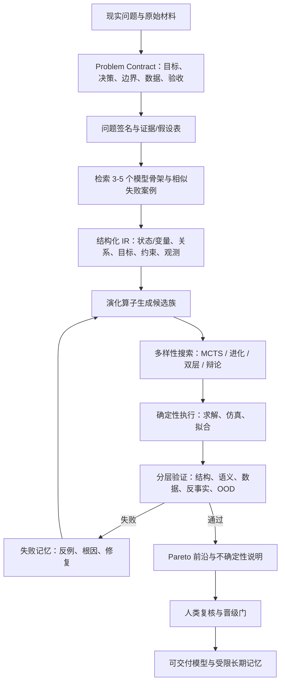

# AI 辅助数学建模 Agent 前沿调研

> 调研日期：2026-07-19  
> 目标：不是罗列“会写代码的 Agent”，而是寻找真正覆盖 **问题理解 → 模型构造 → 模型演化 → 求解/仿真 → 可信验证 → 记忆迁移** 的系统，并提炼可复用工作流。

## 0. 先给结论

你的判断“建模大多是经典骨架的演化，因此找到骨架和演化方式就能建模”抓住了 **候选生成** 的核心，但还少了决定成败的另一半：**怎样证明某次演化仍然忠实于原问题，以及怎样在多个可行模型中选择**。

更完整的表达是：

> **AI 辅助建模 = 骨架检索 + 结构化表示 + 演化算子 + 搜索策略 + 可执行评估 + 可信晋级 + 经验记忆。**

其中：

- “骨架 + 演化”负责提出候选；
- “求解器/仿真器 + 语义检查 + 留出检验”负责淘汰错误候选；
- “晋级策略”决定什么结果可以写进长期记忆或进入决策；
- AI 最有价值的地方，正是沿着相邻模型、相邻领域、相邻求解方法建立迁移链；
- AI 最大的危险也在这里：它能非常顺滑地迁移一个**不适用的骨架**，并生成看起来完整、甚至能够运行的错误模型。

截至本次检索，没有一个系统同时做到：开放领域通用、客观语义验证、真实世界长期运行、跨分布可靠、完整可复现。因此这里不做虚假的“总榜排名”，而按能力边界选出八个前沿代表。

## 1. 调研范围与证据标准

### 1.1 什么才算“建模 Agent”

本报告把数学建模理解为：从不完全、含歧义的现实问题出发，选择抽象层次，定义变量/状态、关系、目标和约束，确定参数与数据接口，选择算法并执行，再用证据检查模型是否解释或支持了原始决策。

因此以下工作只算相邻能力，不作为核心样本：

- 只做数学题推理或定理证明；
- 已给定模型后只负责求解；
- 单纯 AutoML 调参；
- 只生成报告、代码或图表；
- 没有执行环境和反馈闭环的“角色扮演式多 Agent”。

### 1.2 “前沿”不等于宣传指标高

我按五个问题检查每个系统：

1. **表示**：候选模型以什么状态被保存，是否能定位变量、目标、约束、方程、数据和假设？
2. **搜索**：系统如何从一个骨架变到另一个候选，是检索、反思、MCTS、进化还是多目标搜索？
3. **评估**：反馈来自求解器、数据、规则、外部评审，还是模型自己给自己打分？
4. **记忆**：保存的是成功案例、失败修复、争议轨迹还是模型谱系？错误结果会不会污染长期记忆？
5. **证据**：是否同行评审、代码是否公开、测试是否可执行、是否有消融、是否在未见任务或真实流程中验证？

证据强度在本文中分为：

- **较强**：同行评审 + 可执行客观指标 + 公开实现/复现材料；
- **中等**：同行评审但评测依赖 LLM 裁判，或代码/覆盖范围不足；
- **早期**：预印本或工作论文，有代码和实验，但缺少同行评审或独立复现；
- **主张**：作者案例或自报成绩，只能说明可行性，不能单独证明因果效果。

## 2. 前沿代表全景

| 系统 | 最擅长的问题 | “骨架”如何表示 | 如何演化/搜索 | 主要验证信号 | 证据判断 |
|---|---|---|---|---|---|
| **MATHMO** | 跨框架、跨目标的通用模型设计 | 框架、模型、算法的分层决策 | 双层自适应搜索；框架间探索 + 框架内细化；Pareto 选择 | 数值任务指标 + LLM 代理主观指标 | ICLR 2026；范围仅 4 类任务，代码链接本次访问不可用，**中等** |
| **MM-Agent** | MCM/ICM 式开放建模全过程 | 三级 HMML，含 98 个高层建模 schema | 分层检索、actor–critic、代码迭代 | 人类/LLM 评分、报告质量、比赛案例 | NeurIPS 2025 + 开源；开放任务评判较主观，**中等偏强** |
| **ModelingAgent** | 开放题的方案、数据、实现、报告协同 | 共享工作区中的方案、数据、代码和报告 | 多候选生成、批评、淘汰、细化与补充探索 | ModelingJudge + 小规模人类比较 | EMNLP 2025 Findings；同源模型评估相关误差明显，**中等** |
| **Autoformulator** | 自然语言到 LP/MILP 形式化 | 变量 → 目标 → 等式约束 → 不等式约束的部分树 | MCTS；符号等价剪枝；节点排序 | 求解器执行与参考目标值，辅以 LLM 评价 | ICML 2025 + 代码；窄但最可验证，**较强** |
| **ORPilot** | 企业优化需求澄清、数据接入和多求解器交付 | 访谈规格、CSV、派生参数、代码、可选 typed IR | 状态机 + 执行失败重试 | 语法/运行/可行性/目标值 | 2026 预印本 + 测试代码；成功运行后缺语义验证，**早期** |
| **Agora-Opt** | 两套异构模型互审、争论与经验复用 | 两队候选 + solution/debug/debate 三类记忆 | 分散式辩论，失败或目标不一致时修正 | 求解执行和参考目标值 | 2026 工作论文 + 复现实验包；公开记忆存在测试重合风险，**早期** |
| **KeplerAgent** | 物理约束下的方程发现 | 中间物理性质 + 符号回归配置 + 候选方程 | 先推断结构，再调度 PySINDy/PySR 等工具搜索 | 数据拟合、结构/物理约束、方程比较 | 2026 预印本；领域较窄但代表“工具编排型发现”，**早期** |
| **Sci-Mind** | 竞赛/工程建模中的检索、对抗审查和代码交付 | 问题 embedding + 可执行代码 + 范式描述；JSON blueprint | Theorist/Pragmatist 非对称辩论 + 自动修订 | LLM consistency predicates + 沙箱执行 + 自动 rubric | 2026 预印本；作者自报很强但无代码/独立复现，**早期** |

这八个系统不是同一赛道：MM-Agent/ModelingAgent/Sci-Mind 追求开放建模报告，Autoformulator/ORPilot/Agora-Opt 聚焦运筹形式化，MATHMO 研究模型空间搜索，KeplerAgent 研究科学方程发现。它们的数字不能横向直接比较。

## 3. 八个系统的深拆解

### 3.1 MATHMO：最接近“骨架—演化—选择”的通用研究框架

一手来源：[ICLR 2026 OpenReview](https://openreview.net/forum?id=t2fZ2GOwAT) · [论文 PDF](https://openreview.net/pdf?id=t2fZ2GOwAT)

MATHMO 把数学建模明确表述为“不确定性下的序贯决策”。它的关键不是固定一条“分析—代码—报告”流水线，而是把设计空间分成两层：

- 上层在不同建模框架之间探索，例如不同机理假设、状态空间或算法族；
- 下层在选定框架中局部细化模型形式和求解过程；
- 同时处理多个冲突目标，保留 Pareto 前沿，而不是压成一个总分；
- LLM 既充当搜索算子，又充当部分昂贵/主观目标的代理评价器。

论文在 TSP、作业车间调度、生态和流行病学四类任务上，用有限模型—算法评估预算展示了跨框架搜索能力。最终版报告的归一化 hypervolume 分别为 0.998、0.994、0.992、0.967；但在 Ecology 上，扁平搜索达到 1.000，反而略高于完整 MATHMO，说明分层搜索并非处处占优。这个方向非常契合“经典模型的演化”：一个候选不再只是公式，而是 **框架 + 形式 + 算法** 的组合。

但它并未解决通用建模的可信性：

- 只有四类任务，离开放世界建模很远；
- 主观质量由 LLM 代理，评价偏差会反过来塑造搜索方向；
- 论文声称提供代码，但本次按论文链接访问 GitHub 时返回 404，无法核验当前复现成熟度；
- 找到 Pareto 前沿只说明“在所定义指标下不被支配”，不说明指标覆盖了真实问题。

**最值得迁移的部分**：模型空间应分层，先探索骨架，再做框架内细化；多目标建模应保存前沿和权衡，不宜过早汇总成单一分数。

### 3.2 MM-Agent：开放式竞赛建模最完整的公开系统

一手来源：[NeurIPS 2025 论文页](https://proceedings.neurips.cc/paper_files/paper/2025/hash/1ddd6c6909c2a7acf877ce0f84abf6eb-Abstract-Conference.html) · [代码与 MM-Bench](https://github.com/usail-hkust/LLM-MM-Agent)

MM-Agent 将全过程拆成四阶段：开放问题分析、结构化模型构造、计算求解、报告生成。它最有辨识度的组件是 **Hierarchical Mathematical Modeling Library（HMML）**：

- 三级知识结构，包含 5 个领域、17 个子领域和约 98 个方法节点；
- 公开说明包含 98 个高层建模 schema；
- 同时做 problem-aware 和 solution-aware 检索；
- actor–critic 机制协助从库中选择和修正方法；
- 求解阶段调用代码生成/迭代工具，最终形成完整报告。

其 MM-Bench 包含 2000–2025 年的 111 道 MCM/ICM 问题，覆盖十个领域，但主要端到端对比集中在 2021–2025 的 32 题，并单列 2025 题缓解训练污染。论文报告相对人类专家解答提升 11.88%，GPT-4o 配置约每题 15 分钟、0.88 美元；作者还报告系统辅助两支本科队获得 2025 MCM/ICM Finalist（27,456 队中前 2%）。这些是重要的可行性信号，但最后一项是“系统参与了成功过程”，并不是控制实验，不能归因成系统单独带来的效果。

MM-Agent 正好证明了 AI 在“链锁相邻模型”上的优势：人不必先记住模型名，可以先从问题特征进入知识层次，再看相邻 schema。但还应警惕三点：

- 竞赛优秀论文不是唯一真值，开放式评分不可避免依赖人类/LLM rubric；
- 历年竞赛题和公开优秀论文可能进入基础模型预训练，难完全排除记忆；
- “报告完整”可能掩盖变量定义、因果方向、单位和边界条件的局部错误。

**最值得迁移的部分**：不要做模型名平铺清单，要做“问题特征—适用假设—模型骨架—可替换模块”的分层图谱；检索结果必须附适用条件和反例。

### 3.3 ModelingAgent：多候选批评循环比固定角色更重要

一手来源：[ACL Anthology / EMNLP 2025 Findings](https://aclanthology.org/2025.findings-emnlp.85/) · [论文 PDF](https://aclanthology.org/2025.findings-emnlp.85.pdf) · [官方代码与 ModelingBench](https://github.com/qiancheng0/ModelingAgent)

ModelingAgent 面向 68 个从竞赛题筛出的开放问题。其沙箱包含文件管理、网页搜索、图像处理、代码执行和 PDF 解析。表面上它由四个角色组成：Idea Proposer、Data Searcher、Model Implementor、Report Writer，并由中心 Critic 协调，共享工作区记忆。

真正有价值的不是角色名称，而是候选循环：

1. 一次生成多个候选方案；
2. 按 rubric 评分；
3. 淘汰最低的一部分；
4. 让幸存者定向细化；
5. 同时补充新的探索候选；
6. 多轮后保留最高分结果。

论文表中，GPT-4o 从 vanilla 的平均 50.76、普通工具 Agent 的 55.35，提高到 ModelingAgent 的 73.08；DeepSeek-Chat 配置达到 82.42，接近文中顶尖人类解答 84.63。作者还做了小规模人类 arena 比较。

但评估边界非常关键：ModelingJudge 用 GPT-4o 模拟不同专家角色，结构连贯性/完整性仍由单个 LLM 判断；实验中生成 Agent 和 Critic 使用同一个底座模型。这意味着错误不是独立的：同一底座可能同时生成、认可并润色同一个错误。论文自身也承认问题覆盖有限，复杂物理仿真/视觉问题被排除，开放式裁判存在偏差，仍需人类监督。

**最值得迁移的部分**：保留“幸存候选的局部优化 + 新候选的持续探索”，而不是让一次反思无限修补同一方案；评估器要尽可能与生成器异构，并加入确定性检查。

### 3.4 Autoformulator：最清楚地把模型构造变成树搜索

一手来源：[ICML 2025 / PMLR](https://proceedings.mlr.press/v267/astorga25a.html) · [代码](https://github.com/jumpynitro/AutoFormulator)

Autoformulator 聚焦 LP/MILP，把自然语言建模分成四层：

1. 参数与决策变量；
2. 目标函数；
3. 等式约束；
4. 不等式约束。

每个部分不是一次生成，而是 MCTS 节点。LLM 为一个部分提出多个 JSON 候选，搜索器选择、展开、评价和回传。系统还做等价剪枝：目标和约束尽量用 SMT 判断，变量层用 LLM 判断；不确定时保守保留。完整叶节点被解析成求解器代码，用执行结果和参考目标值打分。

代表性结果：在 NL4OPT、IndustryOR、MAMO complex、ComplexOR 上，作者报告完整配置的 formulation correctness 分别为 92.62%、48.0%、62.3%、72.2%；N=3 搜索在多项任务上明显高于单候选。专家复核 18 个 ComplexOR 失败案例发现，等式约束和不等式约束分别出现在约 54% 的失败中；专家判断与“参考目标值匹配”代理指标的一致率为 82%。

这里有一个非常重要的反例：**求得相同或接近的目标值，不等于形式化语义正确**。不同错误模型可能在某个测试数据上碰巧给出相同目标值。论文代码公开，但仓库规模较小，README 也承认代码尚未完全清理，工程成熟度不等同于论文方法成熟度。

**最值得迁移的部分**：把骨架拆成可定位、可替换的部件，再定义部件级演化算子；每次变化都保留谱系，不要只保存最终自然语言答案。

### 3.5 ORPilot：最接近生产入口，但“能运行”仍不是“做对了”

一手来源：[arXiv](https://arxiv.org/abs/2605.02728) · [论文 HTML](https://arxiv.org/html/2605.02728) · [代码](https://github.com/GuangruiXieVT/ORPilot)

ORPilot 的优势不是新搜索算法，而是把企业需求入口补完整。它用 LangGraph 状态机串联：

- 访谈 Agent：每轮只问一个问题，在目标、决策变量、约束、数据都清楚前不建模，并要求用户确认结构化摘要；
- 数据 Agent：将 CSV 与提示词分离，检查 schema、完整性和一致性；
- 参数计算 Agent：执行 Python，构造距离矩阵、聚合量、Big-M 等派生参数；
- 代码 Agent：生成并运行求解器代码，遇语法、运行、不可行或无界时在预算内重试；
- 报告器：输出模型和业务解释；
- 可选 typed IR：用 Pydantic 表示集合、参数、变量、目标和约束，再确定性编译到 Gurobi、CPLEX、PuLP、Pyomo 或 OR-Tools。

一个关键限定是：当前主流程通常先直接生成 solver 代码，IR 可以在成功后再从代码/规格中生成。因此“IR 可被确定性编译”保证的是后续可移植性，并不能自动约束第一次 LLM 生成，typed IR 目前还不是完整的语义防火墙。

论文在 IndustryOR、NL4OPT、NLP4LP 上报告不同底座的结果；Claude Sonnet 4.6 配置分别达到 75.0%、73.2%、79.8%。仓库提供安装、测试、示例、会话和产物结构，作为研究原型比许多论文代码更接近实际工程。

然而作者明确指出：当前重试只在语法错误、运行错误、不可行或无界时触发；一个错误模型只要成功返回 optimal，就不会进入语义纠错。论文的大量失败正是“成功求解了错误目标值”。早期尝试的 LLM solution validator 又产生太多假阳性。不可行也可能来自真实业务条件互相冲突，而不是代码错误，盲目重写模型可能破坏正确约束。

**最值得迁移的部分**：先形成可确认的 Problem Contract，再分离原始数据、派生参数、模型 IR 和求解代码；失败诊断要区分业务冲突、形式化错误和实现错误。

### 3.6 Agora-Opt：异构辩论有用，但未经验证的“成功记忆”会反噬

一手来源：[arXiv](https://arxiv.org/abs/2604.25847) · [论文 HTML](https://arxiv.org/html/2604.25847) · [代码/实验包](https://github.com/CHIANGEL/Agora-Opt)

Agora-Opt 让两支使用不同底座模型的团队独立经历 Formulator → Programmer → Executor/Debugger。只要有一队失败，或两队的目标值相差超过阈值，就进入最多三轮的分散式辩论。每队都能看到双方的形式化、代码和运行结果，并重新执行。

它还维护三类记忆：

- solution memory：历史问题—形式化—代码；
- debug memory：失败、原因和修复；
- debate memory：分歧、辩论轨迹和共识。

在八个优化基准上，论文主配置的 macro average 报告为 84.6%，优于多种单模型和集中式裁判基线。消融表明去掉辩论后损失很大，尤其在 OPT-Principled 上由 70 降到 21；两队初始都错的 34 个案例中，辩论救回 8 个。第一轮通常贡献最大，更多轮在简单任务上有时回退，说明应自适应停止。

本次还对作者公开的[固定提交 `774a2a8`](https://github.com/CHIANGEL/Agora-Opt/tree/774a2a8435cfa90dcfd34b24ec66d8ee1e0ca396)做了数据级复核。发布包的 `memory_storage/cases.jsonl` 含 1,441 条非空 JSON 记录、1,129 个唯一 description；以 UTF-8 解析后的原始 `description` 字符串，与同仓库 benchmark 做精确匹配，重合数为：NL4OPT 204/213、EasyLP 526/545、ComplexLP 85/111、NLP4LP 176/178、ComplexOR 12/18、IndustryOR 70/100、ReSocratic 380/403，只有 OPT-Principled 为 0/100。代码确实提供 [`filter_perfect_matches`](https://github.com/CHIANGEL/Agora-Opt/blob/774a2a8435cfa90dcfd34b24ec66d8ee1e0ca396/code/Agora-Opt/src/debate_memory/generate_with_memory.py)，但默认最多删除一个完全相同描述；NL4OPT、NLP4LP、ReSocratic 中分别有 188、160、173 个测试 description 在记忆里至少出现两次，而检索去重键是 `(problem_id, dataset)`，跨数据集副本仍可能保留。README 又说明主表复现脚本使用这些保留记忆资产。

因此，**公开发布包所复现的 headline 84.6% 不能直接当作干净 holdout 上的泛化证据**；至少需要先按规范化描述/问题同构簇彻底切断记忆—测试重合，再重跑无泄漏版本。这个结论针对公开资产和默认代码路径，不等于断言作者所有内部实验都有意泄漏，也不改变 OPT-Principled 上没有发现精确文本重合这一事实。

但它暴露出长期 Agent 最关键的风险：论文的 solution memory 只要候选“执行成功”就可写入，而执行成功并不保证语义正确。这样会把“跑通但建错”的案例持续检索回来。两队目标值一致也不等于正确：它们可能漏掉同一业务约束。若达到轮数上限，按“最稳定候选”回退也只是置信启发式，不是正确性证明。当前仓库虽包含八个基准、主要脚本、消融和保留的记忆资产，但只有一次集中发布式提交，仍应视为早期研究包。

**最值得迁移的部分**：用异构模型和分散式交叉修正替代单一裁判；但记忆写入必须经过独立的 promotion gate，不能以 `run_success=true` 为条件。

### 3.7 KeplerAgent：先推断物理结构，再调用符号工具

一手来源：[arXiv](https://arxiv.org/abs/2602.12259)

KeplerAgent 代表另一条重要路线：不让 LLM 直接凭文字写最终方程，而是先推断中间结构性质，再配置成熟科学工具（例如 PySINDy、PySR）搜索候选方程。这里的 LLM 更像研究编排器：

- 从问题和数据推断可能的守恒、对称、单调、稀疏或动力学结构；
- 将这些性质转成工具可用的候选函数库、搜索空间和超参数；
- 运行符号回归/稀疏辨识；
- 比较数据拟合、复杂度与物理一致性；
- 对失败进行结构级修订，而不是只改公式表面。

这类方法与 LLM-SR 一脉相承：LLM 提供方程/程序骨架，数值优化器拟合系数，数据评价器给出反馈，经验缓冲区保存多样候选。它说明 AI 辅助建模未必需要“一个模型知道所有数学”，更可行的设计是让 LLM 发现结构并正确编排传统工具。

作者在 LSR-Transform 上用 GPT-4o-mini 报告：KeplerAgent @1 的 symbolic accuracy 为 35.14%，@3 为 42.34%；对比 PySR 的 37.84% 和 LLM-SR 的 31.53%。@1 约 238 秒/42k tokens，明显低于 LLM-SR 报告的约 2118 秒/209k tokens。这里的 @3 是根据每题测试集 NMSE 从三次运行中取最好，带有 test-selection 的乐观偏差；symbolic accuracy 又由同族 GPT-4o-mini 裁判，不能当成完全独立的符号等价证明。其自建十个微分方程系统上，clean/noisy 的 symbolic accuracy 报告为 75%/45%，但不是封闭盲测。

局限也很明确：方程发现以观测数据为中心，无法自动补足不可辨识性、混杂、测量过程错误和外推风险；拟合优良且形式优美的方程，仍可能不是正确机理。该工作目前为预印本，本次也未从论文找到官方代码仓，结论需等待同行评审和独立复现。

**最值得迁移的部分**：把“模型结构假设”和“参数拟合”分开；优先让成熟数值算法负责可计算部分，让 LLM 负责提出和修订结构假设。

### 3.8 Sci-Mind：截至 2026 年最新的直接竞品，但证据尚未跟上成绩

一手来源：[arXiv](https://arxiv.org/abs/2603.27584) · [论文 HTML](https://arxiv.org/html/2603.27584)

Sci-Mind 是对 MM-Agent 路线的直接扩展，包含三个主要组件：

- Experiential Memory Recall：每条经验同时保存问题语义 embedding、已验证可执行代码、建模范式描述；
- Adversarial Cognitive Dialectic：Theorist 追求理论一致性，Pragmatist 追求数据可行性，Moderator 用双目标和质量下限判断收敛；
- Self-Validating Execution：先生成带变量类型、张量维度、函数依赖、数据 schema 和输出格式的 JSON blueprint，再由 Verifier 检查并生成/修复沙箱代码。

这种“目标不对称”的审查，比把两个 Agent 都设成“尽量写得更好”更有意义。作者在 MM-Bench 上报告 GPT-4o + Sci-Mind 的平均自动评分 9.14、代码可执行率 96.4%，对照 MM-Agent 为 8.43/82.0%；DeepSeek-R1 配置报告 9.37/97.8%。去掉经验记忆后，代码可执行率从 96.4% 降到 55.2%，说明记忆是其主要增益来源。

也正因为增益如此依赖记忆，它的证据风险更高：

- 论文明确承认所有主分数来自自动 evaluator，没有独立人类主评；
- 所谓 formal predicates 仍由 LLM Verifier 执行，是结构化检查，不是形式证明；
- 记忆的构建来源、训练/测试隔离和模板泄漏控制不足以排除检索污染；
- 写入经验的主要门槛仍偏向“可执行 + 新颖”，没有 held-out 科学正确性门；
- 本次精确检索未找到作者公开代码或独立复现。

因此更准确的说法是：Sci-Mind 是**论文自报领先的最新直接竞品**，不是已被独立确认的 SOTA。

**最值得迁移的部分**：让 Critic 承担与生成器结构上冲突的目标；让中间 blueprint 显式携带类型、维度和依赖。但必须把自动 Verifier 置于外部验证门之下，不能让它自行决定长期记忆晋级。

## 4. 四个必须一起看的基础系统/基准

### 4.1 OptiMUS：运筹建模 Agent 的模块化起点

来源：[论文](https://arxiv.org/abs/2407.19633) · [官方代码](https://github.com/teshnizi/OptiMUS)

OptiMUS-0.3 将 LP/MILP 建模拆成参数抽取、自然语言条款抽取、变量/约束/目标逐条定义、连接图、Gurobi 代码和执行调试。它把参数、条款、LaTeX 模型、代码片段以及变量—参数—条款连接图保存在持久 JSON 中；数值数据不直接塞进长提示。这是后来 typed IR、模型谱系和组件级错误定位的重要前身。

但它也最早清楚展示“运行成功不等于建模正确”：在七个 case study 中，GPT-4o 版 4/7 可运行而只有 3/7 正确，o3 版 5/7 可运行而只有 2/7 正确。NL4OPT、IndustryOR 又主要用执行成功和目标值匹配判分，仍可能让漏约束但碰巧目标相同的模型通过。其强项是模块化工作状态与 extraction/formulation/coding 错误分解，不是已经解决语义验证。

**最值得迁移的部分**：让每条需求、每个参数、每个变量和每段代码都有连接边；调试时定位是抽取、定式还是实现错误，而不是把所有失败交给一个“反思提示”。

### 4.2 FunSearch：生成器—验证器—多样性记忆的原型

来源：[Nature 2023](https://www.nature.com/articles/s41586-023-06924-6)

FunSearch 从人写的程序骨架出发，让 LLM 只改一个关键组件，用确定性 evaluator 执行打分，再在多个 island 中保留高分且多样的程序。它能成功，依赖三个苛刻前提：骨架可执行、评价廉价明确、候选可大量采样。它不是通用建模 Agent，但给出了最可靠的发现闭环：**生成模型和裁判必须分离，记忆要保存质量与多样性，而不是聊天摘要。**

### 4.3 LLM-SR / LLM-SRBench：漂亮方程不代表真正发现

来源：[LLM-SR](https://arxiv.org/abs/2404.18400) · [LLM-SRBench](https://proceedings.mlr.press/v267/shojaee25a.html)

LLM-SR 用 LLM 生成可执行方程程序骨架，传统优化器拟合常数，数据误差评价候选，多样经验池支持迭代变异/重组。LLM-SRBench 则故意加入变量变换、合成和防记忆设计；其报告中最佳系统在更严格的 symbolic accuracy 上仍只有 31.5%。不过任务、真值和评测代码在 2025 年公开后，对后续训练的新模型就不再是永久盲测；论文中的 OOD 又主要指输入数值区间外推，不等于未见公式或未见机制。这提醒我们：常见“发现了定律”的结果，可能来自记住经典方程、等价变换判断不充分，或只在训练分布内拟合。

### 4.4 OR-Space：比干净文本题更接近真实建模工作区

来源：[OR-Space 预印本](https://arxiv.org/abs/2605.28158)

OR-Space 不是 Agent，而是 2026 年提出的全生命周期基准。它把 100 个 IndustryOR 基础问题扩成 300 个工作区实例，分为：

- Build：从业务文档、CSV 和空代码骨架构造模型；
- Revise：需求变化后修改已有模型，同时保留未受影响逻辑；
- Explain：结合代码、求解器日志、对偶变量、slack 等证据解释结果。

每个实例把文档、数据、代码和求解状态分散在真实文件工作区。主结果中最强 Build 只有 72%，最佳 Revise-code 为 81%；六模型控制比较中，文件系统相对 flat prompt 平均使 Build 降约 8.2 个百分点、Revise 降约 12.2 个百分点。对最强 Build 模型的 28 个失败做人工分类，data mapping 占 39.3%、hallucinated constraints 占 28.6%、纯数学建模错误占 21.4%。这说明文件发现、schema 对齐、路径和跨产物一致性本身就是建模能力，而不是界面噪声；大量失败正是“代码可执行、求解器 optimal，但优化了错误业务量”。

未来评估自己的 AI 建模工作流，应借鉴 Build—Revise—Explain，而不是只测一次性“题目 → 答案”。

### 4.5 一项独立系统评测给出的外部约束

来源：[How Far Are We? arXiv:2604.04791](https://arxiv.org/abs/2604.04791)

这项 2026 年研究不是上述 Agent 的直接复现，但系统比较了 LLM 与人类专家在建模竞赛全过程中的差距。其总体结论是：模型在问题理解和初始形式化阶段相对更强，在模型求解、代码实现和结果分析阶段持续落后；规格不完整、verification/validation 缺失产生的错误会沿工作流传播。它为本文的核心判断提供了独立约束：前端“找到骨架”已有明显进展，后端可信验证仍是短板。

### 4.6 2026 年下一波：主动实验，以及对“进化”叙事的反证

三项很新的工作值得跟踪，但都仍是预印本：

- [SR-Scientist](https://arxiv.org/abs/2510.11661) 把 LLM 从方程 proposer 提升为最多 25 turn 的工具 Agent：写 Python 分析数据和残差、提交方程、接收数值反馈、继续修改。它在 LSR-Synth 上可获得较好的数值准确率，但符号准确率仍很低，清楚展示“拟合好”和“恢复真实机制”之间的裂缝。
- [LLM-ACES](https://arxiv.org/abs/2606.25039) 不再只在固定数据上搜索。LLM 提出 operator prior，PySR 在多个受限空间拟合候选，再选择“候选预测分歧最大”的新初始条件采集轨迹。作者在 ODEBench/ODEBase 共 122 个系统上报告 46.2%/52.4% symbolic accuracy。关键进步是把**实验设计/信息采集**纳入闭环；局限是仍依赖可安全查询的模拟 oracle，并非真实实验。
- [Dictionaries, Not Darwin](https://arxiv.org/abs/2607.04108) 是一项重要负结果。在相同 LLM 调用预算下，父代条件化演化与独立新采样近乎无差，显式多父代 crossover 更差；作者用一次独立采样得到候选项字典，再由外部稀疏集合选择重组，反而显著提高 LLM-SRBench 成绩。它目前只是单作者预印本，不能视作定论，但提出了正确的审计要求：任何“多代进化”都必须与**等预算独立采样 + 外部候选池/集合选择**消融，否则无法证明收益真来自谱系演化。

这三项工作把前沿问题从“LLM 能否写出公式”推进到三个更难的问题：能否主动获取有区分力的证据、能否让数值拟合对应真实结构、所谓演化究竟是模型改进还是外部筛选器在起作用。

## 5. 横向看：前沿 Agent 共同学会了什么

### 5.1 模型状态从自然语言升级为可编辑对象

不同系统正在接近同一结论：不能把整个模型只存在一段聊天文本里。有效状态至少要包括：

- 问题契约：决策者、目标、输出、范围、时空尺度；
- 证据与假设表：每个假设的来源、必要性、风险和可检验方式；
- 结构化模型 IR：集合、变量/状态、参数、方程/目标、约束、观测映射；
- 数据谱系：原始数据、清洗、单位、缺失、派生参数；
- 候选谱系：父候选、所用骨架、变更算子、生成理由；
- 执行产物：代码、环境、随机种子、求解器/仿真日志；
- 验证向量：不是一个总分，而是多项检查的结果和证据；
- 预算与停止状态：调用、时间、搜索宽度、失败次数；
- 决策状态：draft / runnable / verified / validated / decision-eligible。

这可以称为 **Loop State Representation**。没有外部结构化状态，Agent 的所谓“迭代”往往只是改写文字。

### 5.2 搜索的关键不是 Agent 数量，而是算子和选择压力

前沿系统实际采用的演化算子可整理为六类：

1. **抽象层变化**：个体 ↔ 群体，微观 ↔ 宏观，连续 ↔ 离散；
2. **机理变化**：添加/删除状态、反馈、时滞、空间、网络、随机性；
3. **目标变化**：单目标 ↔ 多目标，期望 ↔ 风险，静态 ↔ 动态；
4. **约束变化**：硬 ↔ 软，确定 ↔ 机会约束，局部 ↔ 全局耦合；
5. **观测变化**：潜变量、噪声模型、采样机制、缺失过程；
6. **求解变化**：精确 ↔ 启发式，仿真 ↔ 代理模型，梯度 ↔ 无梯度。

搜索策略再决定如何组合算子：

- MM-Agent：知识图谱/层次检索；
- ModelingAgent：多候选淘汰与再探索；
- Autoformulator：MCTS；
- MATHMO：双层多目标自适应搜索；
- Agora-Opt：异构候选辩论；
- FunSearch/LLM-SR：进化与多样性池。

因此多 Agent 不是原理，只是实现候选多样性、任务隔离或独立复核的一种手段。若所有角色使用相同模型、相同上下文、相同 rubric，它们很可能只是相关采样，并没有独立证据。

### 5.3 评价器才是当前瓶颈

最可靠到最弱的反馈大致是：

1. 形式证明、符号等价、守恒/单位/边界等确定性检查；
2. 求解器、仿真器、数值残差和参考 oracle；
3. 留出数据、反事实、扰动、压力测试、跨分布预测；
4. 专家 rubric 和成对比较；
5. 异构 LLM 裁判；
6. 同一个 LLM 的自我反思和自我评分。

现实中要组合使用，而不是迷信某一项。尤其需要区分：

- **executability**：代码能不能运行；
- **solver feasibility**：解是否满足所写约束；
- **formal correctness**：公式/代码是否实现了宣称的模型；
- **semantic fidelity**：模型是否忠实表达真实需求；
- **empirical validity**：是否解释或预测未参与构造的数据；
- **decision validity**：在不确定性和失配下是否仍支持目标决策。

前沿运筹 Agent 普遍较强于前两项，弱于后四项。

还应把论文常说的 “OOD/盲测”分级，避免把数值外推误当真正发现：

- **B0 公开经典题**：公式、真值和评测代码都公开，主要测工具能力；
- **B1 作者内部冻结**：评测在开发后冻结或用新合成/匿名变量，仍由作者掌握；
- **B2 第三方封存**：提交后才揭示任务，测试反馈不可用于搜索，预算和多 seed 预注册；
- **B3 前瞻真实证据**：新数据、新实验或开放问题，由独立专家/实验复核。

本次调研的方程发现 Agent 尚未看到完整 B2；FunSearch 的 cap-set 新结果最接近 B3 式“真实新发现”，但它依赖精确程序评价器，并非开放现实建模。

### 5.4 记忆的核心是“晋级”，不是“保存”

长期记忆至少要有四个层级：

- `candidate`：仅由 Agent 提出；
- `runnable`：能够执行；
- `verified`：通过结构、单位、约束、实现一致性检查；
- `validated`：通过留出/压力/外部证据或人工审核；
- `decision-eligible`：明确了适用边界、风险与责任人后，才可用于真实决策。

推荐的 **Promotion Policy**：

- 不允许 `runnable → long-term solution memory`；
- 错误案例也保存，但进入 failure memory，并带诊断标签；
- 每条经验绑定问题签名、数据版本、环境、指标向量和反例；
- 检索时同时返回“相似成功案例”和“相似失败案例”；
- 当需求、数据或代码变化时，自动失效相关验证，而不是继承旧结论；
- 高后果结果必须由人确认晋级，Agent 不能自行把草案升级成事实。

## 6. 推荐的 AI 辅助建模工作流



### 阶段 1：问题契约，而不是立刻问“用什么模型”

至少明确：谁做什么决策、评价成功的指标、允许什么行动、时空边界、已有数据、不可违反的约束、输出给谁、错误代价。对缺失信息逐项提问，并让用户确认机器可读摘要。

### 阶段 2：生成问题签名和骨架候选

问题签名建议包含：静态/动态、确定/随机、连续/离散、解释/预测/控制/优化、个体/群体、空间/网络、数据量、可干预性、主要不确定性。基于签名检索 3–5 个**有原则差异**的骨架，而不是五个名字不同但假设相同的模型。

每个骨架必须返回：

- 为什么适用；
- 依赖哪些假设；
- 最可能在哪些条件下失效；
- 与相邻模型的差异；
- 可用的演化方向；
- 需要什么数据/实验才能区分它与竞争骨架。

### 阶段 3：编译成结构化 IR

先生成 IR，再生成代码和报告。IR 中的每一项都要追溯到需求或显式假设。对优化问题可参考 ORPilot；对 LP/MILP 的部件分解可参考 Autoformulator；对动力系统要额外表示初边值条件、单位、观测过程、守恒和可辨识性。

### 阶段 4：使用显式演化算子搜索

初始预算可采用：3 个不同骨架 × 每骨架 3 个局部变体。只允许 Agent 使用登记过的算子变更候选，并记录 diff。搜索中同时保留：

- 当前最优；
- 结构最简单；
- 对压力测试最稳健；
- 与现有候选差异最大的可行方案。

不要只围绕一个早期高分方案反思；这会形成局部最优和锚定。

### 阶段 5：分层验证

建议最小验证栈：

1. schema、类型、单位、维度；
2. 变量域、约束覆盖、边界/初值、守恒和极端情况；
3. IR—代码双向一致性；
4. 求解/仿真可重复，固定环境与随机种子；
5. 合成微型案例和已知答案；
6. 留出数据或未用于搜索的情景；
7. 参数敏感性、扰动、缺失数据和分布变化；
8. 异构 Critic 给出反例，不只给分；
9. 人类检查不可逆假设和决策后果。

### 阶段 6：比较而不是“宣布最佳”

输出 Pareto 表：拟合/目标、复杂度、稳健性、可解释性、数据要求、计算成本、失效风险。模型选择应写成条件句，例如“若重点是短期预测且观测机制稳定，A 更好；若重点是政策干预和机制解释，B 更可信”。

### 阶段 7：只晋级经验证的经验

保存的不是“答案摘要”，而是：问题签名、骨架、算子序列、模型 diff、代码与环境、数据版本、验证向量、反例、失败模式、适用范围和人类决定。下一题的检索由这些对象驱动，才算真正完成“链锁到相关模型帮助迁移”。

## 7. 建议先做的最小原型

不要一开始复制四角色或十 Agent。最小有效系统可以只有一个生成 Agent、一个异构 Critic，加确定性工具：

### Loop State Representation

```yaml
problem_contract: {}
evidence_and_assumptions: []
problem_signature: {}
candidates:
  - id: model_001
    parent_id: null
    skeleton: "..."
    operators: []
    ir: {}
    artifacts: []
    validation_vector: {}
    status: candidate
budget: {}
decision_log: []
```

### 最小工具集

- 文件/表格读取与数据 profiling；
- Python/R 沙箱；
- 优化求解器或领域仿真器；
- 单位/维度、schema、约束和测试执行器；
- 文献与模型骨架检索；
- 版本化产物和运行日志。

### 最小循环

1. 生成 Agent 只负责 problem contract、IR 和候选变更；
2. harness 负责执行代码、记录状态和强制预算；
3. Critic 必须输出具体反例、遗漏或无法判断项，不能只输出分数；
4. 确定性检查失败时不调用“辩论”掩盖错误；
5. 每轮最多一个结构变更，便于归因；
6. 通过验证后再人工选择是否进入长期记忆。

### 第一批评测题

选 12–20 个你真正关心的题，按四类均衡：

- 经典骨架可直接适配；
- 需要组合两个骨架；
- 表面相似但经典骨架不适用的陷阱题；
- 需求或数据中途变化的 Revise 题。

每题预先定义隐藏检查：缺失约束、单位、边界、反事实、留出情景和接受条件。至少比较：单次强模型、简单工具循环、完整搜索循环。若复杂 Agent 没有稳定超过简单循环，就不增加角色。

## 8. 常见失败模式与红旗

| 红旗 | 实际风险 | 应对 |
|---|---|---|
| 一上来就报模型名 | 检索锚定，未确认决策和边界 | 先 Problem Contract，再问题签名 |
| “代码运行成功” | 可能正确求解了错误模型 | 需求—IR—代码三向追溯 + 隐藏案例 |
| “求解器返回 optimal” | 只对所写模型最优 | 语义覆盖、反事实和目标审计 |
| 同一 LLM 生成又评分 | 相关错误、自我确认 | 异构 Critic + 确定性 evaluator |
| 多角色但共享同一上下文 | 角色名称多，证据仍单一 | 按产物/权限隔离，必要时盲审 |
| 只保留最高分 | 过拟合代理指标、丢失多样性 | 保存 Pareto 前沿和新颖候选 |
| 成功运行即写记忆 | 错误案例长期污染 | 明确 promotion policy |
| 只测经典公开题 | 记忆污染、无法证明迁移 | 变量变换、合成题、时间切分和私有留出 |
| 自动修复所有 infeasible | 可能删除真实业务硬约束 | IIS/冲突诊断，人确认业务冲突 |
| 最终只给一份流畅报告 | 不可追溯、难定位模型错误 | 同时交付 IR、代码、日志、验证向量和限制 |

## 9. 对“骨架与演化”观点的最终修正

可以这样说：

> 大量数学建模创新不是从零创造公式，而是在经典骨架上改变抽象层、状态、耦合、目标、约束、随机性、观测过程或求解方法。掌握骨架和演化算子，可以显著提高候选模型的生成效率。

但不能进一步推出“因此就能完成建模”。原因是：

1. 同一现实问题可能有多个合理骨架，选择取决于决策目的，而不是表面相似度；
2. 最关键的创新有时是重新定义边界、变量或可观测量，而不是修改现成公式；
3. 演化后必须证明约束、单位、机理、数据生成过程和决策含义仍一致；
4. 现实中通常没有完美真值，必须管理模型不确定性和多模型共存；
5. 如果没有独立评价器，AI 只会更快地产生和包装候选，未必更快接近正确模型。

更准确的能力公式是：

> **建模能力 ≈ 表示质量 × 搜索质量 × 评价可信度 × 反馈利用率。**

其中任一项接近零，增加更多模型调用或 Agent 角色都无法补救。

## 10. 推荐阅读顺序

1. [MM-Agent（NeurIPS 2025）](https://proceedings.neurips.cc/paper_files/paper/2025/hash/1ddd6c6909c2a7acf877ce0f84abf6eb-Abstract-Conference.html)：先看开放建模任务如何被正式定义；
2. [Autoformulator（ICML 2025）](https://proceedings.mlr.press/v267/astorga25a.html)：看如何把模型部件化并进行 MCTS；
3. [MATHMO（ICLR 2026）](https://openreview.net/forum?id=t2fZ2GOwAT)：看跨框架、局部细化和 Pareto 搜索；
4. [ORPilot](https://arxiv.org/html/2605.02728)：看需求访谈、数据分离、IR 和生产状态机；
5. [Agora-Opt](https://arxiv.org/html/2604.25847)：看异构辩论和三类记忆，同时重点读其失败边界；
6. [ModelingAgent（EMNLP 2025）](https://aclanthology.org/2025.findings-emnlp.85/)：看开放题的候选—批评—淘汰循环；
7. [FunSearch](https://www.nature.com/articles/s41586-023-06924-6) 与 [LLM-SRBench](https://proceedings.mlr.press/v267/shojaee25a.html)：理解强 evaluator 和防记忆评测为何重要；
8. [OR-Space](https://arxiv.org/abs/2605.28158)：最后用真实工作区生命周期重新检查前面系统的实用性。

## 11. 检索与可复现说明

- 检索日期：2026-07-19；
- 检索范围：OpenAlex、arXiv、OpenReview、PMLR、ACL Anthology、NeurIPS Proceedings 与论文官方 GitHub；
- 关键词族：`mathematical modeling agent`、`automated mathematical modeling`、`LLM autoformulation optimization`、`equation discovery agent`、`symbolic regression LLM agent`、`industrial optimization agent`；
- 优先采用论文、会议页面和作者代码等一手来源；搜索摘要只用于定位，不单独承担关键结论；
- 不同系统的任务、数据、底座模型和评价器不一致，本文不把论文中的百分比做总榜比较；
- GitHub 活跃度和 API 模型版本会变化；本文只据访问时状态判断，不用 star 数作为能力证据；
- MATHMO 论文给出的代码地址在本次访问时返回 404，因此本文没有把“代码公开”视为已核验事实；
- ORPilot、Agora-Opt、KeplerAgent、OR-Space 在本次调研时仍属预印本/工作论文，其结果应标记为早期证据。

---

### 一句话备忘

**骨架库让 AI 知道“还能怎么想”，演化算子让它知道“怎么改”，执行器让它知道“能不能算”，可信评价与晋级门才决定“能不能信”。**
