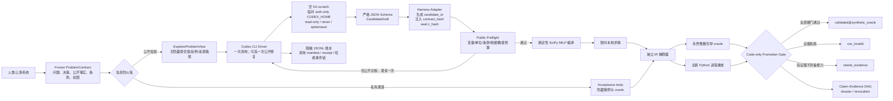

# Codex CLI 驱动的数学建模 Agent：Phase B 架构

## 结论

这套 Agent 现在可以由 Codex CLI 真实驱动，但 Codex 只拥有“候选模型提议权”。冻结契约、权威字段注入、编译、求解、独立验证、Promotion 和证据撤销全部由 Python Harness 控制。

当前准确能力声明是：

> Codex CLI 能在只看到公开题面的条件下，生成一个受类型约束的有界整数线性模型草稿；可信 Harness 能把草稿绑定到冻结契约，并独立决定它是 `validated@synthetic_oracle`、`run_invalid`、`needs_evidence` 还是 `NO_RESULT`。

这不是“Codex 自己证明了模型正确”，也还不是“能自主解决任意前沿数学建模问题”。

## 第一性原理架构



## 关键组件

| 组件 | 能力 | 功效 | 明确不能做 |
|---|---|---|---|
| `ProblemContract` | 冻结问题、公开决策、公开数值事实、条款、隐藏验收、权限和风险 | 把“题目是什么”变成内容寻址的执行契约 | 自动证明契约忠于现实 |
| `ExplorerProblemView` | 从契约生成最小公开投影 | 防止把已知最优值、反例、来源路径和历史解泄漏给生成器 | 访问私有 acceptance tests |
| `CodexCLIExplorer` | 非交互调用 Codex，要求严格结构化草稿 | 把 LLM 能力限制在 LP/MILP 候选生成 | 生成权威 hash、求解、晋级 |
| CLI 隔离层 | 临时仅认证 `CODEX_HOME`、空 Git 仓库、只读沙箱、禁用已知工具、清理环境变量 | 不让 Explorer 读取业务仓库、历史解、用户技能/MCP 或密钥 | 证明 Codex 协议层绝对不存在工具 |
| Wire Schema | 只允许整数/二元变量、线性项数组、约束映射、短 rationale | 拒绝未知字段、重复项、连续/非线性或自称 validated 的输出 | 判断自然语言语义正确 |
| Harness Adapter | 生成 ID、绑定冻结 hash、封存 IR、计算语义去重 hash | 权威字段永远不由模型填写 | 修改冻结契约 |
| Public Preflight | 检查决策名/域/单位、条款覆盖、数值和枚举预算 | 提供可安全回传的结构错误；阻断溢出和资源滥用 | 泄露隐藏测试结果 |
| Trusted Kernel | 确定性编译、求解、独立重算、精确枚举、洁净重放 | 把“模型说对了”改成“代码证据通过了” | 判断现实世界假设是否真实 |
| Promotion Gate | 从 Store 重新加载工件并重算硬门 | 只有代码能写入 `validated` | 接受模型自报的 `passed=true` |
| Trace Store | 内容寻址工件、精确 argv、脱敏事件账本、失败 receipt、哈希事件链 | 让成功、拒绝、超时和策略违规都可复核 | 保存模型思维链或原始命令正文 |
| Permission Gate | 检查契约动作授权和 A3/A4 人工批准 | 在启动 CLI/写运行工件前阻断越权任务 | 执行任何现实外部动作 |

## 实际控制流

```text
1. 人类或上游代码冻结 ProblemContract。
2. Harness 在任何 CLI 调用前检查权限和风险。
3. Harness 生成公开投影；隐藏 acceptance tests 留在私有通道。
4. 每次调用创建空 Git scratch 和临时 auth-only CODEX_HOME。
5. prompt 从 stdin 输入；最终消息必须匹配 JSON Schema。
6. JSONL 中只允许 reasoning/agent_message；任何 command、file、MCP、web 或未知 item 整批拒绝。
7. Harness 把草稿转换并 seal 为 OptimizationModelIR。
8. 仅公开 preflight 错误可触发第二轮；私有测试只要被访问一次就停止，不做自适应回灌。
9. 可信内核编译、求解、独立验证、重放并执行 Promotion。
10. 所有终态生成结构化 outcome；不允许静默回退到手写 fixture。
```

## 硬预算与停止条件

- 每次最多 3 个候选；默认 1 轮，可显式允许第 2 轮公开结构修复。
- 只支持 integer/binary LP/MILP；精确 oracle 空间不超过 100,000 个赋值。
- 单个变量、系数、边界、常数和 RHS 有绝对值预算；派生线性表达式另有上限。
- prompt/schema/stdout/stderr/JSONL 行数均有字节或事件上限。
- 父进程执行 wall-clock timeout；stdout/stderr 流式读取，超过上限终止本次进程树。
- 权限、认证、CLI 版本、MCP 关闭、工具事件、nonce、schema 或 scratch 完整性失败时 fail closed。
- 私有预检失败、验证失败或 `needs_evidence` 不进入下一次模型提示。
- 默认不使用 `resume`，每轮都是新的 ephemeral 调用。

当前 Codex CLI 版本固定为 `0.144.6`。版本改变后默认拒绝运行，直到重新审计参数和 JSONL 协议。

## 运行方式

合成端到端实验：

```powershell
python -m fma codex-demo `
  --output codex_agent_output `
  --codex-bin "C:\Users\charles\AppData\Local\Programs\OpenAI\Codex\bin\codex.exe"
```

运行自己的冻结契约：

```powershell
python -m fma codex-run `
  --contract .\contract.json `
  --output .\runs `
  --codex-bin "C:\Users\charles\AppData\Local\Programs\OpenAI\Codex\bin\codex.exe"
```

若允许一次仅公开诊断的结构修复，增加 `--max-rounds 2`。A3/A4 契约默认返回 `needs_approval`；只有人明确加 `--approve-high-risk` 才会运行本地建模链，且仍不开放外部执行工具。

## 已证明与未证明

已证明：

- CLI 可以通过 ChatGPT 登录态被 Python Harness 非交互驱动。
- 私有验收对象没有进入 Explorer prompt。
- 模型不能提交 `candidate_id`、`contract_hash`、`ir_hash`、解、验证结果或 Promotion 状态。
- 合法候选能进入既有可信链；工具事件、越权字段、超时、流量超限、MCP 未关闭、scratch 变化和隐藏反馈回灌均有负向测试。
- 旧 v1.0 无 `public_facts`/`decisions` 的冻结契约仍保持原 hash 可读。

未证明：

- `read-only + 已知工具禁用 + JSONL 零工具事件` 不是“协议层绝对没有工具”的密码学证明。
- `requested_model=cli_default` 不证明服务端实际模型身份；receipt 明确记录 `served_model_attested=false`。
- `validated@synthetic_oracle` 只覆盖这个冻结合成契约和有限微例，不证明现实语义、外部有效性、新颖性或训练数据无泄漏。
- 还没有自动 Problem Contract Builder、数据快照 provenance、审核骨架库、演化算子搜索、鲁棒/随机优化、OOD holdout、主动实验或现实决策执行。
- Codex CLI 当前没有稳定的硬 token/费用上限；现有硬门覆盖时间、输入输出、候选数和本地求解规模，usage 只做观测。

## 下一阶段

### 已完成：FMA-Bench v0 基础设施

已经实现 24 题的 6×4 任务矩阵、公开/私有哈希绑定、fixture 控制臂、真实 Codex 单轮/修复臂，以及独立有限域 holdout。运行和证据边界见 [FMA_Bench_v0.md](FMA_Bench_v0.md)。

当前完整 `live_single` 已在 suite `799affb9…` 上得到 24/24，但出现明显 ceiling effect。下一证据门不再是重复这套过易矩阵，而是先建立能暴露语义建模失败的 hard split；只有出现可复现失败后，`live_repair` 才有可归因的比较价值。

后续实验顺序已经收窄为：

1. 建立 `Matrix-Withheld Semantic Contrast Split`：公开原始领域事实，不直接给出目标和约束矩阵；
2. 用成对语义对照测试“恰好/至多、硬约束/罚函数、固定成本/边际成本”等结构推导；
3. 加入隐蔽缺失事实、分散矛盾和可线性化/不可线性化乘积对照；
4. `live_single` 至少重复三次，报告 pair consistency、错误晋级、NO_RESULT 校准、token 和延迟；
5. 只有 single 出现可复现公开结构失败后，再运行 `live_repair` 做因果消融；之后才考虑 untyped baseline 或并行 Explorer。

因此，第一版“可运行架构”已经闭环；“前沿开放问题能力”仍需通过隐藏多题基准和真实数据 provenance 单独建立证据。
