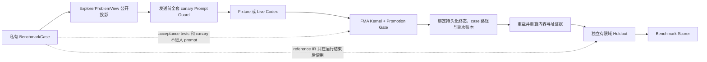

# FMA-Bench v0

## 目的

FMA-Bench v0 用来回答一个窄而可证伪的问题：

> 在当前有界整数/二元线性协议内，Codex Explorer 能否在未获得隐藏验收的情况下形成可执行模型；可信 Harness 能否避免错误晋级，并在模型无法安全作答时得到校准的显式 `NO_RESULT`？

它评测完整的模型—驱动器—验证器组合，不把 fixture control 当作模型能力。

## 任务矩阵

套件固定为 24 题：6 种骨架 × 4 种任务形态。

| 骨架 | Build | Revise | Explain | NO_RESULT |
|---|---:|---:|---:|---:|
| 资源分配 | 1 | 1 | 1 | 1 |
| 0-1 背包 | 1 | 1 | 1 | 1 |
| 指派 | 1 | 1 | 1 | 1 |
| 运输 | 1 | 1 | 1 | 1 |
| 设施选址 | 1 | 1 | 1 | 1 |
| 集合覆盖 | 1 | 1 | 1 | 1 |

支持范围刻意保持狭窄：

- 有界整数或二元变量；
- 单目标线性模型；
- 线性等式或不等式；
- 每题完整笛卡尔空间不超过 100,000 个赋值；
- `Explain` 只机械评分最终 IR，自由文本解释不进入可信晋级。

## 双层验证



Promotion Gate 的验收用于控制真实运行；Benchmark Scorer 另行枚举完整有限域，逐点比较：

- 参考模型和候选模型的可行性是否一致；
- 在共同可行点上的业务目标值是否一致；
- 原始 Promotion、事件链、工件哈希、重放和环境绑定能否重算。

因此，外层 `status=validated` 本身不能得分。

## 四种运行臂

| Arm | 作用 | 能否作为模型能力证据 |
|---|---|---:|
| `fixture_golden` | 正确 fixture 穿过与真实调用相同的响应解析、IR、求解和晋级链 | 否 |
| `fixture_mutant` | 目标常数被篡改的候选不得晋级 | 否 |
| `live_single` | 真实 Codex，单轮 typed Explorer | 是 |
| `live_repair` | 真实 Codex，最多两轮；第二轮只接收公开结构错误 | 是 |

当前尚未加入自由文本或直接 Pyomo 的 untyped baseline。它需要独立的解析和公平评分协议，不能伪装成已经完成的比较臂。

## 主要指标

按优先级：

1. `false_promotion_count`：错误或应拒答任务被晋级；
2. `validated_precision` / `validated_recall`；
3. 显式首轮 `NO_RESULT` precision / recall；
4. 全题和基础设施错误剔除后的两套准确率；
5. family macro accuracy；
6. token、延迟、轮数、候选数和工具事件；
7. privacy canary、证据完整性和事件链。
8. 实际 CLI executable hash、CLI 版本、output-schema hash、逐提示集合承诺和 runtime receipt 完整性。

`run_invalid` 不等于正确拒答；候选全部失败后才返回的 `no_result` 也不计校准 abstention。只有首轮结构化 `status=no_result` 才计入 NO_RESULT 指标。

## 运行

查看不含隐藏答案的公开清单：

```powershell
python -m fma bench-list
```

验证正确控制臂：

```powershell
python -m fma bench-run `
  --arm fixture_golden `
  --output fma_bench_output
```

验证故障注入臂：

```powershell
python -m fma bench-run `
  --arm fixture_mutant `
  --output fma_bench_output
```

运行少量真实 Codex smoke test：

```powershell
python -m fma bench-run `
  --arm live_single `
  --live `
  --cases ra_b1 ra_n1 `
  --output fma_bench_output
```

运行完整两轮能力评测：

```powershell
python -m fma bench-run `
  --arm live_repair `
  --live `
  --repetitions 3 `
  --output fma_bench_output
```

真实臂必须显式传入 `--live`。未提供该标志时，运行器会在任何 CLI 推理之前停止。

## 证据边界

- fixture 的 100% 只证明协议与 Harness 控制不变量，不证明 Codex 能力；
- suite hash 是绑定与防篡改承诺，不是保密措施；
- 私有完整套件只在所有 Explorer 调用结束后写入 benchmark run；
- Prompt Guard 在子进程启动前扫描全部 suite canary；运行后再次扫描持久化 prompt；
- `arm_config_hash` 绑定全部驱动预算，aggregate 另绑定实际 CLI executable、版本、schema 和 prompt 集合；
- 聚合器按原始终态字段重算关键派生布尔值，不信任外部传入的 accuracy/control 标记；
- `served_model_attested=false`，不能从请求参数推断服务端实际模型；
- `cost_usd=null` 不是零成本；
- 当前题目是合成有限 ILP，不证明真实数据、外部有效性、鲁棒优化或前沿研究能力；
- Explain 文本仍需独立盲评，不能由当前 Promotion Gate 自证。
