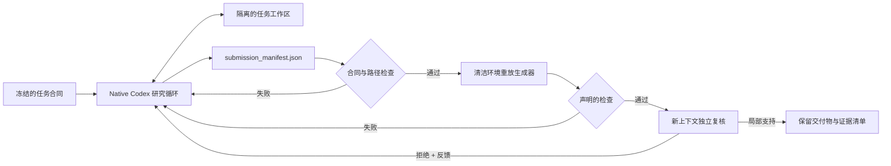

# THIN Modeling Agent

THIN 是一个面向真实、未见数学建模问题的轻量 Agent Harness。它不规定模型族，
也不把研究过程塞进固定阶段。推荐的 `native` 模式让 Codex 在隔离工作区中使用
原生 shell、读写和推理能力；Harness 只冻结任务合同、限制副作用、重放关键计算、
检查证据，并让新的 verifier 上下文复核最终声明。

## 核心链路



- Codex 自己决定问题分解、模型族、代码结构、实验顺序和何时换向。
- `submission_manifest.json` 只描述交付物、声明、生成器和检查，不规定研究过程。
- Harness 重放声明的 Python 生成器，并要求关键输出与原输出逐字节一致。
- 最终 verifier 只看冻结合同、交付物和重放记录，不能批准无证据的强声明。
- 失败时只把具体反馈送回研究循环；达到预算后保留最佳交付物并如实标记未验证。

## 安装

需要 Python 3.11+ 和可用的 Codex CLI。

```powershell
python -m pip install -e ".[test]"
python -m modeling_agent --version
```

核心运行时只使用 Python 标准库；`pytest` 仅用于测试。

## 推荐运行：Native Codex + Thin Sidecar

```powershell
python -m modeling_agent native `
  --workspace D:\runs\my-problem `
  --objective "在这里给出完整的建模问题" `
  --max-attempts 2 `
  --max-seconds 1800
```

首次运行会在工作区冻结默认合同。需要改变必须交付的文件、最低生成器或检查数量时，
可显式传入 `--contract contract.json`；合同一旦写入工作区就不能静默替换。

查看状态：

```powershell
python -m modeling_agent status --workspace D:\runs\my-problem
```

主要状态保存在：

```text
<workspace>/
  .modeling-agent/task-contract.json
  .modeling-agent/native-state.json
  .modeling-agent/native-events.jsonl
  submission_manifest.json
  paper/final.md
```

旧的 `run` 命令仍保留，用作结构化 Problem Graph 循环的消融臂，不再是默认产品路径。

## 冻结对照实验

先冻结同一任务、模型、预算、评分规则、简单基线和独立评分者：

```powershell
python -m modeling_agent ablation-init `
  --output D:\runs\experiment\ablation.json `
  --objective "未见任务原文"
```

三个实验臂是：

1. `raw_codex`：一次原生模型回答；
2. `thin_harness`：原有结构化 Problem Graph 循环；
3. `native_sidecar`：原生 Codex 研究循环加最小合同、重放和最终复核。

内部测试通过只证明实现符合合同。只有冻结未见任务上的盲评结果，才能说明
`native_sidecar` 是否优于裸 Codex 或原有 THIN。

## 能力边界

- Native 研究循环依赖 Codex 的 `workspace-write` 沙箱；Windows 嵌套运行显式使用
  受限 token 的 `unelevated` 实现，Sidecar 另做路径和合同检查；
- 当前只能在运行结束后统计 Codex 的可观察工具调用，不能在单次原生循环中硬截断调用数；
- 只重放 manifest 声明的 Python 生成器，未声明或非 Python 计算不获得同等级复现保证；
- 新 verifier 上下文不是外部科学同行评议；
- 通用机械检查不能自动证明因果、机制、稳健性或外推；
- 默认关闭联网、插件、浏览器、安装依赖和任务目录外写入，也不授权现实世界行动；
- 是否真正提升建模能力，必须由冻结的未见任务和外部评分证明。

详细设计见 [THIN_MODELING_AGENT.md](docs/architecture/THIN_MODELING_AGENT.md)。

## 开发

```powershell
python -m pytest tests/test_thin_modeling_agent.py -q
python -m pytest
```

目录保持刻意精简：

```text
modeling_agent/                         # 唯一运行时包
tests/test_thin_modeling_agent.py       # 核心合同测试
docs/architecture/THIN_MODELING_AGENT.md
```
