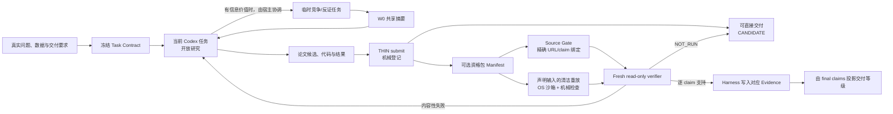

# THIN Modeling Agent

THIN 是一个由当前 Codex 任务原生驱动的开放数学建模 Agent。当前 Codex 可以定义问题、搜索资料、提出任意模型、写任务代码、试错、并行探索和换方向；Harness 不再启动另一个 Codex 代替它研究，只负责冻结任务、保存状态、机械检查、可复现执行、来源绑定、独立复核、证据承认、撤销和停止。

研究与资格是松耦合的：`start` 给当前 Codex 返回任务工作根与研究简报，`submit` 登记它已经完成的论文候选，`qualify` 再按 claim 独立检验。资格失败降低可声明的证据等级，但不删除论文。`solve` 只是 `submit + qualify` 的便利命令，不是隐藏的模型循环。

它不建设固定 S0–S6 流水线、永久角色群、模型族白名单、方法包工厂、向量数据库或证书栈。

## 架构



研究者只以 `<run>/work/` 为工作根。Harness 独占 `<run>/.modeling-agent/`、`<run>/sources/` 和 Evidence 承认权。生成者不能批准自己的 claim 或最终论文。

## 安装与宿主要求

核心登记只需要 Python 3.11+；只有独立模型复核需要兼容的 Codex CLI：

```powershell
python -m pip install -e ".[test]"
python -m modeling_agent --version
codex --version
```

核心 Python 包没有第三方运行时依赖。

执行有两个不同强度的边界：

- 当前 Codex 的研究权限由当前宿主负责，THIN 不复制、提升或绕过这些权限；
- 生成代码的独立重放复用同一个 workspace-only profile 与双 canary，再通过 `codex sandbox` 执行；不提供不安全回退。

只有显式资格检验可能由 Harness 启动 `codex exec`。这些复核调用都是非交互运行：同时固定
`approval_policy="never"` 与 `--ask-for-approval never`，不分配 TTY，并忽略个人
rules/config。直接 `codex sandbox` 的探针和重放则在 Windows 上显式覆盖为
`windows.sandbox="unelevated"`。权限不足、
越界访问或网络被宿主拒绝时直接返回失败或 `NOT_RUN`；Harness 不弹确认框，
不等待点击，也不会改用 full access 重试。Receipt 会记录实际 permission profile、
工作根、审批策略和可观察交互请求数，非交互合同不成立时不能写入 Evidence。

`start`、`next` 和 `submit` 不启动子 Codex，因此生产研究链不会再因为嵌套模型触发审批。显式 `qualify`/`solve` 仍可能受到父宿主对子进程的审批；需要零弹窗时，可先只交付候选，之后在已授权宿主中独立复核。不要通过 `danger-full-access` 消除弹窗。

可先检查本机沙箱：

```powershell
codex -c 'windows.sandbox="unelevated"' sandbox `
  -P :workspace -C D:\some-empty-workspace -- python -I -c "print('ok')"
```

这条命令只检查底层 sandbox helper 能否启动；Harness 还会自动运行更严格的 workspace-only 父目录读取 canary。研究探针失败只降低隔离保证；资格重放若没有真实 OS 沙箱则返回 `NOT_RUN`，不会用普通宿主 Python 冒充隔离执行。

## 运行

先初始化任务：

```powershell
python -m modeling_agent start `
  --workspace D:\runs\my-problem `
  --objective "在这里给出完整数学建模问题" `
  --network research-search
```

当前 Codex 按返回的 `next.instructions` 在 `<run>/work/` 中完成研究、代码和论文。可随时查看下一步：

```powershell
python -m modeling_agent next --workspace D:\runs\my-problem
```

登记当前 Codex 已完成的候选：

```powershell
python -m modeling_agent submit --workspace D:\runs\my-problem
```

对已有候选做独立资格检验：

```powershell
python -m modeling_agent qualify --workspace D:\runs\my-problem
```

如果当前宿主不能安全启动嵌套 verifier，可把复核拆到另一个全新 Codex 任务：

```powershell
# 生产任务：冻结候选、机械重放和完整有界 review packet
python -m modeling_agent review-export `
  --workspace D:\runs\my-problem `
  --producer-context-id <当前任务ID>

# 新 Codex 任务只读取 packet，按 result_contract 写回 result.json；随后由生产任务导入
python -m modeling_agent review-import `
  --workspace D:\runs\my-problem `
  --packet .modeling-agent/external-review/packet.json `
  --result .modeling-agent/external-review/result.json
```

`review-import` 会重新绑定当前 Task Contract、完整候选指纹、packet 文件哈希和不同的
producer/reviewer context ID。外部任务的独立性是可审计声明，不能伪装成宿主证明，
因此 authority 最高为 E3。`review-export --local-replay` 只在明确接受无 OS 隔离风险时用于
诊断；它会标记 `REPRODUCED_LOCAL / NOT_PROVEN`，后续 Evidence 最高为 E2，且系统不会从
隔离重放静默降级到该模式。

候选和资格包都已完成时，也可以登记后立即尝试独立复核：

```powershell
python -m modeling_agent solve `
  --workspace D:\runs\my-problem `
  --objective "在这里给出完整数学建模问题" `
  --network research-search
```

`research` 仅作为 `submit` 的兼容别名，不会启动生产者。`submit` 在论文存在时返回候选成功，即使 Manifest 尚未就绪；`qualify` 完成一次正面或负面评价均表示命令正常完成，`NOT_RUN/NOT_READY` 返回非零；`solve` 只有最终 delivery 达到 `SUPPORTED` 才返回成功。结构化输出始终保留实际状态。

离线研究：

```powershell
python -m modeling_agent start `
  --workspace D:\runs\offline-problem `
  --objective "问题原文" `
  --network offline-compute
```

恢复任务时继承冻结预算：

```powershell
python -m modeling_agent next --workspace D:\runs\my-problem
python -m modeling_agent submit --workspace D:\runs\my-problem
python -m modeling_agent qualify --workspace D:\runs\my-problem
python -m modeling_agent status --workspace D:\runs\my-problem
```

预算不能被默认参数静默扩大。确需增加时必须显式声明：

```powershell
python -m modeling_agent solve `
  --workspace D:\runs\my-problem `
  --max-attempts 5 `
  --max-seconds 3600 `
  --amend-budget
```

任务合同、模型标识和已有 Evidence provenance 不能在恢复时静默替换。外部调用开始前会保存 active attempt；进程异常中断后，该次尝试与最多其冻结调用预算会在恢复时计入累计消耗，不能靠重启清零。

## 运行目录

```text
<run>/
  .modeling-agent/          # Harness 独占
    task-contract.json
    run-state.json          # 恢复游标与 Evidence 头锚
    events.jsonl
    evidence.jsonl          # 有序哈希链；claim 与 revocation
    traces/
    verdicts/
  work/                     # 当前 Codex 任务的工作根
    task-contract.json      # 可校验镜像
    research/
    src/
    checks/
    data/
    results/
    paper/final.md
    submission_manifest.json
  branches/                 # 可选的宿主协调任务摘要
  sources/                  # 版本化 Source Gate 记录
```

一个非阻塞 OS 文件锁保证同一 run 只有一个写入者。工作记录损坏只会使 Problem Graph 投影不完整，不会被提升为证据，也不会遮蔽已经验证的状态。

## 证据边界

晋升等级由正面事实投影，不是固定流水线：

| 晋升等级 | 含义 |
|---|---|
| `WORKING` | 草稿、搜索摘要和研究记录 |
| `CANDIDATE` | 合同指定的论文候选已经存在；资格包可尚未就绪 |
| `CHECKED` | 与 claim 类型匹配的声明来源、清洁重放、检查和依赖已满足 |
| `SUPPORTED` | fresh 独立上下文支持该 claim；最终交付还需所有 final claims 与 delivery review 支持 |
| `QUALIFIED` | 外部盲评、真实数据或真实环境资格；本 Harness 不自行授予 |

E1–E5 表示证据来源的 authority 上限，与上述研究/晋升状态不同：

| 层级 | 含义 |
|---|---|
| W0 | 搜索摘要、模型记忆、假设、工作记录、分支结论；只能指导研究 |
| E1 | Source Gate 对精确 URL、定位和具体 claim 的 fresh 模型复核记录 |
| E2–E3 | 机械检查、重放、基线、留出、反证或压力测试所支持的有界证据 |
| E4 | fresh、read-only、tool-free verifier 承认的本地证据上限 |
| E5 | 外部数据、外部评审或真实环境资格；本 Harness 不能自行授予 |

`SUPPORTED`、`PARTIALLY_SUPPORTED`、`UNSUPPORTED`、`INCONCLUSIVE`、`NOT_READY` 和 `NOT_RUN` 分开保存。一个被独立支持且依赖闭合的 claim 可以单独进入 Evidence；不受支持的兄弟 claim 不会抹掉它。只有所有 `final_claim_ids` 与完整 delivery 都达到 `SUPPORTED`，Harness 才报告整题完成。部分 Evidence 不会伪装成整篇论文已获支持。

当前 Source Gate 绑定精确 URL 的可观测 web query、短摘录、定位、来源类型和 claim ID；它保存的是带哈希的“模型复核记录”，不是网页原始字节或 WARC 归档。因此它能排除无 trace 的模型记忆式引用，但不能证明网页长期未变化。

Evidence 会绑定完整复核工件集合，包括输入、生成器、检查器、结果、完整交付文档、Manifest、Task Contract 以及 source/verifier 原始 trace。候选身份由 Manifest 与全部声明工件的内容哈希共同确定，不再只看论文。交付文档必须由合同中的 `delivery_artifact` 明确指定，并完整装入有界 verifier packet；超出 packet 上限时返回 `NOT_RUN`，不会只审开头。任何已绑定项之后变化，相关 claim 及其下游变为 `stale`；恢复时追加 revocation，论文仍保留为候选。Evidence 记录自身被编辑、删除、截断或重排时报告 `corrupt`。

## 弹性探索

默认由当前 Codex 直接研究。竞争模型、简单基线、反证或压力测试有信息价值时，可由当前宿主创建临时任务；THIN 不内建永久角色群，也不自行启动这些生产者。结果只以 W0 摘要回到当前任务，失败与反例仍应保留。

## 消融

```powershell
python -m modeling_agent eval `
  --output D:\runs\experiment\ablation.json `
  --objective "冻结的私有未见任务"
```

五个递增臂为 `raw_codex`、`codex_web`、`source_gate`、`hard_eval` 和 `elastic_memory`。只有冻结未见任务证明组件提高建模质量、来源蕴含、复现、正确弃权或换向质量，组件才应保留。

## 验证

```powershell
python -m pytest tests/test_thin_modeling_agent.py -q
python -m pytest
python -m ruff check modeling_agent tests
python -m modeling_agent --version
python -m modeling_agent --help
```

内部测试只证明实现语义，不证明建模效果或外部科学资格。候选生产不依赖嵌套 Codex CLI；真实资格实验仍必须单独通过 verifier 启动、权限配置和 `codex sandbox` 现场探针。详细设计见 [架构文档](docs/architecture/THIN_MODELING_AGENT.md)。
