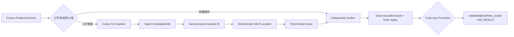

# FMA Trusted Modeling Agent v0.3

FMA 是一个可由 Codex CLI 驱动、但不把验证权交给 LLM 的数学建模垂直切片。

V5 在不改写 V1–V4 工件与哈希的前提下，新增了 Graph-native 的 S0–S6
任务工作区、外部认证门禁、领域检查注册表、结果注入式论文构建和工作区外的
隐藏评测 Harness。阶段 gate 只表示工作流证据完备，永不等同于科学资格或现实行动权限。

当前闭环：



Codex 只能提出模型草稿。Harness 独占以下权力：生成候选 ID、绑定冻结契约、封存 IR、编译、求解、验证、晋级和撤销证据。

## V5.8 Studio：真实 S0–S1

本地 Studio Bridge 已接通可运行的 S0–S1 纵向切片。S1 不是单次
“选一个模型”：四个新鲜、隔离的 Codex 角色从共同 S0 契约出发，分别生成
机制、空基线、统计和系统学习候选。Harness 验证候选与来源后冻结盲探索
前沿，Knowledge Broker 才为每个分支构造有限的同伴知识包；翻译角色只能从
被披露的知识单元提出跨范式假设，目标分支再独立决定是否值得在 S2–S4
检验。候选只由模型生成数学核心；assumption/symbol 引用和冻结的 L0–L4
义务由 Harness 从独立工件唯一绑定，避免让模型重复维护权威字段。

所有知识单元、来源祖先、披露包、迁移假设、目标分支评估和经验隔离决定都
进入内容寻址的 V5.8 认识论事件图。一次 S1 默认最多 16 个模型调用，其中
13 个覆盖含冻结前独立审计的正常链路，3 个是分支、形式化和终审共享的
故障恢复预算。全局上限优先，耗尽即停止。每个定向翻译者只看到
目标分支获准的单个披露包，不能读取完整知识图；目标 ID 由调度器注入，
获准来源 ID 由 Harness 规范化并复核。跨任务经验默认隔离；
`ACCEPT_FOR_TEST` 不是科学支持，S1 Gate 也不授予科学资格或现实行动权限。
图中的 `independence_passed` 只证明上下文与来源收据没有交叉复用；同一模型
的多个进程仍是相关推理者，不能冒充独立科学复现。

候选结构、完整数学形式以及五条 L0–L4 规则分别作为原子工件传输，避免
历史单工件封包上限截断长形式化。冻结阶段文件前，独立形式化审计员先检查
时间索引、特征构造、估计、依赖关系、基线和不确定性规则；未通过时只允许
一次完整替换式修复，再次未通过便保留失败证据并停止，不生成半成品 S1。

Studio API：

```text
POST /api/v1/tasks/{task_id}/run-s0
POST /api/v1/tasks/{task_id}/run-s1
GET  /api/v1/tasks/{task_id}
```

浏览器只持一次性 Bridge token；外部 HMAC authority key 始终留在本地
Harness。

## 安装与测试

```powershell
python -m pip install -r requirements-lock.txt
python -m pytest
```

## 运行

无 LLM 的可信内核故障注入实验：

```powershell
python -m fma demo --output demo_output
```

由真实 Codex CLI 生成候选，再进入同一可信内核：

```powershell
python -m fma codex-demo `
  --output codex_agent_output `
  --codex-bin "C:\Users\charles\AppData\Local\Programs\OpenAI\Codex\bin\codex.exe"
```

运行自己的冻结契约：

```powershell
python -m fma codex-run `
  --contract .\contract.json `
  --output .\runs `
  --codex-bin "C:\path\to\codex.exe"
```

### 实验性 V2.0 协议桥接

V2.0 的首个 fixture 将公开 `ProblemContractProposal` 与独立、私有的 acceptance-test bundle 分开，再冻结为当前内核可验证的 `ProblemContract v1.1`：

```powershell
python -m fma v2-capacity-fixture --output fma_v2_capacity_output
```

该命令只运行确定性的合成容量规划 fixture，用于验证 V2 的协议边界、私有测试绑定和旧内核兼容性；它不调用 LLM，也不证明真实世界建模或自主问题发现能力。

### V2.0.1 原始简报摄取（draft-only）

先把一个受限范围内的本地 UTF-8 Markdown/text 文件封存为 `EvidenceSnapshot`。原文始终被标记为不可信数据，不会直接改变工具、权限、审批或私有验收测试：

```powershell
python -m fma v2-ingest-brief `
  --brief-file .\brief.md `
  --workspace-root . `
  --source-ref "operations:capacity_brief"
```

该命令只打印快照元数据和哈希，不输出原文。要将快照送入问题发现，还需要一个 `MissionSpec` 显式允许该 `source_ref`，随后由 Harness 绑定 `ProblemHypothesisDraft` 的使命和证据哈希；这仍只生成候选，不会冻结契约或调用模型。

### V2.0.2 问题发现账本（fixture-only）

`DiscoveryRunStore` 将 mission、approval、evidence snapshot、draft 和 admission 的终态逐一写入内容寻址工件，并追加至哈希链事件账本。重放会重新检查来源范围、草稿—证据绑定及 admission 结果；单个工件或事件字段被改动时验证失败。当前尚无签名或远程不可变锚点，不能将其表述为对可重写整个目录的攻击者的防护。

```powershell
python -m fma v2-discovery-fixture --output fma_v2_discovery_output
```

该命令只运行固定容量规划 fixture，不调用 LLM、不读取真实历史数据，也不构成真实世界问题发现或决策资格的证据。

### V2.0.3 Codex 问题发现 Provider（显式 live，draft-only）

`CodexProblemDiscoveryExplorer` 只接收已记录的 `MissionSpec` 与带“不可信数据”边界的 `ProblemDiscoveryContext`，返回一个严格类型的 `ProblemHypothesisDraft`、`no_result` 或受控错误。每次调用先记录 provider observation（提示、schema、隔离运行清单、脱敏事件账本与响应/终态），之后草稿才能关联该 observation 进入代码拥有的 admission gate。

```powershell
python -m fma v2-codex-discovery-fixture `
  --live `
  --output fma_v2_codex_discovery_output `
  --codex-bin "C:\Users\charles\AppData\Local\Programs\OpenAI\Codex\bin\codex.exe"
```

`--live` 是强制显式授权；无此标志命令不会创建输出目录或调用 CLI。该 fixture 只到“草稿 → admission hypothesis”为止，不会构造优化模型、调用求解器或生成现实行动建议。当前回归使用 fake CLI 验证协议；尚未把任何真实 CLI 运行当作问题发现质量或模型身份的证明。

### V2.1 经验预测与容量决策门（fixture/shadow-only）

V2.1 的首个窄闭环把生成与评估分开：生成模块只提交 `last value / mean level / linear trend / seasonal naive` 四个冻结候选；代码拥有的 evaluator 使用 expanding-window rolling-origin 持出、历史残差区间、持出覆盖与相对基线 MAE 重新计算候选状态。下游容量门再次重算验证报告，再检查持出 regret 与候选行动是否一致。

```powershell
# 机制稳定：四个候选一致，但用途仍只限合成 fixture 分析
python -m fma v2-empirical-capacity-fixture --scenario stable --output .\empirical_runs

# 结构突变：系统应输出 needs_evidence
python -m fma v2-empirical-capacity-fixture --scenario regime_shift --output .\shift_runs
```

`ingest_local_timeseries_csv` 另提供工作区内、两列 UTF-8 CSV 的严格摄取：列名、缺失、有限非负值、时间顺序、最少样本数和原始内容哈希全部 fail closed。当前没有把任意本地 CSV 自动送入决策 CLI，避免在任务/阈值/用途契约尚未独立批准时暗中替用户做选择。

即使稳定 fixture 返回 `decision_eligible`，报告仍固定为 `accreditation_status=not_accredited`、`real_world_action_authorized=false`；它只说明冻结的合成场景下，存活模型对当前影子决策一致。

### V2.1 官方数据 retrospective shadow（显式 live）

官方适配器只允许 BLS 与 USGS 的固定 HTTPS 主机，请求参数必须与冻结 `TimeSeriesDataContract.source_ref` 完全一致。原始 JSON 与请求/响应 hash 一并落盘；重放会重新解析数据并复算 rolling validation、三 seed 配对 moving-block bootstrap、漂移诊断和终态报告。

```powershell
python -m fma v2-official-shadow --live `
  --dataset bls_nonfarm_employment `
  --output .\official_shadow_runs

python -m fma v2-official-shadow --live `
  --dataset usgs_potomac_discharge `
  --output .\official_shadow_runs
```

另外两个 matrix-withheld 数据集用于验证失败驱动的 V2.2 候选演化：`bls_private_weekly_hours` 与 `usgs_point_of_rocks_discharge`。`--live` 只授权一次 allowlist 官方 API 读取，不授权任何外部写操作。当前四个真实运行的总终态均为 `needs_evidence`；BLS 持出上局部趋势/指数平滑相对基线有正区间证据，但漂移门仍阻止晋级，USGS 演化候选仍整体差于 last-value。

### V2.2 可撤销方法记忆与隐藏 WorldPack

`EpistemicGraphStore` 将来源、数据快照、方法主张、候选、验证/技能/漂移/决策报告和演化算子保存为内容寻址 V2.2 节点；依赖边和撤销 receipt 进入同一追加式哈希事件链。状态只能由重放得到。撤销来源或数据时，`derived_from / evaluates / justifies_use / learned_from / supports` 下游自动失效；`refutes / supersedes` 改变认识状态但不伪装成派生关系。

网上方法学习只允许精确 URL allowlist、只读抓取、大小/media type/UTF-8/最终 URL 检查。网页保存为 `untrusted_web_data`，最多生成 `candidate_requires_hidden_validation` 的方法知识。首个真实捕获是 FPP3 SES 页面；它不直接授权指数平滑或整个候选组合。

隐藏 WorldPack 用 4 个机制 × 3 个 seed 比较同为 4 候选、同为 96 次内层评估的 direct 与 memory policy。外层 24 点和机制标签不进入选择器。结果为 memory 4 胜、8 平、0 负迁移，平均 MAE 改善的 95% case-bootstrap 区间为 `[0.0153, 0.1097]`；但预先冻结的 50% 严格个案胜率门未满足，所以终态仍为 `candidate_rejected`。完整证据见 [大迭代 3 结果](experiments/iteration_03/RESULTS.md)。

### V2.3 前瞻 policy 确认

V2.3 不改写 V2.2 结果。确认 spec 和 exact policies 必须在 private pack 生成前进入事件链；门改为四机制等权宏平均改善的分层 bootstrap 下界、逐机制 5% 非劣、>5% 负迁移率的一侧 95% 上界以及同预算。

第一组 80 个全新 case 的收益/非劣门通过，但 1 个实质负迁移使上界为 5.79%，仍被拒绝。失败签名驱动 memory policy 在相同 4 候选预算下保留 global/local trend、退役 SES 槽位；第二组 80 个全新 case 得到 11.97% 宏平均改善（95% CI `[11.01%, 13.11%]`）、0 个实质负迁移（上界 3.68%），因此只为 exact policy 生成 `synthetic_forecast_worldpack_v23` qualification。详见 [大迭代 4](experiments/iteration_04/RESULTS.md) 与 [大迭代 5](experiments/iteration_05/RESULTS.md)。

### V2.4 Dynamics IR 与跨方言评测

动力系统 adapter 把状态、时间、候选函数库、导数估计、回归器、系数、轨迹条件 rank/condition 和适用边界冻结为 typed artifacts。网上学习由 SINDy、Weak SINDy 与结构可辨识性三个精确 DOI/Crossref 合约进入候选知识；当前实现使用 Savitzky–Golay + ridge/STLSQ，不冒充完整 Weak SINDy，也不把经验 rank 诊断称为结构可辨识性证明。

隐藏 Dynamics WorldPack 分开评分 private-outer 轨迹、新初值反事实、隐藏方程支持集 F1 和不可辨识 sentinel。初始探索发现 cubic sparse 在 Lotka–Volterra 上灾难性外推；删除 cubic 后的第一次 80-case 确认虽有 `15.22%` 宏平均改善区间和 `30.48%` 结构 F1 改善，仍因阻尼振子非劣失败及 14 次负迁移被拒绝。增加 10% inner safety guard 后，第二组 80 个全新 case 的结构 F1 改善区间仍为正，但轨迹宏效应区间跨零、9 次负迁移，仍拒绝且不生成 qualification。详见 [大迭代 6](experiments/iteration_06/RESULTS.md)。

大迭代 6 历史基线为 124 项测试；其在线 knowledge、三次 Dynamics WorldPack 和当时 53 节点/53 边主认识图均可独立重放。

### V2.5 积分匹配与参数稳定性门

V2.5 保持 V2.4 历史对象不变，新增 `point_savgol` 与 `window_integral_matching` 同构 policy。后者直接拟合滑窗积分方程，不计算点导数；它是常值测试函数积分特例，不冒充完整 Weak SINDy。Harness 机械检查两臂只改变估计方程构造，并在 private pack 生成前冻结 exact policies、窗宽、步长和稳定性协议。

15 点窗首轮 32-case 探索出现 21 次实质负迁移；失败演化为 41 点窗后，新的 32 cases 宏区间跨零且仍有 12 次负迁移。一次性 80-case 确认得到宏相对改善 `-31.08%`（95% CI `[-56.99%, -8.79%]`）、39 次实质负迁移；结构 F1 却提高 `6.15` 个百分点。200-replicate moving-block 稳定性门也因 integral 23/80 不稳定而失败。exact integral policy 被认识图 refute，没有 qualification。详见 [大迭代 7](experiments/iteration_07/RESULTS.md)。

大迭代 7 收口基线为 130 项测试通过；三条 V2.5 运行、三条历史 V2.4 运行和当时的 75 节点/84 边主认识图均可独立重放。

### V2.6/V2.6.1 顺序主动实验设计

V2.6 把“下一次采什么数据”从模型建议升级为 Harness 控制的动作循环。两臂只能在同一个有限安全初值目录中选 reset；Harness 验证动作边界、无重复与预算，执行隐藏模拟器，返回带 hash 的观测，再由相同拟合器更新模型。baseline 使用预冻结随机顺序，candidate 使用 24-member bootstrap 模型在候选初值处的导数预测分歧；它不是校准不确定性或连续控制。

首轮 32-case 探索发现近零 baseline loss 使逐 case 相对效应失真。旧结果未改写；V2.6.1 只版本化为 log-compress 联合损失的绝对差和实际退化阈值。第二组 32-case 探索为正后，一次性 80-case 确认得到联合损失改善 `0.03430`（95% CI `[0.01580, 0.05496]`）、5 次实际负迁移（一侧上界 `12.69%`）、四机制均非劣且宏经验条件数改善为正，因此只生成 `synthetic_safe_initial_condition_design_v261` qualification。改善主要由 Lotka–Volterra 贡献；logistic 条件数略退化，真实安全、连续输入和结构可辨识性仍未建立。详见 [大迭代 8](experiments/iteration_08/RESULTS.md)。

大迭代 8 收口时的回归基线为 133 项测试；对应三条 V2.4、三条 V2.5 和三条 V2.6/V2.6.1 运行继续作为历史重放集。

### V3.0/V3.0.1 可重构认识闭环

V3 将永久冻结的问题流水线拆成双层契约：`MissionConstitutionV30` 冻结价值所有者、权限、预算和现实行动边界；`EpisodeProblemContractV30` 在单次 episode 内不可变，但权威新证据可以创建一个绑定父契约 hash、触发证据 hash 和结构化原因的子契约。策略只提出类型化认识动作，Harness 独立决定权限和成本、执行 synthetic Reality Interface，并保证成功、拒绝和错误都有结构化 result。

首个 private WorldPack 比较“固定问题后继续采数据”和“发现损失语义会改变决策时先澄清问题”。V3.0 一步协议虽有正宏效应，但因问题澄清挤占数据预算出现 2 次实质负迁移，被保留为失败证据。V3.0.1 只把 horizon 演化为两步：baseline 采两批，candidate 在缺失时澄清后再采一批，同总成本。80 个全新 case 的 bounded regret 改善为 `0.09770`（95% CI `[0.07494, 0.12175]`），四机制均为正、0 次实质负迁移（上界 `3.68%`）、60 个缺失语义全部证据绑定重构、20 个已知语义零误改。因此只生成 `synthetic_sequential_problem_reformulation_capacity_worldpack_v301` qualification。

```powershell
python -m fma v3-epistemic-fixture `
  --phase v30-exploratory `
  --output .\v3_runs

python -m fma v3-epistemic-fixture `
  --phase v301-confirmation `
  --prior-failure-report-hash 42f1acef8be166a80f3789c9ac85a1fd771151b868a40cee283a27e7cf37bc3d `
  --output .\v3_runs
```

该结果证明的只是本地合成容量任务上的问题重构协议与同成本效用；不证明开放世界问题发现、广义建模、真实有效性或现实行动资格。架构见 [V3 认识闭环](V3_EPISTEMIC_LOOP_ARCHITECTURE.md)，来源见 [大迭代 9 研究冻结](research/iteration_09_epistemic_loop_sources.md)，结果见 [大迭代 9](experiments/iteration_09/RESULTS.md)。

### V3.1/V3.1.1 目标导向受控实验

V3.1 把 V3 的认识动作接到已知 actuator map `B` 的分段常值输入。输入 IR 由 Harness 复算峰值、能量、切换、成本和经验预测风险；模型不能批准动作。拟合时从导数中扣除冻结的 `Bu(t)`，不估计未知执行器。目标未知时 candidate 可向绑定的 synthetic value owner 澄清；数据校准失败或无 admissible action 时必须代码级弃权。

两步 V3.1 探索得到宏 absolute loss 改善 `-0.04786`、6/18 次实质负迁移，失败。V3.1.1 只把 horizon 从 2 改为 3，使阻尼振子均值从 `-0.18524` 变为 `+0.25928`、宏均值变为 `+0.10191`，但 95% CI 下界仍为 `-0.02469`，负迁移仍为 6/18；Duffing 模型错配也未被训练残差 router 发现。两个版本均无 qualification，且均可独立重放。

第一性原理定位、组件边界与目标架构见 [V3.1 受控认识系统](V3_1_CONTROLLED_EPISTEMIC_ARCHITECTURE.md)；来源见 [大迭代 10 研究冻结](research/iteration_10_controlled_experiment_sources.md)；实验见 [大迭代 10 结果](experiments/iteration_10/RESULTS.md)。

当前新增的 V3.1/V3.1.1 专项回归为 8 项；最新全量回归为 `150 passed in 129.28s`。三条 V2.4、三条 V2.5、三条 V2.6/V2.6.1、三条 V3.0/V3.0.1 历史运行继续保留重放边界。

### V3.2-V3.3.2 目标风险、资源公平与采集信任

V3.2 将启发式 acquisition 改为 public goal operator 下的 ridge/Laplace feature covariance 风险下降，但分数与真实 improvement 基本不相关，8/36 次实质负迁移。V3.3 发现并修复了问题澄清与物理实验共用 action count 的资源混杂：两臂获得相同 clarification entitlement、三次 controlled experiments 和相同目标契约；净化比较后仍有 7/36 次负迁移。

V3.3.1 让两臂先执行相同的两个随机锚点，仅当第一锚点拟合的模型能预测第二锚点、且主动动作相对随机 fallback 有足够 goal-risk margin 时才改变第三动作。全新种子仍有 2/36 次实质负迁移。V3.3.2 进一步在同一 bootstrap member 内配对 active/fallback 优势，仍出现一次 12/12 内部成员一致支持、但 target loss 从 `4.6213` 恶化到 `13.2579` 的共同偏差，宏改善为 `-0.22993`，3/36 次实质负迁移。

四个版本均保留为失败证据，无 qualification/confirmation，router 未演化。结论不是“再调一个阈值”，而是纯离线模型自洽度不能独立授权未观测干预。下一层将引入按 segment 返回观测的可中断 Reality Adapter、真实 exposure ledger 和只会收紧权限的在线失配门。来源与协议见 [V3.2 研究冻结](research/iteration_11_goal_posterior_risk_sources.md)、[V3.3 资源协议](research/iteration_11_v33_resource_ledger_protocol.md)、[V3.3.1 信任门协议](research/iteration_11_v331_acquisition_trust_gate_protocol.md)、[V3.3.2 配对优势协议](research/iteration_11_v332_paired_advantage_protocol.md)；完整结果见 [大迭代 11](experiments/iteration_11/RESULTS.md)。

大迭代 11 收口基线为 `167 passed in 417.9s`。V3.1-V3.3.2 六条正式运行与 9 节点/11 边认识图均由当前代码独立重放通过；四个 acquisition 候选在认识图中均为 `refuted`。

### V3.4/V3.4.1 可中断 Reality Adapter

V3.4 把第三次受控实验从 batch action 改为六个 segment 的流式 Reality Interface。每段返回哈希观测并记录权限、模型失配、累计时间、能量、峰值、切换和 clean-state synthetic envelope；权限只允许继续、永久切到零输入或终止，不能重新升级。proposer、两个共享锚点、V3.3.2 配对优势 trust decision、估计器和 private target evaluator 均保持不变。

单段失配触发的 V3.4 在新鲜 64-case pack 上只中断一次且产生轻微退化，正式失败。V3.4.1 只要求两次连续越界；另一组 64 个全新 case 得到宏改善 `0.000626`、95% CI `[0, 0.001878]`、0 次实质负迁移，12 个治理/性能门全部通过。因此 exact persistent Adapter 只获得 `ready_for_acquisition_retest`，不构成 whole-agent qualification 或现实安全证据；正效应仅来自一次中断，统计覆盖仍很薄。

来源与非迁移保证见 [V3.4 研究冻结](research/iteration_12_interruptible_runtime_assurance_sources.md)，连续失配单组件协议见 [V3.4.1 协议](research/iteration_12_v341_persistent_mismatch_protocol.md)，完整结果见 [大迭代 12](experiments/iteration_12/RESULTS.md)。下一步冻结为 shared-random baseline 对 `paired-advantage proposer + exact V3.4.1 Adapter` 的联合 acquisition retest；该层未通过前 router 不演化。

大迭代 12 收口基线为 `176 passed in 606.1s`。V3.4/V3.4.1 两条有效正式运行均可由当前代码再生成 private pack、重放双臂并复算报告；另保留一条 schema 尚不能表达 paired abstention 时的显式不完整失败目录，不把它计作结果。

### V3.5/V3.6 Guarded Acquisition 与结果校准

V3.5 用同一 fresh WorldPack 同时执行 `R=random / A=paired advantage / A+G=persistent Adapter`，把 selector 主效应与 guard moderation 分开。`A+G` 虽有 `0.01043` 正均值，但 95% CI `[-0.00158, 0.02571]` 跨零且有 1 次实质负迁移，故 router 不开放。V3.6 再从 V3.3.2/V3.5 的 30 个历史 action-change 构造可重算 `OutcomeCalibrationLedger`，训练选择 `q20>=0.12`；全新包中它实际回退 14 次，calibration moderation 却为 `-0.00284`，最终 package CI `[-0.00264, 0.00822]`，再次失败。

这两轮排除了“加 Adapter 就能修好 acquisition”和“用一个历史 scalar cutoff 就能校准迁移”两种形式。当前受控动力学 acquisition 分支冻结为 `refuted_pending_new_state_representation`；下一架构层转向结构异质模型 portfolio/challenge gate，而不是继续调 q20。协议见 [V3.5](research/iteration_13_v35_guarded_acquisition_factorial_protocol.md)、[V3.6](research/iteration_13_v36_outcome_calibration_protocol.md)，结果见 [大迭代 13](experiments/iteration_13/RESULTS.md)。

大迭代 13 收口全量回归为 `186 collected / 186 passed`（`846.6s`）。这只确认代码与证据协议兼容，不构成真实世界有效性或自主授权证据。

### FMA-Bench v0

当前包含 24 个任务：资源分配、背包、指派、运输、设施选址、集合覆盖，各有 Build、Revise、Explain 和 NO_RESULT。基准在原有 Promotion Gate 之外使用独立的全有限域 holdout，避免验证器给自己打分；发送前 canary guard、持久化终态绑定、实际 CLI runtime provenance 和派生指标重算均 fail closed。

```powershell
# 公开清单
python -m fma bench-list

# 不调用模型的正确/故障控制实验
python -m fma bench-run --arm fixture_golden --output fma_bench_output
python -m fma bench-run --arm fixture_mutant --output fma_bench_output

# 真实 Codex 小样；--live 是强制授权门
python -m fma bench-run --arm live_single --live --cases ra_b1 ra_n1
```

完整设计、指标和证据边界见 [FMA_Bench_v0.md](FMA_Bench_v0.md)；首轮控制与真实 Codex 结果见 [FMA_Bench_v0_首轮结果_2026-07-20.md](FMA_Bench_v0_首轮结果_2026-07-20.md)。

`codex-run` 要求契约显式允许：

- `codex_cli_inference`
- `local_compute`
- `write_local_run_artifacts`

A3/A4 契约还需要显式 `--approve-high-risk`。这只批准本地建模链，不开放现实外部动作。

## 已实现

- 内容寻址并可冻结的 `ProblemContract` 和 `OptimizationModelIR`；
- 公开决策、公开数值事实与隐藏 acceptance tests 的信息隔离；
- Codex CLI 版本、登录和 MCP readiness 检查；
- 临时 auth-only `CODEX_HOME` 与空 Git scratch；
- `read-only + approval never + ephemeral + ignore config/rules`；
- 已知 Shell、浏览器、插件、MCP、Web、记忆和多 Agent 功能禁用；
- JSON Schema + Pydantic 双重输出校验；
- 任何工具/未知 JSONL item、scratch 写入或 nonce 错配均 fail closed；
- 仅公开错误可触发一次修复；私有测试结果永不回灌；
- 确定性 SciPy MILP 编译证书和实际数组 hash；
- 独立 IR 解释器、有界整数穷举 oracle、新进程重放；
- Store 重载并重算证据的代码级 Promotion；
- Claim–Evidence DAG、dossier、证据撤销和 superseding snapshot；
- 精确调用 manifest、脱敏 JSONL 账本、成功/失败 receipt 和哈希事件链；
- FMA-Bench v0 的 24 题哈希套件、golden/mutant/live-single/live-repair 四个运行臂；
- 独立有限域语义 holdout、错误晋级统计、显式 NO_RESULT 校准和分母明确的汇总报告；
- 发送前全套 canary 阻断、outer outcome/路径/轮次绑定、实际 CLI/runtime 哈希汇总和聚合派生字段重算；
- V2.1 结构化时间序列契约、本地 CSV 质量门和内容哈希快照；
- 四族候选谱、无未来泄漏的滚动时间持出、历史残差区间与经验覆盖；
- 验证报告的下游独立重算、容量 regret/行动一致性门和结构突变弃权；
- 经验运行 manifest、内容寻址工件、全链复算和篡改检测；
- BLS/USGS allowlist 官方适配器、原始响应冻结、source identity/连续频率检查与 revision warning；
- 三 seed 配对 circular moving-block bootstrap、相对基线效应区间和相邻窗口漂移诊断；
- 失败驱动的局部窗口/指数平滑/季节尺度演化，以及 V2.1/V2.2 schema hash 兼容回归；
- 事件溯源 `EpistemicGraph V2.2`、类型化反驳/取代状态、关系限定的撤销 cascade；
- exact-URL 方法来源契约、原始网页快照、候选知识 admission 与独立重放；
- 私有外层 WorldPack、有记忆/无记忆同预算 policy 消融、负迁移与 fail-closed 晋级门；
- 预提交 V2.3 确认、机制分层 bootstrap、逐机制非劣、Clopper–Pearson 负迁移安全界与 exact-policy qualification；
- 精确 DOI 方法证据、Dynamics typed IR、多项式 basis、噪声导数、稀疏/密集候选与经验可辨识性弃权；
- 四机制 Dynamics private WorldPack、轨迹/反事实/结构三重评分、同预算失败演化与 fail-closed refutation；
- 时间、流量、候选、枚举空间与数值幅度硬门。
- V3 双层使命/episode 契约、证据绑定 supersede、类型化认识动作、代码级权限/成本决定和两步问题重构闭环。
- V3.1 已知 actuator map、等峰值/能量/切换分段输入、目标导向 acquisition receipt、经验风险权限门、合成 Reality Interface 和 problem/data/model 路由。
- V3.1.1 不改估计器/acquisition/router，只演化 action horizon；失败报告、协议、两臂 bundle 与事件链独立保存和重放。

## 证据边界

`validated@synthetic_oracle` 仅表示候选在冻结 IR、隐藏微例、精确小规模 oracle 和新进程重放范围内通过。它不证明：

- 问题契约忠于真实世界；
- 有限测试等价于完整自然语言语义；
- 已解决任意前沿开放问题；
- 有真实 OOD、鲁棒性或外部有效性；
- 服务端模型身份已被独立证明；
- CLI 在协议层绝对没有工具。当前只证明已知工具被禁用且本次 JSONL 观察到零工具事件。

同理，V2.1 的 `decision_eligible` 只属于报告中的 `synthetic_fixture_analysis` 或 `retrospective_shadow_analysis` 用途；历史残差区间不带独立同分布或无条件 conformal 覆盖保证。目前仍未证明真实数据外部有效性、漂移鲁棒性、前瞻性效用或现实行动授权。

V2.2 的认识图和 WorldPack 证明的是来源冻结、撤销传播、隐藏评测和安全弃权的协议能力。一次 12-case 合成消融不能证明通用迁移、很低的真实负迁移率或开放世界自主建模；当前 memory policy 已被事前门标为 `candidate_rejected`，不得用于现实决策。

V2.3 通过的是新 `retrieval_hybrid_safe_policy` 在冻结合成 forecast WorldPack 上的资格。它没有恢复旧 policy，也没有晋级 SES；更不等价于真实时间序列、动力系统、优化、因果或现实决策中的通用有效性。

V2.4–V2.5 证明的是第二种 IR 方言、可辨识性弃权、估计器单组件消融和参数稳定性门已经可执行；它们同时给出重复反证：结构 F1 更好、甚至绕开点导数，都不足以保证轨迹/反事实低负迁移。V2.4 两个确认 policy 与 V2.5 exact integral policy 均为 `refuted`，不存在 Dynamics qualification。

V3.1–V3.1.1 只证明已知执行器下的受控输入契约、权限/弃权、目标重构和 private-outer 路由协议已经可执行。其 acquisition 效用尚未约束负迁移，Duffing 模型错配路由也失败；因此不存在受控动力学 qualification，更不能声称真实系统安全或自主实验能力。

### V3.7/V3.7.1 Applicability State 与 Failure-to-Action

V3.7 在同一 pilot + 两条受控轨迹上比较固定二次 ODE 与 linear/quadratic/cubic 三族 challenge selector。它把状态覆盖、数据质量、rank/condition、逐轨迹留一预测和 family decision 内容寻址，但 fresh 64-case 实验中 candidate 只覆盖 25/52 个质量合格 case，宏 improvement `-5.38566`，因此正式失败。

V3.7.1 不改模型或阈值，只新增 challenge disposition controller，将失败路由为修数据、澄清目标、采集判别证据、扩展非嵌套骨架或进入 private validation。第一次运行因 generator/evaluator 同时漏掉 `target_status` 而产生虚假 100%，现已由 verifier 拒绝；加法式 target-aware state 修复后，fresh 64 cases 的五类路由均通过，但只授权下一次受限合成动作实验。协议和完整证据见 [大迭代 14](experiments/iteration_14/RESULTS.md)。

这轮把架构公式进一步改写为：

`建模闭环 = applicability state + skeleton challenge + typed disposition + bounded epistemic action + private adjudication`

大迭代 14 收口全量回归为 `196 collected / 196 passed`（`983.5s`）。

### V3.8 Target Clarification Action

V3.8 不改模型族或 V3.7 challenge 阈值，只执行 V3.7.1 路由出的目标澄清动作：synthetic value owner 生成类型化 evidence，Harness 构造带 parent/evidence lineage 的 V2 contract，再按权威 decision target 重算 held-out folds 和 family decision。

fresh 64-case 运行中，39/39 次应澄清动作执行，目标状态准确率从 `33.33%` 升为 `100%`。但澄清后仍有 21 个案例需要新的判别证据、9 个需要非嵌套模型族，仅 9 个进入 private validation；因此终态仅为 `target_clarification_ready_for_composed_synthetic_loop_v38`，不产生模型 qualification、task-router、confirmation 或现实动作授权。完整证据见 [大迭代 15](experiments/iteration_15/RESULTS.md)。

大迭代 15 收口全量回归为 `201 collected / 201 passed`（`1043.8s`）。

### V3.8.1 Target-Discriminating Acquisition

V3.8.1 检验 `NEEDS_EVIDENCE -> 再采一次数据` 是否真的有终端价值。baseline 在剩余安全 catalog 中做哈希确定性随机选择；candidate 用 linear/quadratic/cubic 三模型的归一化轨迹分歧选 action。两臂预算、成本、Reality Interface、拟合器与 target-conditioned challenge 完全相同。

训练 21 case 和 fresh 22 case 中，两种一次采证策略都得到 0 resolved coverage。fresh 两臂各合法执行 22 次，adjudicated loss 都是 10，paired improvement 与 CI 都为 0。终态因此是 `target_discriminating_acquisition_refuted_v381`，恢复动作由代码固定为停止重复采证并重分类到 estimator/family；不生成 qualification、confirmation、task-router 或现实授权。完整证据见 [大迭代 16](experiments/iteration_16/RESULTS.md)。

大迭代 16 收口全量回归为 `206 collected / 206 passed`（`1129.2s`）。

### V3.9/V3.9.1 Validator Semantic Recovery

V3.9 发现 V3.7–V3.8.1 的 held-out simulator 把49行逐时刻 observation inputs 当作6段 action sequence，导致共享错误被 generator、evaluator 和 verifier 一致重放。加法式 recovered arm 改为由 observation action hash 唯一绑定 public catalog 的6段输入，不改历史方言。

第一次 fresh V3.9 又暴露 evaluator 使用 private `performance_eligible` 删除 Duffing sentinel，正确失败。V3.9.1 用全新 seeds、只按公开 quality flags 分区：52 effect/12 quality，coverage 从 `40.38%` 到 `100%`，paired loss improvement CI `[4.395, 7.249]`；Duffing private loss仍为 `1.10359`。因此只恢复 validator 并进入 skeleton factorial，不产生模型 qualification。完整证据见 [大迭代 17](experiments/iteration_17/RESULTS.md)。

大迭代 17 收口全量回归为 `211 collected / 211 passed`（`1220.8s`）。

### V3.10 State-Topology Skeleton Factorial

V3.10 不再把多项式次数当作完整的 skeleton diversity。它在已恢复的6段输入契约上冻结5个骨架、2个估计器和2个时间验证器；结构骨架分别约束一阶 rate law，以及 `position' = velocity` 的二阶 force law。候选必须同时通过跨实验 LOO 和 blocked-tail，并且只有公开 LOO 上界优于旧基线时才允许切换。

fresh 48-case 正式运行中，39个性能case和9个公共质量弃权全部按预注册分区，`1872/1872` 个仿真fold绑定正确。平均 private target loss 从 `0.352936` 降到 `0.016675`，配对改善95% CI为 `[0.192755, 0.495582]`；Duffing从 `1.045960` 降到 `0.004451`，材料性负迁移为 `0/39`（一侧95%上界 `7.394%`）。全部门通过只授权跨域私有骨架确认，不构成模型qualification、task-router或现实动作授权。完整证据见 [大迭代 18](experiments/iteration_18/RESULTS.md)。

当前仍存在明显的 fixture shortcut：公开变量名直接给出 `position/velocity` 语义，并且状态完全观测、采样规则且机制来自同一经典ODE集合。下一阶段必须在匿名/置换状态、单位变化和未见跨域机制上检验拓扑发现与迁移，不能把本轮结构成功外推为开放世界建模能力。

大迭代18收口全量回归为 `216 collected / 216 passed`（`1342.1s`）。

### V3.11 Representation-Invariant Topology Discovery

V3.11 移除 V3.10 的 `position/velocity` 语义 shortcut。公开 case 只给出匿名 `z0/z1/z2`、三条轨迹和质量标志；机制、reference/scaled-permuted 表示、坐标变换、成对 ID 和 OOD probes 全部在 Harness 私有 WorldPack。候选同时搜索变量角色和六类拓扑，并把 topology hypothesis 与 public prediction switch 分开记录。

fresh confirmation 包含 70 个性能 case 和 10 个公开质量弃权。四类受支持机制 coverage、含 open-set 的 topology accuracy、pendulum 弃权率和 reference/transformed 成对拓扑一致性均为 `100%`；最大成对 private loss 差 `0.004213`，材料性负迁移 `0/70`，一侧 95% 上界 `4.189%`。全部 13 个冻结门通过，只生成 `representation_topology_confirmed_v311`，不生成模型 qualification、task router 或现实权限。完整证据见 [大迭代 19](experiments/iteration_19/RESULTS.md)。

这仍只是预定义 topology 的选择/拒答，不是新骨架发明。下一层将检验 `open-set failure -> residual signature -> concept proposal/evolution -> typed grammar -> public challenge -> private concept admission/revocation`，且至少使用两个不同的候选库外算子族。

大迭代 19 收口专项为 `5/5 passed`（`265.8s`）；全量回归为 `221 collected / 221 passed`（`1611.9s`）。

### V3.12 Open-Set Concept Evolution

V3.12 把 V3.11 的 open-set 拒答转为受限概念演化 loop：固定多项式 baseline 失败后，从匿名公开轨迹提取 residual signature，在相同四次表达式评估预算下挑战 typed concept grammar，并持久化全部成功、失败和 invalid 尝试。公共分数只能选择待裁决候选；mechanism、representation、真实概念与 OOD probes 继续留在 Harness 私有侧，正式 concept admission 只由私有 evaluator 决定。

fresh confirmation 包含 36 个性能 case 和 4 个搜索前质量弃权。`logarithmic_rate` 与 `periodic_restoring_force` 各恢复 18/18，四个 decoy 零次入选；reference/scaled-permuted 概念一致性 100%，平均 private loss 从 `2.445382` 降到 `0.005051`，改善 95% CI 为 `[1.600952, 3.348115]`；材料性负迁移 0/36，单侧 95% 上界 `7.985%`。15 个冻结门全部通过，正式终态为 `open_set_concepts_admitted_v312`。完整证据见 [大迭代 20](experiments/iteration_20/RESULTS.md)。

本轮 grammar 仍由开发者预先冻结，所以它确认的是“baseline 目录外、candidate grammar 内”的受限概念恢复与私有准入，不是任意新公式的自主发明，也不证明互联网知识可直接写入可信 concept library。下一层需要跨任务 experience store、证据到 typed concept 的受限编译器、独立科学批评器，以及部分观测/不规则采样反例。

大迭代 20 收口专项为 `6/6 passed`（`32.4s`）；全量回归为 `227 collected / 227 passed`（`1627.2s`）。

### V3.13 Evidence-to-Concept Compiler

V3.13 把来源记录、科学 claim/limitation、声明式算子树、量纲证明、数值 canary、同维度 compiled concept library、积分轨迹拟合和 append-only experience store 接入 V3.12 私有准入链。来源文本不可执行，公共 executor 不接收 mechanism、representation、pair ID 或 private probes；四个候选和四个多项式 baseline 保持等表达式预算。

fresh confirmation 包含 42 个性能 case 和 6 个搜索前质量弃权。三种目标概念各恢复 14/14，诱饵 0 次，平均 private loss 从 `0.570934` 降至 `0.019082`，改善 95% CI `[0.393356, 0.726890]`，材料性负迁移 0/42。但最差 Richards reference/scaled pair loss 差为 `0.054603`，超过预注册门 `0.05`，所以 20/21 门通过仍必须判为 `evidence_compiled_concepts_refuted_v313`。

独立审计又发现全局准入事务没有 fail closed：`ready_for_concept_admission=false` 时三个 concept 仍被写成 active `privately_admitted`。正式 experience store 已由 [Iteration 21 状态文件](experiments/iteration_21/STATUS.json) 隔离，不得用于 active retrieval 或 qualification；专项测试把该缺陷保留为 strict expected failure。下一版本必须先实现 staged adjudication + all-gates atomic commit，再使用全新 seeds，不能在本轮确认集上事后修门。冻结、结果和完整边界见 [大迭代 21](experiments/iteration_21/RESULTS.md)。

大迭代 21 收口专项为 `11 passed / 1 xfailed`（`49.5s`）；全量回归为 `239 collected / 238 passed / 1 xfailed`（`1677.3s`）。唯一 xfail 是上述全局准入控制缺陷，不代表数值测试偶发失败，也不能计作 V3.13 通过。

完整架构、权限边界、状态机和下一阶段见 [Codex_CLI驱动数学建模Agent_PhaseB.md](./Codex_CLI驱动数学建模Agent_PhaseB.md)。

### V4.0 Graph-Native 双层闭环控制内核

V4.0 新增两个物理隔离、机制同构的事件图：一层编排数学建模 Agent 本体，一层编排用户与 Codex 共同开发该 Agent 的过程。两层都采用 `graph state -> frontier -> execute -> independent evaluate -> promote/reject/revoke`，但开发 release 只能作为产品运行时的 pending 候选，不能授予科学有效性；产品 failure 也只能以脱敏 receipt 进入开发 issue。

Iteration 22 已在控制内核上完成首条产品纵切：

- V3.13 原子概念准入适配器：旧事件保持冻结，失败的全局门通过补偿撤销得到空 active view；
- 跨层 bridge reconciler：每次 runtime release 前重验 source tip、release 状态和 active patch，过期桥会阻断或级联撤销；
- V3.11→V3.12→V3.13 五节点可恢复纵切片，并将原子判决登记到独立 epistemic graph；
- Codex CLI frontier driver：只暴露 model-owned frontier，使用 `read-only`、`approval never`、`ephemeral` 和禁用工具的传输边界，模型不能填写 verifier/human 权限字段；
- 3 种检索 × 4 种 frontier policy 的 12-arm 合成消融。

正式纵切片重放四个冻结 verifier 后得到 `scientific_concepts_rejected_v40`，active concepts 为 `{}`，graph 与 epistemic replay 均通过；第二次执行事件文件字节级不变。这个拒绝是正确的 fail-closed 终态，不会改写或“修复”V3.13 的冻结科学结论。

12-case 合成策略装置中，no-memory 与 vector-only 的 greedy 成功率均为 0/12；graph retrieval 沿 `failed -> fixed_by` 取回修复经验后，greedy/diversity/search 均为 12/12，执行成本均为 2。报告写死 `synthetic_policy_harness_only` 与 `real_world_modeling_claim_permitted=false`，因此不构成真实世界或前沿建模性能证据。

专项验证为：

```powershell
python -m pytest -q `
  tests\test_v4_graph_native_dual_loop.py `
  tests\test_v4_codex_frontier_driver.py `
  tests\test_v4_experience_policy_ablation.py `
  tests\test_v4_product_vertical_slice.py `
  tests\test_v3_evidence_compiled_growth.py
```

正式证据与边界见 [Iteration 22 结果](experiments/iteration_22/RESULTS.md)，完整设计见 [V4 Graph-Native 双层闭环架构](V4_GRAPH_NATIVE_DUAL_LOOP_ARCHITECTURE.md)。当前仍缺开放世界问题发现、真实数据 heldout、进程级私有 evaluator、身份签名和跨域 benchmark；不得把这次纵切解释为能无人监督解决任意前沿数学建模问题。

Iteration 22 收口全量回归为 `252 collected / 252 passed`，退出码 `0`，墙钟 `2024.3s`。

### V4.0.1 全新未见任务：USGS 地震连续事件过程

Iteration 23 把 V4 首次接到仓库外的新数据/模型骨架：USGS Southern California 地震事件时刻、连续点过程 likelihood、Weibull renewal、exponential Hawkes 和 time-rescaling verifier。任务、区域、2023 development、2024 private confirmation 和七个合取门均在首次数据查询前冻结。

真实 Codex CLI 根据公开过度离散、lag-1 correlation 和 interarrival CV 选择 exponential Hawkes；Harness 最大似然拟合后，候选 development BIC 从 homogeneous Poisson 的 `734.8398` 降至 `537.9734`，私有 confirmation log-score 也提升 `0.912613 nat/event`。但 time-rescaling KS `p=5.86e-15`，compensator 相对计数误差 `24.06%`，同时 decay rate 撞到优化上界。因此私有 verifier 正确给出 `rejected@private_confirmation`，没有 qualification 或现实动作资格。

首次 CLI 调用因 strict output-schema 兼容问题停在 transport error，未生成候选；失败 run 被保留。修复只影响 wire schema，恢复 run 使用相同的内容寻址 USGS bytes、公开摘要和私有门，并严格只调用一次模型。完整证据、传输修正案和科学边界见 [Iteration 23 结果](experiments/iteration_23/RESULTS.md)。

Iteration 23 收口全量回归为 `255 collected / 255 passed`，退出码 `0`，墙钟 `2034.1s`。

### V4.1 Graph-native 模型演化

Iteration 24 把一次性 `select → fit → evaluate` 扩展为动态模型族谱：

`candidate → execution → development evaluation → failure signature → evolution operator → child candidates → development champion`

通用 `ModelEvolutionCampaignSpecV41` 冻结 development data hash、八个门、generation、
beam、candidate budget 和 `private_data_access_permitted=false`。Graph runner 动态提交
candidate、execution、evaluation、failure、experience/operator 和 decision 节点；
失败评价只释放脱敏 signature，子候选同时绑定父候选和 operator。冠军 receipt 永久写死
`development_champion_unqualified`、`qualification_granted=false` 和
`private_confirmation_consumed=false`，因此开发搜索不能伪装成私有 qualification。

正式 USGS development-only 纵切只复用 2023 的 346 个事件，按时间切为 245 training /
101 validation。第一代 exponential Hawkes 的 validation lift 为
`+0.100755 nat/event`、KS `p=0.33625`、count error `2.66%`，但 decay rate 再次撞到
`10/day` 上界，未过 `parameter_interior`。Graph 据此生成 Weibull renewal 和
homogeneous Poisson 两条结构分支；二者均通过八个开发门，冻结策略选择 utility 更高的
Weibull 为未获资格的开发冠军。正式图包含 13 nodes、20 edges、47 graph events、0
promotion，replay 和完成后 no-op resume 均通过，2024/2025 数据未被访问。

V4.1 当前证明的是“失败后能在 Graph 中换模型方向”，不是开放公式发明或地震模型获得
科学资格。grammar 仍限于三个既有 family，operator 仍是确定性映射；下一层需要 Codex
驱动每代候选、多时间尺度/时变/时空模型 grammar，以及全新 private confirmation。
完整协议、metric audit amendment、结果和哈希见
[Iteration 24 结果](experiments/iteration_24/RESULTS.md)。

V4.1 V4 专项回归为 `17 collected / 17 passed`，退出码 `0`，墙钟 `356.15s`。
全仓回归为 `257 collected / 257 passed`，退出码 `0`，墙钟 `2029.97s`
（`0:33:49`）。

### V4.2 Graph-native Open Evolution Kernel

V4.2 已把三个限制纳入同一逻辑 Graph：

`typed grammar → quarantined proposal → code-owned validation → development admission → idempotent execution → evaluation → hybrid evolution`

- `OpenModelGrammarV42` 冻结 primitive、arity、单位、复杂度和 adapter contract hash，
  但不锁死 generation>0 family 名称；
- prescribed 与 generated operator 先冻结为同一 `HybridEvolutionBatchV42`，再进入相同
  model-space verifier 和 development evaluator；
- execution attempt 在调用前写图，幂等键绑定 spec 与 candidate；
- incomplete run 追加 `incident → recovery_patch → reconciled checkpoint`，不覆盖历史；
- execution 工件已提交但 outcome 未写时，恢复只补 outcome，不重复调用 adapter；
- admission 和冠军均固定为 development-only，不生成 promotion、qualified 或 active。

首个合成切片中，生成式 `history_augmented_rate` 不属于 seed family，但由合法 primitive
组合并成为未获资格的开发冠军；其单位错误 sibling 被留在 Graph 中拒绝且从未执行。
另外两个故障注入分别验证了同键重试和已提交结果的零重执行 reconcile。当前全部 V4
回归为 `20 collected / 20 passed`，退出码 `0`，墙钟 `427.98s`。
全仓回归为 `260 collected / 260 passed`，退出码 `0`，墙钟 `2138.28s`
（`0:35:38`）。

这证明的是开放演化和恢复控制内核，不是真实公式发现能力。真实 Codex generated
channel、真实事件过程 V4.2 adapter、全新 private confirmation 和跨域 benchmark 仍待
完成。协议见
[V4.2 Graph-native Open Evolution Protocol](V4_2_GRAPH_NATIVE_OPEN_EVOLUTION_PROTOCOL.md)。
实现与验证边界见 [Iteration 25 结果](experiments/iteration_25/RESULTS.md)。

### V4.2.1 真实 Codex 开放结构演化

Iteration 26 把 V4.2 从合成 generated channel 接到真实 Codex CLI 和真实事件过程
adapter。生成请求只暴露 typed grammar、失败父候选、脱敏诊断和 development metrics；
响应不能携带 lineage、准入、评价或晋级字段。请求/响应被密封为
`GenerationCallEvidenceV42` 并成为同一 Graph 的 `generation_call` 节点，随后才允许
生成 operator 和隔离候选出现。

真实 Codex 在单指数 Hawkes 的参数边界失败后提出 `bi_exponential_hawkes`。Harness
不信任 family 名称，而是从 expression DAG 识别两个 exponential-memory 分支，将其
编译为真实 two-timescale Hawkes 并执行多起点 MLE。该分支的 development validation
lift 为 `+0.113164 nat/event`、KS `p=0.371758`、count error `1.7446%`，但 fast decay
达到 `10/day` 上界，所以仍被 `parameter_interior` 拒绝。规定性 Weibull 通过全部九个
开发门，冻结为 `development_champion_unqualified`。

正式 run 只读取既有 2023 development snapshot，真实模型调用 1 次、工具事件 0，Graph
包含 38 nodes、55 edges、38 outcomes 和 307 events；完成后 resume 字节级 no-op。
`private_confirmation_consumed=false`、`qualification_granted=false`、promotion 为 0。
这证明了真实生成—编译—拟合—开发验证闭环，不证明任意公式发明或地震预测有效性。
V4 专项回归 `22/22 passed`；全仓回归 `262/262 passed`。
预注册、协议和完整证据见 [Iteration 26 结果](experiments/iteration_26/RESULTS.md)。

### V4.3 Registry 驱动的递归结构演化

Iteration 27 把一次 generated mutation 升级为真正可递归的 Graph loop。新的声明式
Topology Compiler Registry 用一个参数化规则识别 K1 至 K4 指数混合 Hawkes，要求完整
连通到 intensity、独立分量参数和合法单位；family 名称不参与 executor 选择。一个通用
`2K+1` 参数 MLE executor 负责所有 K 值。

真实 Codex 连续两次形成 K1→K2→K3 lineage。K2 的 validation lift 提升到
`+0.118924 nat/event`、KS p 为 `0.435086`、count error 为 `1.8097%`，但 fast decay
仍撞到 `10/day` 上界。K3 没有获得额外似然收益，两个慢 decay 的最小相邻比仅
`1.000415`，因此同时失败于参数内点和分量可辨识性，BIC 也从 `340.5420` 恶化为
`351.5445`。这使系统能用 verifier 识别并停止一个冗余演化方向，而不是只机械增加复杂度。

正式 Graph 有 4 个真实拟合候选、2 个 generation-call evidence、51 nodes、77 edges、
417 events；replay 和完成后字节级 no-op resume 通过。Weibull 仍是
`development_champion_unqualified`，没有 private confirmation、qualification、
promotion 或现实动作权限。当前下一限制是把 prompt 中的 K+1 指导升级为代码拥有的
Graph-native mutation contract。完整实现、哈希与证据边界见
[Iteration 27 结果](experiments/iteration_27/RESULTS.md)。

Iteration 27 收口验证：新增专项 `7/7 passed`，V4 回归 `31/31 passed`，全仓回归
`269/269 passed`（`0:37:14`）。

### V5.0 Graph-native S0–S6 任务工作区

V5 把传统数学建模流程变成 V4 Modeling Graph 上的任务投影：

```text
S0 work → verifier gate → S1 work → ... → S6 work → verifier gate
```

`problem/docs/data/src/checks/results/predictions/gates/paper` 是 Agent 可读的持久工作面，
不是授权来源。每个 gate certificate 绑定精确文件清单、前序证书、typed check receipts、
独立评审上下文、evaluator epoch、Graph node 和工作区外 HMAC。手写 `stamp` 无效；文件
变化使证书 stale；返工通过 V4 revocation closure 级联撤销旧下游，再生成新的无环 attempt
谱系。

检查协议严格区分 scientific computation、integrity、workflow presence 和 reviewer
judgement。L0–L4 只有领域 adapter 实际计算并提交证据后才能 PASS；缺 adapter 是
`NOT_RUN → NEEDS_EVIDENCE`。通用内核不会用文件存在伪装 Markov、Sobol、守恒、MMS
或 UDE/SINDy 验证。

外置 H0 Harness 只把 public case 投影进 fresh workspace，在外部保留 private capsule、
holdout 与 canary；第一次预测被不可变快照，随后才允许揭示评分。注册后篡改原文件会得到
`integrity_valid=false` 和零质量分。当前隔离强度明确是
`logical_projection_plus_canary`、`host_secrecy_attested=false`，所以 fixture 只证明控制
协议，不构成新的模型能力结论。

入口：

```powershell
$env:FMA_V5_AUTHORITY_KEY_FILE = "D:\secure\fma-v5.key"
python -m fma.v5 init `
  --workspace D:\tasks\example `
  --workspace-id example `
  --objective "Build and falsify a report-only model" `
  --mission-hash <64-hex> `
  --evidence-snapshot-hash <64-hex>
python -m fma.v5 status --workspace D:\tasks\example
```

实现、权限图、组件功效、已完成范围和诚实缺口见
[V5 Graph-native S0–S6 架构](V5_GRAPH_NATIVE_STAGE_WORKSPACE.md)。上传方案的
逐条覆盖与缺口见 [V5 需求追踪矩阵](V5_REQUIREMENTS_TRACE.md)；最终合成控制链证据见
[Iteration 28 结果](experiments/iteration_28/RESULTS.md) 和
[机器状态](experiments/iteration_28/STATUS.json)。

### FMA Studio：前端到真实 S0 的本地执行桥

`fma.studio` 只绑定 loopback，并把浏览器请求收敛为三个窄接口：创建任务、
读取状态、启动一次 S0。authority key 始终留在服务端；Codex 只提交未信任草稿，
Harness 负责结构验证、独立 reviewer 收据和 Gate 转移。

```powershell
$env:FMA_STUDIO_TOKEN = [guid]::NewGuid().ToString("N")
python -m fma.studio `
  --task-root D:\fma-studio-tasks `
  --authority-key-file D:\secure\fma-v5.key `
  --codex-bin "C:\path\to\codex.exe"
```

随后在 `frontend` 运行 `npm run dev`，打开 `http://localhost:3001`，在“本地执行桥”
中填入 `http://127.0.0.1:8765` 和同一会话令牌。当前真实纵切止于
`S0 generator → mechanical check → fresh referee → S0 gate`；S1–S6 尚未通过网页调度。
外部写入、私有验收、科学资格和现实行动始终不在该桥的权限内。
