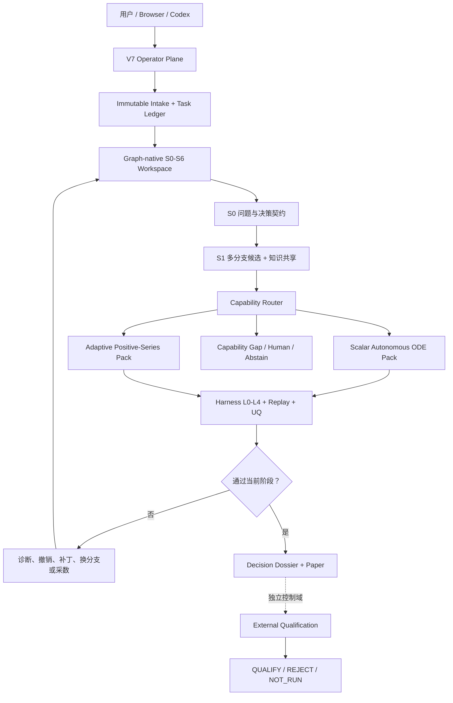

# FMA Trusted Modeling Agent

FMA 是一个由 Codex 驱动、由确定性 Harness 掌握验证权的数学建模 Agent。
它把问题定义、多方向候选、可执行模型、L0–L4 检查、失败恢复、任务运营和
外部资格协议放进同一张可审计的建模图中。

> English summary: FMA is a graph-native mathematical-modeling agent whose
> language models propose work while typed, fail-closed code owns evidence,
> verification, recovery, and workflow transitions.

当前版本：`0.3.0`（V7 Operator Plane）。

## 当前能做什么

| 能力 | 当前状态 |
|---|---|
| 任务附件与目标接入 | V7 内容寻址 Intake、幂等提交和完整 manifest |
| 问题定义 | Codex 角色生成，Harness 类型校验，独立 referee 复核 |
| 多方向建模 | S1 机制、空基线、统计、系统学习分支并行探索 |
| 任务内知识共享 | 受限 Knowledge Broker、来源绑定和迁移审计 |
| 可执行建模 | 已注册正值标量自治 ODE 与 adaptive positive-series 能力包 |
| 科学检查 | 输入绑定的 L0–L4、rolling-origin、基线、UQ 和支持域检查 |
| 失败恢复 | PATCH、RETRY、BRANCH、ACQUIRE_DATA、HUMAN、ABSTAIN |
| 运营连续性 | SQLite WAL、lease、heartbeat、fencing、reconcile、doctor |
| 界面 | 本地 Studio Bridge 与 Web 前端 |
| 外部科学资格 | 协议和验证器已实现；没有外部独立节点时固定为 `NOT_RUN` |

当前可执行后半链路仍是窄域能力：

- 至少 12 个严格递增时间点的正值标量序列，可进入自治 ODE 候选族；
- 至少 26 个观测的正值序列，可进入 adaptive positive-series 候选族；
- 注册骨架主要覆盖 constant、exponential、Gompertz、logistic、
  log-drift 与 log-growth AR(1)；
- 不兼容问题会返回能力缺口或弃权，不会静默换成另一个模型。

## 当前不能声称什么

FMA 还不是任意前沿数学问题的通用自动求解器。仓库中的本地运行、测试、
同机多进程和 Gate 证书均不能单独证明：

- 模型具有机制真实性或因果有效性；
- 结果已通过独立外部科学资格；
- 模型可以安全外推到未支持的人群、机制或时间范围；
- 系统获得现实世界、监管、财务或安全相关行动权限。

模型可以提出候选、诊断失败和运行允许的工具；Harness 独占输入冻结、
artifact hash、typed checks、图转移和撤销。外部科学资格仍需仓库外的
Custodian、Registry、Evaluator、Promotion Authority 和独立信任根。

## 架构



设计上的核心分工：

- 文件系统保存可移植、内容寻址的科学证据；
- SQLite 保存事务化的运营状态，不进入科学 manifest；
- Agent 负责提出和计算，Harness 负责承认或拒绝；
- 失败会形成新 attempt 和撤销闭包，不覆盖历史；
- 并行度来自隔离写集，而不是简单增加 Agent 数量。

## 三分钟开始

要求：

- Python 3.11 或更高版本；
- 完整 Studio 角色运行需要可用的 Codex CLI；
- Web 前端需要 Node.js 22.13 或更高版本。

安装 Python 包：

```powershell
git clone https://github.com/zx070326-hash/fma-trusted-modeling-agent.git
Set-Location fma-trusted-modeling-agent

python -m venv .venv
.\.venv\Scripts\Activate.ps1
python -m pip install --upgrade pip
python -m pip install ".[test]"
```

创建一个不带科学权限的运营 Intake：

```powershell
fma-ops --task-root .\tasks intake `
  --idempotency-key example-001 `
  --objective "Estimate and validate the dynamics described by the supplied data."

fma-ops --task-root .\tasks status
fma-ops --task-root .\tasks doctor
```

查看主要命令：

```powershell
fma-ops --help
fma-studio --help
python -m fma --help
python -m fma.v5 --help
```

运行精简后的公开契约测试：

```powershell
python -m pytest
```

启动前端：

```powershell
Set-Location frontend
npm install
npm test
npm run dev
```

本地 Studio Bridge 需要至少 32 字节、位于任务工作区之外的 authority key，
以及至少 24 字符的 `FMA_STUDIO_TOKEN`。完整参数请运行
`fma-studio --help`；密钥不得写入仓库或浏览器。

## 主要入口

| 入口 | 用途 |
|---|---|
| `fma-ops` | Intake、状态、Next Packet、reconcile 和 doctor |
| `fma-studio` | 仅绑定 loopback 的本地执行 Bridge |
| `python -m fma` | 早期可信建模内核和 benchmark 命令 |
| `python -m fma.v5` | S0–S6 工作区、Gate、撤销和论文构建 |
| `frontend/` | 面向任务、图、候选和证据状态的 Web 界面 |

## 仓库导航

```text
fma/
  operator_v70.py       # V7 事务化任务账本与恢复
  operator_cli_v70.py   # fma-ops JSON CLI
  studio/               # Codex 阶段驱动、HTTP Bridge、后半链路
  v5/                   # Graph-native S0-S6 权威工作区
  v5_8/                 # 多分支知识共享与认识图
  v6/                   # 能力包、恢复、科学成功与外部资格
frontend/               # Web 控制台
tests/                  # 精简的公开契约与 Operator 测试
```

公开主干刻意不包含运行数据库、完整 campaign 输出、历史实验 receipts、
迭代研究笔记和内部循环状态。这些文件不是运行 FMA 所必需的源码，也不应让
默认分支变成开发过程转储。清理前的完整 V6–V7 证据快照保留在
`evidence-archive-v7.0` tag；删除默认树中的过程材料不提高任何科学结论的等级。

## 关键文档

- [V7 Operator Plane](V7_OPERATOR_PLANE.md)：运营账本、租约、fencing、
  intake、reconcile 和权限边界。
- [V6 Graph-native Recovery](V6_GRAPH_NATIVE_RECOVERY.md)：失败诊断、
  撤销闭包和 attempt lineage。
- [V6.8 Capability Pack Factory](V6_8_CAPABILITY_PACK_FACTORY.md)：能力包
  manifest、typed IR 和输入绑定 verifier。
- [V6.9 Development Portfolio Lane](V6_9_DEVELOPMENT_PORTFOLIO_LANE.md)：
  多骨架比较与弃权。
- [V6.3 External Qualification](V6_3_EXTERNAL_QUALIFICATION.md)：外部预测、
  私测、promotion 和独立信任边界。
- [V6.1 Scientific Success Gate](V6_1_SCIENTIFIC_SUCCESS_GATE.md)：
  claim-relative 科学成功定义。
- [V5 Graph-native Stage Workspace](V5_GRAPH_NATIVE_STAGE_WORKSPACE.md)：
  S0–S6 工作区和 Gate 协议。
- [V5.6 Hybrid ODE](V5_6_HYBRID_ODE.md) 与
  [V5.7 Adaptive Positive Series](V5_7_ADAPTIVE_POSITIVE_SERIES.md)：
  当前两个窄域建模方向。
- [迁移说明](MIGRATION_README.md)：在新电脑重建开发环境。

## 公开验证范围

公开测试保留的是最小可信契约：

- 基础 trusted chain；
- V5 stage workspace、external harness、paper、scaffold 和 single-writer；
- V6 scientific success、external qualification、recovery、capability SDK
  和 portfolio runtime；
- V7 authority、ledger、intake、CLI 和 HTTP operator surface；
- 前端构建与 rendered HTML。

它们验证工程契约和回归边界，不构成现实数据有效性或外部科学资格。

## 许可证

仓库目前公开可读，但尚未加入开源 `LICENSE`。在许可证明确之前，公开可见
不等于自动授予复制、修改或再分发权。
