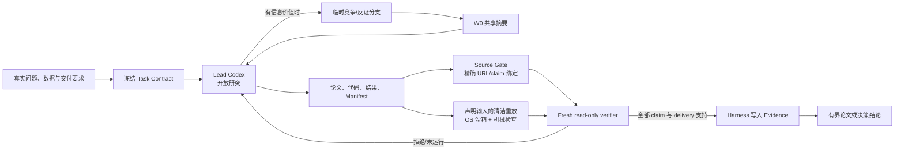

# THIN Modeling Agent

THIN 是一个由 Codex 原生驱动的开放数学建模 Agent。Codex 可以定义问题、搜索资料、提出任意模型、写任务代码、试错、并行探索和换方向；Harness 只控制不能交给同一个生成模型的部分：预算、任务本地权限、可复现执行、来源绑定、独立复核、证据承认、撤销和停止。

它不建设固定 S0–S6 流水线、永久角色群、模型族白名单、方法包工厂、向量数据库或证书栈。

## 架构



研究者只以 `<run>/work/` 为工作根。Harness 独占 `<run>/.modeling-agent/`、`<run>/sources/` 和 Evidence 承认权。生成者不能批准自己的 claim 或最终论文。

## 安装与宿主要求

需要 Python 3.11+ 和兼容的 Codex CLI：

```powershell
python -m pip install -e ".[test]"
python -m modeling_agent --version
codex --version
```

核心 Python 包没有第三方运行时依赖。

生产资格执行有两个强制宿主边界：

- Lead/branch 使用从 `:workspace` 扩展的 `modeling-workspace-only` 权限配置，默认拒绝根文件系统读取，只开放最小运行路径和任务工作根；启动模型前还会用真实命令验证“工作根可读、父目录 canary 不可读”，任一异常立即停止；
- 生成代码的独立重放复用同一个 workspace-only profile 与双 canary，再通过 `codex sandbox` 执行；不提供不安全回退。

可先检查本机沙箱：

```powershell
codex sandbox -P :workspace -C D:\some-empty-workspace -- python -I -c "print('ok')"
```

这条命令只检查底层 sandbox helper 能否启动；Harness 还会自动运行更严格的 workspace-only 父目录读取 canary。如果真实 OS 沙箱不可用或仍能读出父目录，研究会在启动 Lead 前停止；重放阶段也会返回 `UNSUPPORTED/NOT_RUN`，不会用普通宿主 Python 冒充隔离执行。

## 运行

允许公开网页研究：

```powershell
python -m modeling_agent solve `
  --workspace D:\runs\my-problem `
  --objective "在这里给出完整数学建模问题" `
  --network research-search `
  --max-attempts 3 `
  --max-seconds 1800
```

离线研究：

```powershell
python -m modeling_agent solve `
  --workspace D:\runs\offline-problem `
  --objective "问题原文" `
  --network offline-compute
```

恢复任务时继承冻结预算：

```powershell
python -m modeling_agent solve --workspace D:\runs\my-problem
python -m modeling_agent status --workspace D:\runs\my-problem
```

预算不能被默认参数静默扩大。确需增加时必须显式声明：

```powershell
python -m modeling_agent solve `
  --workspace D:\runs\my-problem `
  --max-attempts 5 `
  --max-seconds 3600 `
  --amend-budget
```

任务合同、模型标识和已有 Evidence provenance 不能在恢复时静默替换。外部调用开始前会保存 active attempt；进程异常中断后，该次尝试与最多其冻结调用预算会在恢复时计入累计消耗，不能靠重启清零。

## 运行目录

```text
<run>/
  .modeling-agent/          # Harness 独占
    task-contract.json
    run-state.json          # 恢复游标与 Evidence 头锚
    events.jsonl
    evidence.jsonl          # 有序哈希链；claim 与 revocation
    traces/
    verdicts/
  work/                     # Lead Codex 工作根
    task-contract.json      # 可校验镜像
    research/
    src/
    checks/
    data/
    results/
    paper/final.md
    submission_manifest.json
  branches/                 # 按需临时分支
  sources/                  # 版本化 Source Gate 记录
```

一个非阻塞 OS 文件锁保证同一 run 只有一个写入者。工作记录损坏只会使 Problem Graph 投影不完整，不会被提升为证据，也不会遮蔽已经验证的状态。

## 证据边界

| 层级 | 含义 |
|---|---|
| W0 | 搜索摘要、模型记忆、假设、工作记录、分支结论；只能指导研究 |
| E1 | Source Gate 对精确 URL、定位和具体 claim 的 fresh 模型复核记录 |
| E2–E3 | 机械检查、重放、基线、留出、反证或压力测试所支持的有界证据 |
| E4 | fresh、read-only、tool-free verifier 承认的本地证据上限 |
| E5 | 外部数据、外部评审或真实环境资格；本 Harness 不能自行授予 |

`SUPPORTED`、`PARTIALLY_SUPPORTED`、`UNSUPPORTED`、`INCONCLUSIVE` 和 `NOT_RUN` 分开保存。只有全部声明、依赖和最终 delivery 都被支持，且证据级别高于 W0，Harness 才能写入 Evidence 并报告完成。

当前 Source Gate 绑定精确 URL 的可观测 web query、短摘录、定位、来源类型和 claim ID；它保存的是带哈希的“模型复核记录”，不是网页原始字节或 WARC 归档。因此它能排除无 trace 的模型记忆式引用，但不能证明网页长期未变化。

Evidence 会绑定完整复核工件集合，包括输入、生成器、检查器、结果、完整交付文档、Manifest、Task Contract 以及 source/verifier 原始 trace。交付文档必须由合同中的 `delivery_artifact` 明确指定，并完整装入有界 verifier packet；超出 packet 上限时返回 `NOT_RUN`，不会只审开头。任何已绑定项之后变化，delivery 变为 `stale`；恢复时追加 revocation 并清空旧的 verified delivery。Evidence 记录自身被编辑、删除、截断或重排时报告 `corrupt`。

## 弹性探索

默认只有一个 Lead。Lead 只有在竞争模型、简单基线、反证或压力测试具有信息价值时才申请临时分支。分支互相隔离，只通过波次结束后的只读 W0 摘要共享结论；失败与反例会保留，不会覆盖。

## 消融

```powershell
python -m modeling_agent eval `
  --output D:\runs\experiment\ablation.json `
  --objective "冻结的私有未见任务"
```

五个递增臂为 `raw_codex`、`codex_web`、`source_gate`、`hard_eval` 和 `elastic_memory`。只有冻结未见任务证明组件提高建模质量、来源蕴含、复现、正确弃权或换向质量，组件才应保留。

## 验证

```powershell
python -m pytest tests/test_thin_modeling_agent.py -q
python -m pytest
python -m ruff check modeling_agent tests
python -m modeling_agent --version
python -m modeling_agent --help
```

内部测试只证明实现语义，不证明建模效果或外部科学资格。当前机器还必须单独通过 Codex CLI 启动、权限配置和 `codex sandbox` 现场探针，才能运行真实资格实验。详细设计见 [架构文档](docs/architecture/THIN_MODELING_AGENT.md)。
