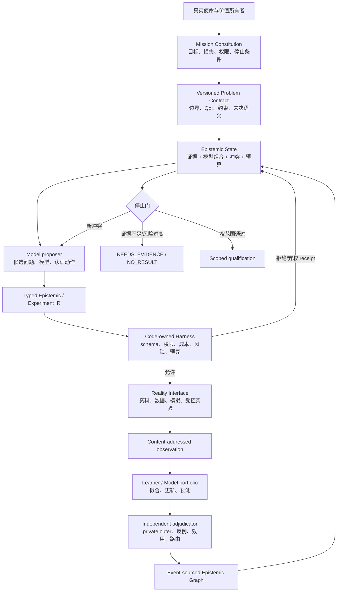
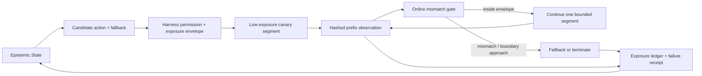
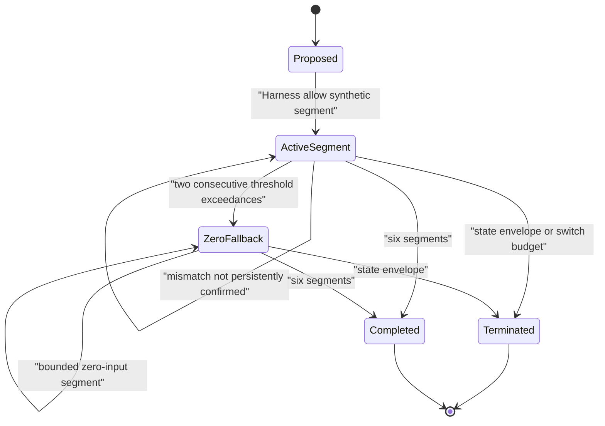
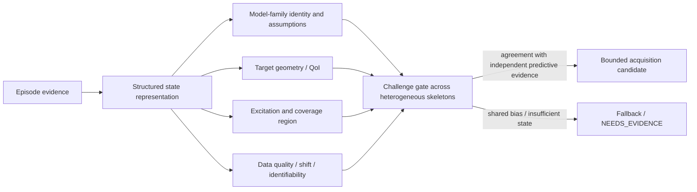
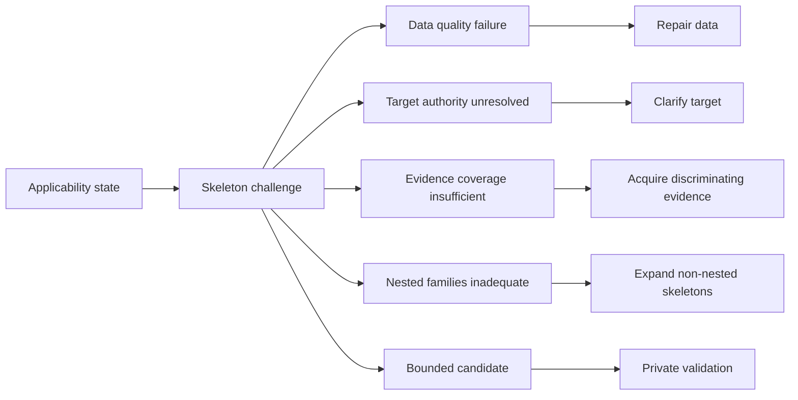
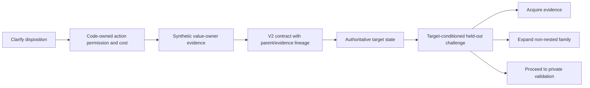
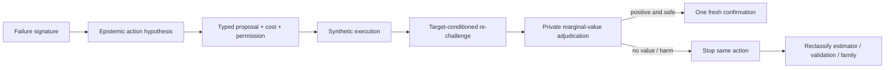
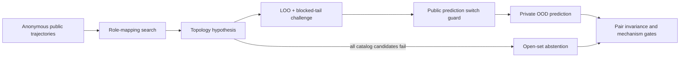

# FMA V3.1：目标导向的受控认识系统

## 第一性原理结论

当前 FMA 不是最终最好的数学建模 Agent 形态。它更准确的定位是：**可信证据与权限内核**。最终形态应是一个受治理的认识控制系统，在每一步选择“最能降低终端决策损失、同时满足权限/成本/风险约束的认识动作”，而不是一条固定的“读题—选模型—求解—写报告”流水线。

形式化目标是：

`a_t* = argmin_a E[terminal_decision_loss | K_t, a] + cost(a)`

subject to：动作类型、来源、预算、执行器、峰值、能量、切换、数据质量和风险门全部由 Harness 验证。`K_t` 包含使命、当前 episode 契约、证据、模型组合、冲突、预算和权限状态。

## 目标架构



## V3.1 新增的关键组件

| 组件 | 能力 | 功效 | 当前边界 |
|---|---|---|---|
| `KnownActuatorMapV31` | 冻结状态—输入矩阵 `B` | 明确哪些变化来自已知输入，避免把执行器效果误学成漂移 | 不推断未知 `B` |
| `PiecewiseConstantInputActionV31` | 类型化分段常值输入 | 代码复算峰值、能量、切换和成本 | 只支持有限目录、单输入 |
| `ExperimentConstraintEnvelopeV31` | 绑定动作与状态边界 | 两臂同物理预算；越界 fail closed | 状态风险是经验代理 |
| `ExperimentAcquisitionReceiptV31` | 分开记录 D-opt、模型分歧、目标信息、成本、风险 | 避免一个不可审计综合分数掩盖权衡 | 当前目标信息代理仍未校准 |
| `ExperimentPermissionDecisionV31` | 代码级 allow/deny/abstain | 无可接受动作、数据失败或预算不足时停止 | 不构成形式化安全证书 |
| `ControlledDynamicsContractV31` | 版本化预测目标 | 目标未知时先向授权价值所有者澄清 | 只验证两个合成 QoI |
| `ControlledDriftModelV31` | 从导数中扣除已知 `Bu(t)` 后拟合漂移 | 将控制输入与自主机制分开 | 二次多项式库；无结构可辨识性证明 |
| Cross-layer router | `problem/data/model` 路由 | 失败回到正确层，而不是只换算法 | 模型错配检测仍失败 |
| Private WorldPack adjudicator | 同预算、隐藏 probe、负迁移和路由门 | 防止策略给自己打分 | 仍是合成覆盖，不是现实外部有效性 |

## V3.1 与 V3.1.1 的真实实验含义

- V3.1 两步协议失败：问题澄清会把二维系统压缩到一次输入实验；宏改善 `-0.04786`，6/18 次实质负迁移。
- V3.1.1 只把 horizon 从 2 改为 3；阻尼振子均值从 `-0.18524` 变为 `+0.25928`，宏均值变为 `+0.10191`。
- 但 V3.1.1 仍失败：95% bootstrap 下界 `-0.02469`，6/18 次实质负迁移；Duffing 三次项也没有被当前局部训练残差路由发现。

这说明“认识动作可执行”不等于“认识动作值得做”。下一核心组件不是更多模型名称，而是：

1. 用目标 probe 的预期后验风险替代当前启发式 acquisition；
2. 加入独立于训练残差的模型错配/外推诊断；
3. 把问题澄清的 action debt 与最小实验充分性写入预算规划器；
4. 只有这些门在全新 private pack 上通过后，才考虑开放世界数据和现实实验接口。

## 为什么仍采用单 Orchestrator

当前失败来自效用代理和诊断，不是覆盖率或吞吐瓶颈。多 Agent 不会自动修正一个错误的 acquisition objective，反而会增加共享错误和审计面。因此保持一个提议者，配代码拥有的 Harness 和独立 adjudication task；只有单循环在可复现评测上出现分解收益时才增加 worker。

## “最好形式”的判据

一个形态只有同时满足以下条件，才比当前架构更好：

- 在相同现实/计算/人类注意力预算下，终端决策损失更低；
- 负迁移和错误晋级率受预冻结上界约束；
- 问题、数据、模型和决策层错误能被正确路由；
- 每次动作都有可重放的权限、成本、来源和结果；
- 失败可以成为下一版组件/eval，而不是被对话解释掉；
- 能明确输出 `NO_RESULT`，且资格严格限于证据覆盖域。

因此结论是：**V3.1 是正确方向上的下一层，不是终局；“认识控制器 + 可信 Harness + Reality Interface + 独立裁决 + 可撤销证据图”才是目前第一性原理下的目标骨架。**

## 大迭代 11 后的修正：Reality Interface 必须可中断

V3.2-V3.3.2 的四组新鲜 WorldPack 说明：即使目标风险、资源公平、两个真实锚点、交叉激励验证和配对 bootstrap 全部加入，纯离线 selector 仍可能在 12/12 内部模型一致时选择灾难动作。内部不确定性只描述当前模型族，不能排除整个模型族共同错误。

因此目标架构中的 `Reality Interface` 不能只是“提交完整动作，结束后返回观测”的一次性函数。对可分段、可撤回的动作，它必须成为受 Harness 控制的流式协议：



新增的不变量应为：

- 每个 segment 执行前重新授权；未来权限不能由过去一次 allow 决定；
- 真实暴露按持续时间、输入能量、峰值、切换、状态边界距离和不可逆成本分别计量；
- 前缀失配只能收紧权限，不能因为模型“更自信”而放宽安全 envelope；
- fallback 本身也必须预冻结、可执行且计入同一资源账本；
- 终端效用仍由独立 adjudicator 评估，在线 mismatch gate 不得读取 private target loss；
- 不可中断或不可逆现实动作必须停在人工审批/外部安全认证之前，不能用 synthetic 结果自动授权。

这使“最好的形式”进一步收敛为：**模型负责提出可检验的动作，Harness 负责把动作拆成最小可逆暴露，Reality Adapter 持续返回证据，权限随证据逐步收紧或延续，独立裁决只在事后决定是否扩大资格。**

## 大迭代 12 后的实现：提议权与执行权分离

V3.4/V3.4.1 已把上面的抽象边界落成四个 code-owned 组件：

| 组件 | 能力 | 功效 | 当前边界 |
|---|---|---|---|
| `OnlineMismatchCalibrationReceiptV34` | 用两个共享锚点做 leave-one-anchor-out 逐段预测，并冻结 12 个 segment NRMSE 的最大值 | threshold 来自 episode 内 public evidence，不读 hidden probe | 不是概率校准或置信上界 |
| `SegmentAuthorizationReceiptV34` | 每段封存预测、观测、失配、权限前后、累计暴露和决定 | 可重算何时继续、降权或终止；禁止重新升级 | synthetic segment；无物理实时性证明 |
| `ExecutedInterventionV34` | 记录真正执行的输入前缀/零 fallback、是否中断和终态 | 把 proposed action 与 executed action 分开，避免事后把计划冒充执行 | fallback 只有零输入代理 |
| `InterventionExposureLedgerV34` | 分别计量时长、能量、峰值、切换、segment 和 state ratio | candidate 必须逐 case component-wise 不超过 baseline | 无人类注意力、设备磨损或不可逆成本实测 |

执行状态机是：



关键语义是 `proposed_action != executed_intervention`。模型和 acquisition selector 只能提供前者；Harness 根据 segment receipt 构造后者。Learner 必须拟合实际输入序列，不能继续用原 proposal hash 解释混合轨迹。

### 两次实验给出的设计判据

- 单次失配越界不是足够的权限变化证据。V3.4 的唯一切换轻微伤害 target loss，因此被正式拒绝。
- 两次连续越界是当前最小存活规则。V3.4.1 在新种子上通过全部预冻结门，但只有一次中断，故只授权 acquisition retest。
- Runtime Adapter 的任务不是证明 proposer 正确，而是在 proposer 可能错误时限制暴露并产出可复算证据。
- 正确的下一层对照不是继续测试 Adapter 对自己，而是比较 shared-random acquisition 与 `V3.3.2 proposer + exact V3.4.1 Adapter` 的终端效用。

因此第一性原理下“当前最好的形式”可以更精确地写成：

`Model proposer -> typed plan -> code-owned segment authority -> streaming Reality Adapter -> actual-intervention learner -> private adjudicator -> scoped promotion/revocation`

它优于 batch Agent 的原因不是模块更多，而是四种责任不再能相互冒充：提议不等于许可，许可不等于执行，执行不等于有效，局部通过不等于整体资格。

## 大迭代 13 后的修正：迁移需要充分的 episode state

V3.5 三臂 factorial 和 V3.6 OutcomeCalibrationLedger 证明，interaction layer 通过后，错误 acquisition 仍不会自动变对：

- `random -> acquisition` 描述 selector 主效应；
- `acquisition -> guarded acquisition` 描述 Adapter moderation；
- `random -> guarded acquisition` 才是可部署 package 效应；
- 三者必须同包、同 anchor、同 noise、同 private outer 计算，不能用两个不同实验的均值相减冒充交互效应。

V3.6 把历史 q20 与真实 outer gain 写入 ledger，并严格分开训练/新测试，但 scalar cutoff 仍失败。这揭示目标状态 `K_t` 不能只有“一个更好的 confidence”：



下一代状态至少要区分：模型族与假设、目标算子、被数据实际激励的区域、外推距离、数据/传感器质量、可辨识性和历史失败域。只有在这些条件上相似，OutcomeCalibrationLedger 的迁移样本才可合并。

因此“骨架与演化方式”还缺一个决定性中项：

`建模能力 = skeleton portfolio + applicability state + evolution operators + reality/evidence adjudication`

没有 applicability state，骨架检索只是类比；没有异质 challenge，ensemble 只是同一偏差的复读；没有 Reality Adapter，错误动作无法及时收权；没有 private adjudication，历史 ledger 会把训练成功冒充现实资格。

## 大迭代 14 后的修正：Challenge 必须产生认识动作

V3.7 证明，结构化 applicability state 和多个 family 的 held-out challenge 仍可能只得到大量 `NEEDS_EVIDENCE`。一个只会 pass/fail 的 gate 不能独立建模；它必须把失败类型转换成受治理的下一认识动作：



V3.7.1 还暴露了评价器的系统性风险：如果 generator 和 evaluator 都从同一个不完整 state 读事实，两者会共享盲点并制造满分。因此独立评价不只意味着“另一个函数/模型”，还要求 **独立重建关键事实**。修正版 evaluator 直接从冻结 public contract 重算 target authority，而不是相信 generator 派生的 target state。

当前更完整的公式是：

`建模闭环 = applicability state + skeleton portfolio/challenge + typed disposition + bounded epistemic action + reality/private adjudication`

V3.7.1 只验证 disposition，不执行 action。下一层必须逐类测试：澄清是否真的修复目标、额外实验是否提升 target-conditioned coverage、非嵌套 family 是否减少 Duffing 型错配，以及每种动作是否值得其成本。

## 大迭代 15 后的修正：澄清是状态变换，不是对话文本

V3.8 把 `clarify_decision_target` 实现为受限认识动作，而不是让模型重写 prompt：



39 个目标未确认 case 的准确率从 `1/3` 提升到 `1`，证明状态更新、lineage 和 challenge conditioning 在合成边界内可执行。它没有证明选出的模型好：18 个被选模型的 private target loss 仍偏高，21 个案例继续弃权。

因此目标澄清的功效是**删除一个认识不确定性来源并重新定义相关证据**，不是自动减少所有模型不确定性。下一层必须组合执行 discriminating acquisition 与 non-nested family expansion，并用 shared-budget private outer 比较其边际价值。

## 大迭代 16 后的修正：认识动作也需要价值函数和停止证明

V3.8.1 证明，正确的 failure-to-action 路由不能止于动作类型。它还需要：动作前的价值假设、同预算对照、动作后的目标条件重挑战，以及失败后不可绕过的 stop/reclassification。



本轮 maximum-disagreement acquisition 与 random baseline 在 fresh 22 cases 上都 0 resolved。这说明 action selector 再聪明，也无法修复错误的认识层归因。`NEEDS_EVIDENCE` 必须携带可证伪的因果假设；否则 Agent 会把“我不知道”错误翻译成“再买一次数据”。

因此当前更好的形式是：

`state -> challenge -> causal failure hypothesis -> bounded epistemic action -> target re-challenge -> marginal-value adjudication -> promote | stop-and-reclassify`

它仍不是最终最优形式：目前 action ledger 只在各方言内实现，尚未统一；非嵌套 skeleton、validation-semantics calibration 和跨域动作迁移仍未完成。

## 大迭代 17 后的修正：重放一致不等于语义独立

V3.7–V3.8.1 的 generator、evaluator 和 verifier 都调用同一个错误输入适配器，所以哈希、事件链和全重放全部可以通过，同时给出错误科学结论。V3.9/V3.9.1 将“独立评价”进一步拆成：

```text
独立事实重建 + 独立表示契约 + 独立分母定义 + 独立终端裁决
```

Validator 的每个 fold 现在保存 observation 表示、simulator 表示、action-hash lineage、segment 数和 binding hash。Evaluator 的 case partition 只能由公开 quality flags 决定，不能用 private mechanism/performance 标签删掉困难 case。

因此可信闭环必须增加一个此前缺失的层：

`typed semantic adapters -> contract tests -> generator/evaluator implementation diversity -> private adjudication`

只写两个不同函数不构成独立性；如果它们共享同一个错误 adapter，第二个函数只是重复第一份盲点。下一步 skeleton factorial 必须使用已恢复的 input contract，并把 Duffing 高损失作为显式失败域，而不是重新调低验证门。

## 大迭代 18 后的修正：骨架必须包含状态拓扑，切换必须有证据

V3.7 的 linear/quadratic/cubic 只是同一多项式库的嵌套容量，不是充分的 skeleton portfolio。V3.10 将模型搜索拆成三个正交轴：

```text
state topology / equation constraints
× parameter estimator
× temporal validation semantics
```

结构候选把 `position' = velocity` 作为代码可检查的方程约束，只估计 force law；积分估计器用窗口积分避免显式导数；LOO 与 blocked-tail 分别检验跨输入实验和时间外推。39个fresh性能case中，公开规则在28个case选择结构骨架、11个case保留通用多项式，private均值从 `0.352936` 降至 `0.016675`，且预注册材料性负迁移为0。

开发诊断还证明“one-standard-error + parsimony”本身不够安全：统计等价时偏爱结构模型曾制造一次小但材料性的负迁移。最终选择器增加公开switch guard：新候选的LOO均值加一标准误必须优于当前基线均值，否则不切换。由此得到新的最小决策结构：

`semantic adapter -> topology hypothesis -> estimator -> dual temporal challenge -> public switch evidence -> private adjudication`

V3.10依然不是自主骨架发现。公开变量名包含 `position/velocity`，结构骨架由开发者预先给定，状态完全观测。下一步需要把变量标签当作不可信提示，在匿名/置换/缩放状态和未见跨域机制中，从可检验的导数关系、守恒量和干预响应提出 topology hypothesis；若不能区分，必须弃权而不是按名称路由。

## 大迭代 19 后的修正：拓扑应对坐标表示不变，目录外失败必须可表达

V3.11 将 observation representation 与 hidden mechanism 分成两个 typed world packs。Generator 只看到匿名坐标和公开轨迹，在所有 role mappings 上挑战 rate、kinematic、population、compartment、generic 和 decoy topology；Evaluator 才能把成对 reference/scaled-permuted 表示还原到同一隐藏物理 case。



正式 70-case 性能分母中，topology accuracy、14 个 pendulum open-set 弃权和 28 个 representation pairs 的 topology consistency 均为 1；0 次材料性负迁移。它给出的新最小结构是：

`anonymous observation -> role/topology hypothesis -> dual public challenge -> switch | abstain -> private representation-paired adjudication`

本轮还修复了哈希无法覆盖的时间治理缺口。第一个开发包把审计时钟写到未来；内容可重放但时间因果不成立。当前 verifier 额外要求 `public protocol <= private spec <= report`，且运行时钟不得比墙钟超前五分钟。可信证据因此至少需要：

`content integrity + typed lineage + causal event order + plausible audit clock`

V3.11 仍没有骨架发明：成功的四类 topology 全由开发者冻结，pendulum 只能拒答。下一层不能只把 `sin` 硬编码进目录，而要实现 bounded open-set evolution：从残差签名提出概念、在 allowlisted expression grammar 内组合、确定性拟合常数、用 accuracy/complexity Pareto 与公共 OOD 检验挑战，最后由私有 WorldPack admission 或 revoke 概念。LLM 可以提出 concept，不能批准它进入长期知识库。
