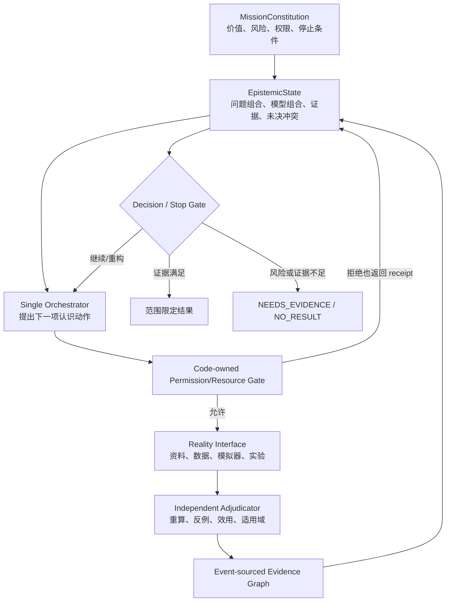

# FMA V3：受治理的认识控制系统

## 目标形态

V3 不把“一个被冻结的问题契约”当作永久真相。它冻结稳定的使命和权限；每次建模 episode 的问题契约仍然不可变、可重放，但新证据可以产生一个显式 supersede 它的子契约。

## 双层契约

### `MissionConstitution`

稳定并由 Harness 持有：使命、价值所有者、允许/禁止动作、预算、现实行动权限和停止条件。模型不能修改。

### `EpisodeProblemContract`

单个 episode 内冻结：决策变量、目标语义、约束语义、系统边界、适用域、证据来源和未决字段。修订只能创建新版本，并绑定：

- 父契约 hash；
- 触发证据 hash；
- 结构化修订原因；
- 仍未解决的字段。

旧版本保留，禁止原地改写。

## 模型与 Harness 的责任

| 模型可以提出 | Harness 必须独占 |
|---|---|
| 问题假设、模型候选、资料查询、取数或实验动作 | 类型、权限、预算和资源范围检查 |
| 何处存在冲突、哪项证据可能最有价值 | 工具执行、每次拒绝/超时/error receipt |
| 新问题契约草稿及 supersede 理由 | 契约封存、父子绑定、事件链 |
| 停止或决策建议 | 独立重算、private eval、晋级/撤销 |

## V3.0 最小垂直切片

V3.0 只验证一个第一性原理断点：问题语义缺失时，系统能否在“多采同类数据”和“澄清问题”之间做决策价值选择。

- 任务：离散容量决策；公开 pilot demand 相同。
- 可变问题语义：平衡损失、短缺高代价、过量高代价。
- 认识动作：再采一批需求，或从授权来源取得损失语义。
- baseline：固定契约后继续采样。
- candidate：若候选语义导致不同最优决策，先澄清并生成子契约；语义已知时继续采样。
- 公平性：同一初始数据、一次动作、相同动作成本、相同容量求解器和隐藏评测。
- 真实权限：全部 `shadow_only`，不执行现实容量动作。

这不是前沿开放建模能力的证明，而是从“线性验证器”升级到“可重构认识闭环”的首个协议证据。

## 后续扩展顺序

1. 将认识动作 IR 接入已知 actuator 的有界输入实验；
2. 把模型组合和问题组合统一为可反驳的 claim graph；
3. 引入模型判别、决策敏感度和风险约束 EVSI；
4. 用含错误题目定义、缺失变量和不可识别机制的跨方言 WorldPack 验证；
5. 单循环在覆盖率或吞吐上出现可复现瓶颈后，才消融并行 worker 或多 Agent。
