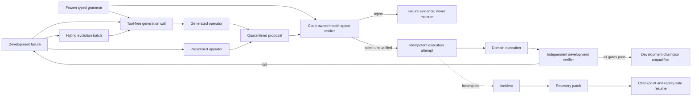

# FMA V4.2 Graph-native Open Evolution Protocol

状态：`initial_protocol_frozen / real development vertical slice implemented`

## 1. 目标

V4.2 在不改变 V4.0/V4.1 既有工件、哈希和晋级语义的前提下，增加一个统一的
Graph-native Open Evolution Kernel。它必须同时证明：

1. 模型空间可以由冻结 primitive grammar 组合扩建，而不是只能在 family 白名单中选择；
2. 规定性演化和模型生成式演化可以同时提出候选，但共享同一个代码所有 verifier；
3. 未完成 run 可以通过图内 `incident → recovery_patch → checkpoint` 恢复；
4. 恢复、模型准入和开发冠军均不能授予科学 qualification 或现实执行权限。

V4.2 首个切片仍是开发期内核，不是开放数学发现能力或真实科学有效性证明。

## 2. 一个逻辑 Graph，六个类型化视图

```text
scientific: problem → evidence → model proposal → development evaluation
model-space: grammar → quarantined proposal → validation → admission
evolution: failure → prescribed/generated operator → child proposal
execution: admission → idempotent attempt → execution → evaluation
recovery: pending attempt → incident → patch → checkpoint → resumed attempt
trust: verifier decision → development champion, never qualification
```

这些视图共享同一条 tamper-evident event chain。任何改变候选、执行前沿、恢复状态或
最终开发结论的动作，都必须产生 Graph node、edge、outcome 和内容寻址工件。



## 3. 模型空间协议

### 3.1 冻结 grammar

grammar 定义：

- seed family，仅用于约束 generation 0；
- typed primitive：输入单位、输出单位、arity 和使用上限；
- symbol/application 复杂度预算；
- 可用 executable adapter；
- 禁止进入生成候选的 token；
- grammar 内容哈希。

grammar 不包含允许的最终 family 白名单。generation > 0 可以提出新 family，只要它能
由冻结 primitive 组合，并通过代码所有的结构 verifier。

### 3.2 隔离候选

模型或 Harness 只能创建 `model_proposal`。候选在准入前必须通过：

```text
lineage_valid
primitive_allowed
arity_valid
symbols_resolved
units_valid
acyclic
complexity_budget
executable_adapter_available
no_forbidden_token
private_data_absent
```

失败 proposal 仍保留在 Graph，并产生 model-space failure signature；它不能进入执行。
通过 proposal 获得 `admitted_for_development_unqualified` receipt，但仍无 qualification。

## 4. 混合演化协议

每个 development failure 同时允许两条 channel：

- `prescribed`：代码或领域 adapter 提供的可靠修复算子；
- `generated`：模型提出的新机制、结构组合或 family。

Harness 冻结每条 channel 的配额、候选总预算、generation 预算和去重规则。两类 proposal
都必须经过同一个 model-space verifier 和 development evaluator。模型不能：

- 修改 grammar；
- 修改 evaluator epoch 或 required gates；
- 读取 private confirmation；
- 自己准入候选；
- 自己冻结冠军或晋级。

## 5. 恢复协议

### 5.1 防范

- 每次 execution 使用由 `spec_hash + candidate_hash` 派生的幂等键；
- adapter 必须声明并遵守 local/replay-safe execution contract；
- execution attempt 在实际调用前先成为 Graph node；
- 已提交 execution 工件但尚未写 outcome 时，恢复只补写 outcome，不重复执行；
- 每个 admission、evaluation 和 reconcile 阶段写内容寻址 checkpoint；
- 最大恢复次数由冻结 spec 限制。

### 5.2 补丁

检测到 incomplete run 时，Harness 必须追加：

1. `incident`：记录事件 tip、pending nodes、最近 checkpoint 和中断事实；
2. `recovery_patch`：记录 `reconcile_from_committed_graph` 策略、幂等范围和防范控制；
3. `checkpoint`：记录 reconcile 后的可恢复前沿。

旧工件不覆盖、不删除。需要作废时只能追加 `invalidates` 或 `supersedes` 关系。

### 5.3 恢复边界

首个 V4.2 内核只允许恢复：

- local compute；
- content-addressed artifact writes；
- 同一冻结 spec、grammar、evaluator epoch；
- adapter 明确声明的 replay-safe 幂等执行。

任何 external、destructive、financial、regulated 或幂等性不明确的动作必须停止，不能
由自动补丁重试。

## 6. 不变量

1. Model proposes; Harness validates, admits, executes, reconciles and records.
2. Verifier 独立拥有 model-space validation、development evaluation 和 champion freeze。
3. 每个 tool/execution attempt 最终必须有成功、失败、阻塞或仍 pending 的可查询状态。
4. 生成式 proposal 与规定性 proposal 使用相同准入和评价门。
5. 完成后 resume 为字节级 no-op；未完成 resume 必须留下 recovery Graph 证据。
6. private confirmation、scientific qualification 和现实动作在本协议中永久为 false。

## 7. 首个实现验收

- 新 family 不在 seed family 中，但由 grammar primitive 合法组合并成为开发冠军；
- 同一 failure 至少产生一个 prescribed 和一个 generated operator；
- 一个单位错误或结构非法的生成候选在 model-space gate 被拒绝且从未执行；
- 在 execution attempt 后注入中断，第二次运行写入 incident、patch、checkpoint 并完成；
- 恢复使用同一 idempotency key；
- 第三次运行为 byte-for-byte no-op；
- Graph replay、专项测试和全仓回归通过；
- 无 promotion、qualified、active 或 private confirmation artifact。

## 8. V4.2.1 生成调用成为 Graph 内对象

真实 generated channel 不直接把模型文本变成候选。Harness 先构造
`OpenEvolutionGenerationRequestV42`，其中只包含：

- 公开 primitive grammar 与复杂度预算；
- 失败父候选的非权威视图；
- 脱敏 failure signature；
- development-only metrics；
- adapter 的结构编译提示。

请求永久冻结 `private_evidence_exposed=false`、
`authority_fields_exposed=false` 和 `tools_permitted=false`。Codex 严格响应只允许
候选草案字段，不允许 parent、hash、admission、evaluation、promotion 或 qualification。
Harness 再绑定 lineage 和内容哈希，并把请求、响应及 transport 标志封装成
`GenerationCallEvidenceV42`。

每次调用在同一模型 Graph 中形成：

```text
failure + hybrid batch
        ↓
generation_call evidence
        ↓
generated operator
        ↓
quarantined model proposal
        ↓
code-owned validation
```

响应 request hash 错绑、工具事件、scratch 改动、私有/权威标志不为 false 或未密封证据，
都会在进入 operator 前 fail closed。

## 9. V4.2.1 真实事件过程编译器

`event_process_open_v42` 不使用模型给出的 family 名称选择求解器。它从最终
`intensity: rate_per_day` 向上遍历完整 expression DAG，并按 primitive 拓扑识别：

- homogeneous Poisson；
- Weibull renewal；
- single-exponential Hawkes；
- two-timescale Hawkes。

所有 application 必须可达最终 intensity；未使用分支、重复 producer、非法单位、非法
arity 或无法执行的拓扑均被隔离。双时间尺度 Hawkes 的实际强度为：

```text
lambda(t) = mu
          + n_fast * d_fast * sum(exp(-d_fast * lag))
          + n_slow * d_slow * sum(exp(-d_slow * lag))
```

MLE 使用 `background + total branching + fast fraction + fast decay + slow decay`
参数化，冻结 `total branching < 0.95`，并新增 component identifiability 门。family 名称
因此只是可审计标签，不是绕过编译器的执行权限。

## 10. Iteration 26 真实开发纵切

真实 Codex CLI 在单指数 Hawkes 的 `parameter_boundary` 失败后提出
`bi_exponential_hawkes`：两个 exponential-memory 分支先相加，再与 background 相加。
Compiler 按拓扑将其识别为 `two_timescale_hawkes`，完成真实 MLE 与 chronological
development validation。

生成候选的 validation lift 为 `+0.113164 nat/event`、KS p-value 为 `0.371758`、
count error 为 `1.7446%`，但 fast decay 再次达到 `10/day` 上界，因此未过
`parameter_interior`。规定性 Weibull 分支通过全部九个开发门并成为
`development_champion_unqualified`。Graph 包含 38 nodes、55 edges、38 outcomes 和
307 events；模型调用 1 次，工具事件 0，完成后 resume 字节级 no-op。

这证明的是“真实 Codex 草案 → 图内调用证据 → 拓扑编译 → 数值拟合 → 独立开发门”的
纵向闭环。它仍不证明任意公式发明、地震预测有效性或科学 qualification；本轮没有使用
新的 private confirmation。完整预注册与证据见
[Iteration 26](experiments/iteration_26/RESULTS.md)。

## 11. V4.3 声明式 Registry 与递归结构演化

V4.3 解除 V4.2.1 的两个实现瓶颈：

1. compiler 不再为每个 Hawkes 分量数硬编码一个 family；
2. generated child 的开发失败可以在同一 Graph 中再次触发 generation call。

`TopologyCompilerRegistryV43` 使用参数化规则识别一个 background、K 个
`exponential_memory` 和 K 个 `add_rate` 的连通表达式树，其中 `1 <= K <= 4`。
Compiler 验证所有 application 可达 intensity、每个中间结果只消费一次、各分量参数互异，
并继续完全忽略 family 标签。K1 至 K4 由同一个 `exponential_mixture_hawkes` executor
完成 `2K+1` 参数的多起点最大似然拟合。

递归链路为：

```text
candidate evaluation failure
        ↓
generation_call evidence
        ↓
generated child candidate
        ↓
registry compile → fit → independent evaluation
        ↓
new failure → next generation_call
```

Iteration 27 的真实链路为 K1→K2→K3。K2 的开发集预测与校准改善，但 decay 仍撞到
冻结边界；K3 新增慢分量与已有慢分量 decay 比仅 `1.000415`，触发
`component_identifiability`，BIC 也恶化。规定性 Weibull 成为未获资格开发冠军。
Graph 包含 51 nodes、77 edges、51 outcomes、417 events 和两个 generation-call
evidence；replay 与完成后 no-op resume 通过，private confirmation 未使用。

当前“失败后恰好新增一个分量”仍由冻结 prompt 指导，尚未成为独立代码拥有的结构差分
合同。下一版应增加 Graph-native `MutationContract`，显式验证 expected/observed delta，
再扩大 primitive 语义与 private benchmark。完整证据见
[Iteration 27](experiments/iteration_27/RESULTS.md)。

Iteration 27 收口验证：新增专项 `7/7 passed`，V4 回归 `31/31 passed`，全仓回归
`269/269 passed`；三个层级均无 failure、error 或 stderr。
