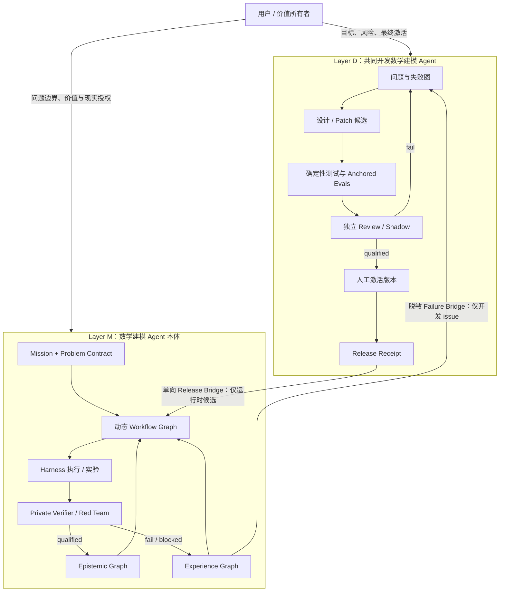
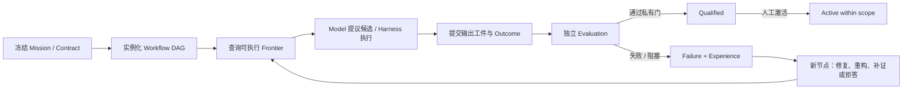
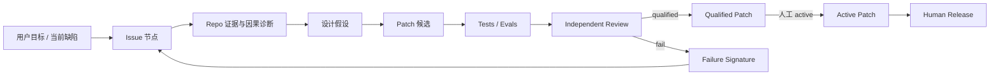

# FMA V4：Graph-Native 双层闭环架构

状态：`V4.2 initial open-evolution kernel implemented / real open-domain qualification pending`

## 1. 架构结论

V4 不把 Graph 当成 Loop 的替代品，也不把“多 Agent”当作默认答案。统一抽象是：

> Graph 是可查询、可回放、可撤销的状态与因果结构；Loop 是在该结构上选择前沿、执行动作、验证结果并提交状态转移的控制策略。

同一抽象用于两个严格隔离的层：

1. **建模产品层**：让数学建模 Agent 能从问题契约出发，生成、运行、批评、修正和积累可迁移经验。
2. **Agent 开发层**：让用户与 Codex 共同开发 FMA 的过程，也成为有问题节点、补丁节点、验证节点、版本晋级和回滚的受控闭环。

两层共享机制，不共享权限。开发测试通过只说明“软件候选合格”，绝不自动成为“科学结论可信”；产品运行成功也不能反向批准代码或修改 evaluator。

## 2. 第一性原理

一个可持续建模系统至少需要六个对象：

\[
\mathcal{L} = (G_t, F_t, \Pi_e, H, V_e, B)
\]

- \(G_t\)：时刻 \(t\) 的类型化图状态；
- \(F_t\)：由依赖、状态和权限共同计算出的可执行前沿；
- \(\Pi_e\)：在 evaluator epoch \(e\) 内冻结的前沿选择策略；
- \(H\)：确定性 Harness，负责工具执行、工件提交和权限检查；
- \(V_e\)：与生成侧隔离的 evaluator；
- \(B\)：节点数、执行数、失败数、晋级数等硬预算。

一次内循环是：

\[
a_t=\Pi_e(F_t,G_t) \rightarrow o_t=H(a_t)
\rightarrow v_t=V_e(o_t) \rightarrow G_{t+1}=Commit(G_t,o_t,v_t)
\]

外循环优化的不是一句 prompt，而是候选模板、路由策略、技能组合、验证规则或 Harness 版本。外循环只能在新 evaluator epoch 中用 anchored regression、held-out cases 和 shadow run 验证后晋级，不能一边看当前确认集，一边改门槛再宣布通过。

## 3. 总体架构



### 不允许的捷径

- `development release -> scientific validity`：禁止；
- `product success -> code approval`：禁止；
- `model output -> qualified/active`：禁止；
- `raw experience -> epistemic knowledge`：禁止；
- `private acceptance data -> generator/dev loop`：禁止；
- `当前确认集失败 -> 当场改 evaluator -> 同集宣布成功`：禁止。

## 4. 产品层：Graph-Native Modeling Loop

### 4.1 三种图，不混成一张“万能知识图”

| 图 | 保存什么 | 谁能写入 | 主要用途 |
|---|---|---|---|
| Workflow / Computation Graph | 本次任务的步骤、依赖、分支、执行者和前沿 | Model 仅能提议；Harness 提交执行事件 | 规划、调度、并行、恢复 |
| Experience Graph | 尝试、工件、失败签名、修复关系、成本、效用和因果 lineage | Harness 根据真实执行 receipt 写入 | 跨任务检索、frontier ranking、失败迁移 |
| Epistemic Graph | 来源、证据、claim、适用域、反驳、取代和撤销 | 独立 verifier / code-owned gate | 决定什么可被当作可信知识使用 |

V4 的 Workflow 与 Experience 是运行控制面；现有 `EpistemicGraphStore V2.2` 继续是可信知识面。三者之间只通过类型化 receipt 连接。

### 4.2 产品内循环



逻辑上这是循环；持久化时每一次重试、修复和新假设都是新节点，因此历史仍是 DAG。这样可精确回答：某结论基于哪一版契约、哪次执行、哪一个 evaluator epoch，以及上游证据撤销后哪些下游结果必须失效。

### 4.3 产品外循环

外循环把以下对象视为候选：

- workflow 模板；
- frontier selection policy；
- model skeleton / concept grammar；
- skill bundle 与检索策略；
- acquisition / clarification / abstention policy；
- evaluator 或 Harness 的新版本。

晋级顺序固定为：

`proposal -> deterministic checks -> public challenge -> private heldout -> shadow -> qualified -> human active`

当 evaluator 本身变化时，必须开启新 epoch，并同时跑：旧 anchored cases、未见 heldout、历史失败回放和负迁移检查。旧 evaluator 的结果保留，不原地改写。

## 5. 开发层：User × Codex Development Loop

开发层不是聊天记录，而是第二个独立事件图：



### 5.1 开发内循环

一次普通改动遵守：

1. 用仓库事实生成 issue 和验收条件；
2. Codex 只生成 design / patch 候选；
3. Harness 运行静态检查、单测、回归和故障注入；
4. verifier 检查权限、证据边界、负例和测试有效性；
5. verifier 只能授予 `qualified`；
6. 用户授予 `active`，再由用户完成 release；
7. 失败与修复关系进入开发 experience graph。

### 5.2 开发外循环

当多个 issue 形成稳定失败簇时，才允许提出：新工具、新 skill、新图节点类型、新 evaluator、新预算策略或架构变化。开发外循环采用 Double Ratchet：

- **Capability Ratchet**：候选能力只在 shadow 中增加；
- **Credibility Ratchet**：anchored regression、heldout 和反例覆盖不能下降；
- 只有两者同时通过，才生成新版本 release receipt。

这避免“Agent 为了让自己看起来更强，顺便放宽了评价器”。

## 6. 共享 V4 控制内核

已实现于 `fma/v4/graph_loop.py`。

| 组件 | 能力 | 功效 |
|---|---|---|
| `GraphLoopContractV40` | 冻结 layer、evaluator epoch、目标、权限和预算 | 防止运行中偷换目标、门槛或扩权 |
| `GraphNodeV40` | 类型化任务节点、执行者、创建者和工件绑定 | 把“谁可以做什么”变成代码约束 |
| `GraphEdgeV40` | success / active / terminal 依赖、评估、失败学习和 lineage | 支持动态分支，同时保留因果关系 |
| `GraphLoopStoreV40` | 哈希链事件、内容寻址工件、确定性投影和恢复 | 聊天上下文丢失或进程崩溃后仍可继续 |
| Frontier projection | 从依赖、状态和预算计算当前可执行节点 | Agent 不再凭自然语言猜下一步 |
| `NodeOutcomeV40` | 输出工件、执行者、状态和 base snapshot 绑定 | 防止伪造、重复提交与跨状态提交 |
| `PromotionReceiptV40` | evaluator-bound 原子晋级/拒绝 | 修复“部分门失败但经验已 active”这一类事务缺陷的控制模式 |
| `RevocationReceiptV40` | 关系限定的级联撤销 | 上游失效后确定性标出受影响下游 |
| `CrossLayerBridgeV40` | 开发 release 或产品 failure 的单向脱敏桥 | 两层可协作，但不会互相继承权限 |
| `AtomicConceptAdmissionReceiptV40` | 将 V3.13 单概念判决暂存为一个全局事务 | 全局门失败时补偿撤销，active view fail closed |
| `BridgeReconciliationReceiptV40` | 绑定 source tip、release、active patch 和 target snapshot | 过期跨层发布不能继续执行，并可由高权限角色撤销 |
| `ProductVerticalSliceV40` | 将 V3.11→V3.13 verifier 与原子准入封装为五节点图 | 获得可中断、可恢复、可 replay 的真实历史纵切 |
| `CodexFrontierDriverV40` | 只向 Codex 暴露 model-owned frontier 并提交不可信草稿 | 模型可驱动候选生成，但不能自授验证或审批权 |
| `ExperiencePolicyAblationV40` | 对照 3 种检索和 4 种 frontier policy | 在同预算合成 harness 中分离检索结构与选择策略的贡献 |
| `ModelEvolutionCampaignSpecV41` | 冻结开发数据、候选预算、门、beam 和私有数据禁令 | 防止搜索中偷换门槛或把 confirmation 变成训练集 |
| `ModelEvolutionGraph V4.1` | 动态添加 candidate、execution、evaluation、failure、operator 和 champion 节点 | 把一次押注改成可回放的失败驱动模型族谱 |
| `DevelopmentChampionReceiptV41` | 在所有开发门通过的候选中冻结冠军 | 明确写死未获 qualification、未消耗 private confirmation |
| `EventProcessEvolutionAdapterV41` | 将 Hawkes 失败映射为 Weibull/Poisson 结构分支 | 首次在真实开发数据上证明 Graph 能换模型方向 |
| `OpenModelGrammarV42` | 冻结 typed primitive、单位、复杂度和 adapter contract hash，但不冻结 generation>0 family 名称 | 允许模型空间受控扩建，同时防止生成器改 grammar 或偷换执行器 |
| `ModelSpaceValidationV42` | 对 seed、prescribed、generated proposal 使用同一组结构门 | 生成器只有提案权，单位错误、环、未知 primitive 或 private 引用均留图后拒绝 |
| `HybridEvolutionBatchV42` | 在物化分支前原子冻结规定性和生成式候选 | 两类演化共存，恢复时不会丢失生成到一半的 sibling branch |
| `ExecutionAttemptV42` + Recovery Graph | 先写幂等 attempt，再追加 incident、patch、checkpoint | 未完成 run 可从已提交工件恢复且不覆盖失败历史 |

V4.0 对角色字符串和状态转移做 schema/code 约束，Codex CLI transport 也已把 Model 与其他权限接口分开；但尚未提供调用者身份签名或 capability token，私有 evaluator 也未完成独立进程隔离。因此现有边界是可审计的软件约束，不是抵抗宿主机高权限攻击者的安全证明。

### 6.1 权限矩阵

| 行为 | Model | Harness | Verifier | Human |
|---|---:|---:|---:|---:|
| 生成 workflow / model / design / patch 候选 | 是 | 是 | 否 | 是 |
| 工具执行、求解、测试与工件提交 | 否 | 是 | 否 | 可授权 |
| 私有 evaluation / independent review | 否 | 否 | 是 | 可复核 |
| `qualified` | 否 | 否 | 是 | 否 |
| `active` | 否 | 否 | 否 | 是 |
| 撤销 | 否 | 否 | 是 | 是 |
| 现实外部动作 | 否 | 否 | 否 | V4.0 合同仍明确禁止 |

### 6.2 V4.1 模型演化图

V4.1 不在静态 DAG 外包一层无状态 `while`。每一次候选、拟合、开发评价、失败、
演化算子和子候选都成为不可覆盖的新节点：

```text
model_candidate
  -> development_execution
  -> development_evaluation
  -> failure_signature
  -> evolution_operator
  -> derived child candidates
  -> development champion receipt
```

开发 evaluator 可以把候选节点判为 failed，并发布不含私有数据的 failure signature；
Harness 只能选择与该 failure 绑定的 operator。子候选同时依赖父候选和 operator，因此
模型族谱、失败原因与修复意图均可查询。选择策略先保留 family diversity，再在冻结
beam 内按 proposal priority 和 parent utility 排序。

开发冠军不是 promotion：

- Graph 中不生成 `PromotionReceiptV40`；
- 不出现 `qualified` 或 `active` 状态；
- receipt 固定 `qualification_granted=false`；
- receipt 固定 `private_confirmation_consumed=false`；
- 只有冻结后的冠军才能在另一个一次性 private evaluator epoch 中申请 qualification。

Iteration 24 的事件过程 adapter 只读取 2023 development snapshot，按时间切分训练和
开发验证。第一代 Hawkes 因 decay rate 撞到上界而失败，Graph 随后生成 Weibull 与
Poisson 子分支，最终冻结 Weibull 为未获资格的开发期冠军。该 adapter 当前仍是三个
预定义 family 之间的确定性换向，不是开放公式发明。

### 6.3 V4.2 开放演化与恢复图

V4.2 把 V4.1 的 `family + model_spec` 候选升级为冻结 primitive grammar 上的 typed
construction graph。grammar 约束 primitive arity、输入/输出单位、最大使用次数、symbol
和 application 预算、可执行 adapter 及其 contract hash，但只约束 generation 0 的 seed
family；后续 family 名称可以由生成侧扩建。

每个候选先进入隔离区：

```text
model_space
  -> model_proposal
  -> model_validation
  -> model_admission
  -> idempotent execution attempt
  -> development evaluation
```

`model_validation` 是代码所有 verifier，固定检查 lineage、primitive、arity、symbol
引用、单位、无环、复杂度、adapter、forbidden token 和 private-data absence。失败候选
仍成为 Graph failure，但不会生成 admission 或 execution。

开发评价失败后，两条 channel 同时进入一个冻结 batch：

```text
development failure
  -> prescribed operator ─┐
  -> generated operator  ─┴→ quarantined child proposals
```

当两路都有候选且预算至少剩余两个槽位时，选择器强制各保留一席，再按 priority 填充。
两路候选共享相同 model-space verifier、development evaluator 和冠军规则。

恢复不是覆盖旧 run。execution attempt 在调用 adapter 前先写入 Graph，幂等键绑定
`spec_hash + candidate_hash`，adapter contract hash 绑定实现版本。检测到 incomplete run
时追加：

```text
incident(failed)
  -> learned_from_failure
  -> recovery_patch(succeeded)
  -> reconciled checkpoint
  -> original pending frontier
```

如果 execution 工件已经提交而 outcome 未写，恢复只补 outcome，不再次调用 adapter；
如果调用前后均无结果工件，才用同一幂等键重试。当前自动恢复范围仍只包括 local、
replay-safe compute 和内容寻址本地写入。

## 7. 双层桥接协议

### 7.1 开发层到产品层

只有满足以下条件的 release 才能成为产品层 `runtime_release` 候选：

- patch 已由 verifier `qualified`；
- patch 已由用户置为 `active`；
- release 节点明确依赖该 active patch；
- release 由 human 执行成功；
- bridge 固定 source graph snapshot；
- bridge 明确写死 `scientific_validity_granted=false`。

导入后仍是产品图中的 `pending` 节点，必须在产品 Harness 内重新执行和评估。

### 7.2 产品层到开发层

只有正式记录的 failure 节点可以转成开发 issue，并且：

- 只带脱敏 failure signature 和工件 hash；
- 不带 private acceptance cases、机制标签或 hidden threshold；
- 不自动触发代码写入或发布。

### 7.3 撤销同步

两个 store 不共享可变状态。桥固定 source snapshot；`reconcile_cross_layer_bridge_v40` 会在目标侧生成显式 receipt，重新检查 source graph、source tip、release 状态和 active patch binding。`runtime_release` 没有 current reconciliation 时硬锁；receipt 过期或源节点被撤销时拒绝执行，verifier/human 还可级联撤销目标节点。该协调是显式调用，不是后台常驻 watcher。

## 8. 与当前 FMA 的关系

V4 是编排层，不改写已有证据：

- V2 `MissionSpec`、`ProblemContract`、private acceptance 和 `EpistemicGraphStore` 继续作为可信边界；
- V3.0–V3.13 的具体 reformulation、acquisition、topology 和 concept loop 逐个封装为 V4 节点执行器；
- V3.13 被隔离的 experience store 不会因 V4 存在而自动恢复 active；
- V4 专项测试成功只证明控制内核行为，不证明真实世界自主建模能力。

## 9. 当前完成度与缺口

### 已完成

- 双层合同、节点、边和统一状态机；
- code-owned frontier；
- model / harness / verifier / human 权限分离；
- 硬预算与 stop reason；
- evaluator epoch 绑定和原子晋级；
- 撤销传播、断点重放和篡改失败；
- active patch + human release 才可跨层导入；
- release 不授予科学可信性，failure 不泄漏 private acceptance data。
- V3.13 原子准入补偿适配器与 V2 epistemic graph 登记；
- bridge reconciliation 与 source 撤销后的 target revocation；
- V3.11→V3.13 五节点真实历史纵切、终态报告和无写入 resume；
- Codex CLI model-frontier transport 与严格 draft-only schema；
- no-memory/vector/graph × linear/greedy/diversity/search 的合成对照。
- V4.1 动态模型演化 Graph、失败签名、演化算子、diversity beam 和开发冠军冻结；
- 2023 USGS development-only 两代三候选结构换向纵切，Graph replay 与 no-op resume。
- V4.2 typed open grammar、隔离 proposal、代码所有 model-space verifier 和开发准入；
- prescribed/generated 双通道 batch、预算紧张时的 channel coverage；
- execution attempt 幂等键、adapter contract hash、incident/patch/reconcile checkpoint；
- 合成切片证明新 family 可进入并获开发冠军，单位错误兄弟候选留图后拒绝；
- 两类断点恢复：调用无结果后同键重试，以及结果已提交后只补 outcome。

### 尚未完成

- 将 V3.0–V3.10 与更多真实建模域封装成统一 node executors；
- 将真实 Codex frontier driver 接入 V4.2 generated channel，而不是合成 fixture generator；
- 在真实任务上校准 experience utility、diversity、uncertainty 与 retrieval；
- MCTS、bandit 或 evolutionary policy 的预注册真实任务对照；
- 将 V4.2 primitive grammar 接入多时间尺度 Hawkes、时变背景、时空 marks 等真实执行器；
- 通用 V4 promotion 到 V2 epistemic graph 的适配器；当前仅有 concept-admission 专用适配；
- 进程级 private evaluator 隔离与全新 heldout；
- 调用者身份签名或 capability token；
- 真实世界复杂建模 benchmark。

因此当前准确状态是：**已具备双层 graph-loop 控制内核和一条可信、可恢复的历史产品纵切；还不具备无人监督地完成任意前沿数学建模任务的证据。**

V4.2 进一步证明的是控制能力：在同一 Graph 内扩建 family、并行保留规定/生成演化、
拒绝结构非法候选，并在两类 execution 断点后恢复。当前证明来自合成 fixture，不等于
真实 Codex 能发明有效公式，也不等于新模型获得科学 qualification。

V4.2 初始内核验证为 `3/3` 专项、全部 V4 `20/20`、全仓 `260/260`；全仓退出码
`0`，墙钟 `2138.28s`。完整实现证据与边界见
[Iteration 25 结果](experiments/iteration_25/RESULTS.md)。

Iteration 23 又完成一条全新真实数据纵切：USGS 连续地震事件时间建模。真实 Codex 能根据公开摘要提出合理的 Hawkes 候选，Harness 能拟合，私有 verifier 能在“log score 很好但校准失败”时拒绝。该结果证明端到端权限与验证链能迁移到一个新骨架，但候选没有获得 qualification，且单任务 rejection 既不是广义能力成功，也不是广义能力失败。

Iteration 24 在同一任务的公开 2023 development evidence 上完成 V4.1 演化纵切：
Hawkes `parameter_boundary` failure 生成两个 `replace_skeleton` operator，派生
Weibull/Poisson 两个新节点；两者通过八个开发门后按冻结 utility 选择 Weibull。
正式图有 13 nodes、20 edges、47 graph events，0 promotion；结果仅为
`development_champion_unqualified`，2024/2025 均未被访问。

## 10. 迁移顺序

1. **P0：安全闭合（Iteration 22 已完成控制实现）**
   - bridge reconciler 与 V3.13 原子 adapter 已实现；
   - 旧 confirmation 保持冻结，当前 V4 active view 正确为空；
   - 科学上的新 concept confirmation 仍必须使用新版本与全新 seeds。
2. **P1：产品纵切（Iteration 22 已完成首条历史链）**
   - V3.11–V3.13 已封装为 V4 nodes 并通过 replay/resume；
   - Codex CLI driver 只读取 model frontier、提交 draft receipt；
   - Iteration 23 已接入一次真实 Codex 候选生成；下一步接入 V4.2 每一代 generated channel。
3. **P2：开发纵切（下一步）**
   - 把下一次真实代码迭代完整记录为 development graph；
   - 将 repo 测试、anchored eval、review 和 release 接入晋级门。
4. **P3：经验图策略实验（合成 harness 已完成，真实任务待做）**
   - 12-arm 合成对照已证明 failure→fixed_by 检索与 policy 组合按设计工作；
   - 下一轮必须预注册真实任务 evaluator epoch，报告质量、成本、失败率和负迁移；
   - 合成 12/12 不得外推为真实建模能力。
   - Iteration 24 已完成 development-only 真实数据演化纵切，但没有独立 private
     qualification，仍不能作为真实建模成功率证据。
5. **P4：扩域**
   - 在 optimization、dynamics、forecasting 之外加入至少两个未见模型域；
   - 通过新 heldout、部分观测、分布漂移和真实数据 shadow 后，才讨论更高自治级别。

## 11. 研究依据

- [Experience Graphs: The Data Foundation for Self-Improving Agents](https://arxiv.org/abs/2606.29823)：将长程探索产生的工件、工具输出、reward、sibling comparison 与 causal lineage 作为可查询数据库状态，并把 frontier selection 视为查询。
- [EXG: Self-Evolving Agents with Experience Graphs](https://arxiv.org/abs/2605.17721)：把成功与失败经验组织成可在线增长、可离线复用的关系图。
- [From Static Templates to Dynamic Runtime Graphs](https://arxiv.org/abs/2603.22386)：区分可复用模板、输入实例化后的 realized graph 与实际 execution trace。
- [Graph of Skills](https://arxiv.org/abs/2604.05333)：用依赖感知图检索有限技能子图，而不是把整个技能库塞入上下文。

这些工作提供了结构化经验和 workflow graph 的方向，但没有替 FMA 解决科学证据权限、私有 acceptance、撤销和现实决策责任。因此 V4 保留现有 trusted kernel，并把 graph 用作控制与经验基础设施，而不是可信性的替代品。
