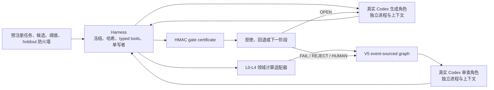

# FMA V5.1 真实能力缺口闭环

## 已完成

### 真实阶段驱动与独立角色进程

`fma/v5_1/codex_stage_driver.py` 通过
`codex exec --ephemeral --json` 启动新进程。每个角色拥有独立 run ID、
context ID、scratch 和结构化输出；工具被禁用，输入输出与 transport
证据被哈希。生成器输出和 reviewer 输出仍是非可信草稿，只有 harness 能
提交工件、签发回执和移动图。

`experiments/iteration_29/run_graph_binding.py` 把这些真实进程接入 V5
event-sourced graph、角色执行回执、独立审查回执、mechanical/scientific
checks 与 HMAC gate certificates。最终实际运行在 S4 科学失败处停止。

### 时间点过程 L0–L4

`fma/v5_1/event_process.py` 提供 production-scoped USGS 时间点过程适配器：

- L0：新鲜子进程确定性回放、源码与环境绑定
- L1：事件、参数、强度、补偿子、单位、边界
- L2：族特定 toy oracle 与嵌套极限
- L3：baseline duel、time-rescaling、补偿子、残差、参数裕量、切片契约
- L4：moving-block bootstrap refit、预测区间、窗口敏感性、模型分歧、支持域

这些检查只对冻结的单变量事件时间任务作出声明，不自动外推到其他建模域。

### Gold 与消融

`fma/v5_1/evaluation_harness.py` 提供认证 gold 包和隔离注入；
`fma/v5_1/executable_evaluation.py` 要求 treatment/control 和
gold/full 使用真实、互不复用的进程回执。复制输出或 no-op ablation 会
fail closed。

### 未见任务

`experiments/iteration_29` 保存了预注册、实现 freeze、目标数据、真实角色
回执、科学证据、图证书、失败补丁谱系、gold continuation、消融和测试日志。
详见 `experiments/iteration_29/RESULTS.md`。

## 架构结果

模型负责提出、解释、质疑和写草稿；harness 负责权限、确定性检查、证据链和
图迁移。这一分离在真实运行中被验证：reviewer 的批准不能覆盖计算型 L3
失败，系统最终停在 `SCIENTIFICALLY_REJECTED`。

当前图运行采用验证前角色共识形成 provisional Hawkes attempt，而主运行按
冻结 development validation 指标选出 Weibull。两个 attempt 都被 L3
拒绝。尚未实现的关键控制能力是：当后验候选比较改变 S1 选择时，自动撤销
下游证书并创建新的无环 attempt lineage。

## 能力判断

当前系统已经能在一个窄领域自主完成：

`问题冻结 -> 候选展开 -> 数据血缘 -> 拟合与计算验证 -> 独立审查 ->
图门控 -> 科学拒绝/继续 -> 机制评估`

它还不能被称为“可独立解决任意前沿数学建模问题”。下一阶段不应再扩建通用
抽象，而应先实现上述图内候选切换，然后增加第二个结构不同的窄领域、真实
private evaluator、跨任务 gold 集和重复机制实验，并保持现有 authority
boundary 不变。
