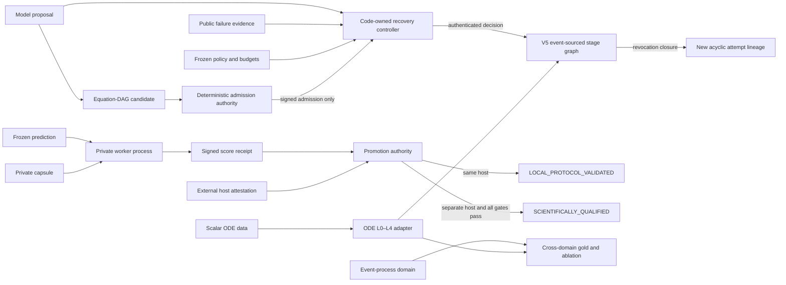

# V5.2 P0–P2 capability closure

V5.2 closes the locally implementable P0–P2 gaps without changing the meaning
of any V1–V5 artifact. It adds a control plane around the existing V5 graph,
one governed candidate language, an externally deployable private evaluation
protocol, a second scientific domain, and cross-domain evaluation evidence.

## Architecture

## P0 — graph-native evolution and recovery

`fma/v5_2/evolution_controller.py` adds six typed actions:

- same-skeleton patch;
- switch to a registered candidate;
- admit and switch to a newly generated candidate;
- revise the data contract;
- invalidate the task;
- stop as scientifically rejected.

Every authorization binds the exact workspace graph, public failure evidence,
candidate scores/registry, recovery state, evaluator epoch, transition files,
and frozen budgets. The model can propose but cannot authenticate or execute.
Execution calls the existing `StageWorkspaceV50.invalidate_from`, preserves
revoked history, creates a new attempt chain, writes only permitted paths, and
commits signed decision and transition receipts.

## P1 — generated and governed candidate space

`fma/v5_2/candidate_space.py` represents a candidate as a topologically
ordered equation DAG. Admission checks operator arity, dimensional algebra,
parameter bounds, executable limit cases, identifiability coverage, lineage,
generator-process receipt, baseline retention, registry budgets, and
structural duplication. A prose proposal or a renamed duplicate has no
authority.

## P1 — private qualification

`fma/v5_2/private_qualification.py` and `private_worker.py` separate:

1. a public commitment-only request;
2. a fresh worker process that owns the private capsule and worker key;
3. a signed result containing scores and commitments, never private targets;
4. executable, source, environment, prediction, capsule and event-chain
   verification;
5. a promotion authority that never reads raw private values.

A local process receipt is forced to `same_host_process` and can produce only
`LOCAL_PROTOCOL_VALIDATED`. `qualification_granted=true` additionally requires
a valid, independently signed `separate_host_attested` statement for a
different host. This repository implements that transport contract but cannot
manufacture a physically independent host.

## P2 — scalar ODE L0–L4 adapter

`fma/v5_2/ode_system.py` adds a domain structurally different from event
processes:

- L0: two fresh deterministic subprocess replays plus source/runtime binding;
- L1: sealed provenance, time ordering, units, finite positive states and
  slice size;
- L2: analytic/numerical logistic agreement, zero-rate reduction and
  large-capacity exponential reduction;
- L3: frozen constant baseline, validation error, residual dependence,
  interval coverage and identifiability conditioning;
- L4: residual bootstrap refits, forecast width, prefix-window sensitivity,
  ensemble disagreement and support declaration.

The adapter is registered through the existing typed `CheckRegistryV50` and
reads only files bound by the frozen stage manifest. Fixture acceptance is
scientific computation evidence, not scientific qualification.

## P2 — cross-domain gold and ablation

`fma/v5_2/cross_domain_evaluation.py` requires disjoint fresh-process arm
receipts, the same nuisance identity, an observed execution-path delta, at
least two domains, at least two cases per domain and at least three repetitions
per case. It reports a paired mean, sample deviation, standard error, 95%
Student-t interval, coverage, failures, trace coverage, wall time, cost status
and human interventions.

Fixture or underpowered observations can never emit a general causal claim.
Gold coverage is reported separately across domain, task and injected stage;
gold files never include private acceptance data.

## Remaining external boundary

Local code and tests can validate all protocol mechanics. A real private
scientific qualification remains `NOT_RUN` until a separately administered
host is deployed, its public key/attestation policy is frozen, and a genuinely
unseen registered prediction is evaluated there. Consequential action remains
human-owned after any scientific qualification.
