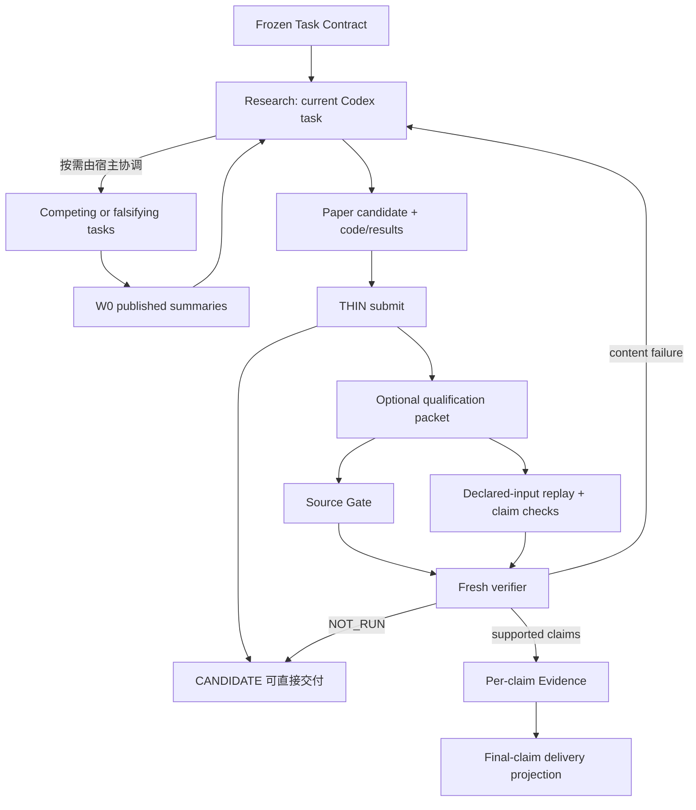

# THIN Modeling Agent 0.7 架构

## 1. 目标函数

目标是解决开放、未见、真实的数学建模问题，并对“哪些结论可以提交和相信”保持保守；不是证明某套工作流被完整执行。

第一性原理分工：

- 当前 Codex 任务负责问题定义、表示选择、模型生成、搜索、代码、计算、试错、竞争路线和换向；
- Harness 负责预算、任务本地权限、单写入者、耐久状态、来源绑定、机械否决、独立复核、Evidence 承认、撤销和停止；
- Harness 不启动另一个 Codex 充当生产者，也不把当前 Codex 伪装成内部模型调用；
- 控制提交、证据和副作用，不限制模型的思考空间；
- 生成者不能批准自己的 claim 或 final delivery；
- 外部资格和现实行动始终由外部评审或人负责。

## 2. 开放研究与独立资格



`start` 初始化工作根，`next` 返回当前任务的下一步，`submit` 只登记已有候选，`qualify` 不运行生产者，`solve` 只是登记后复核。`research` 是 `submit` 的兼容别名。研究路线是自由的；等级标签和 Evidence 写入是严格的。S0–S6、永久 Planner/Scientist/Critic、模型族白名单、通用工作流引擎都不在生产语义中。

## 3. 最小模块

| 模块 | 职责 |
|---|---|
| `engine.py` | 候选登记、Qualification、恢复、预算、撤销和投影 |
| `model.py` | 独立 Codex verifier、权限/网络模式、本地 Schema 复验和 trace receipt |
| `research.py` | W0 工作记录、派生 Problem Graph、分支包与波次摘要 |
| `sources.py` | source candidate、精确 URL trace、source→claim 复核记录 |
| `verification.py` | 资格包、claim obligations、清洁重放、逐 claim 晋升、fresh review |
| `storage.py` | 安全路径、原子写、JSONL、单写入锁、Evidence 哈希链 |
| `tools.py` | 有界文件工具、OS-sandboxed Python、机械检查 |
| `ablation.py` | 冻结组件消融与 append-only 结果 |

权威事实只有：

1. `work/research/records.jsonl`：模型可写的 W0 工作知识；
2. `.modeling-agent/events.jsonl`：操作观察；
3. `.modeling-agent/evidence.jsonl`：Harness 独占的 claim/revocation 链。

Problem Graph、状态页和 delivery 都从这些事实与工件完整性派生，不另建可冲突的数据库。run state 中的等级字段只是最近一次 verdict/Evidence 的恢复缓存，不拥有独立承认权。

## 4. 权限与执行边界

当前 Codex 直接在 `work/` 中研究，其权限由当前宿主负责；THIN 不再为生产者创建子进程、复制权限或执行 canary。Fresh verifier 使用 `:read-only`、禁用 shell 工具，并且只接收完整有界 packet。生成代码的清洁重放使用 `modeling-workspace-only`，并以工作根可读、父目录 canary 不可读验证实际隔离；绝不使用 `danger-full-access`。

只有显式资格检验会产生 `codex exec` 子调用；这些调用固定 `approval_policy="never"`、
`--ask-for-approval never`、无 TTY 和 task-local cwd；直接 sandbox 探针与重放在
Windows 原生执行时固定 `windows.sandbox="unelevated"`，避免继承个人配置中的
elevated/UAC 后端。
允许的 profile 只有 `modeling-workspace-only`、`:workspace` 与 `:read-only`；其他
profile 在进程启动前即被拒绝。任何 approval/user-input 事件、交互式 receipt 或
权限升级痕迹都会使本次资格成为 `NOT_RUN`，不会进行高权限重试。

这只能约束 Harness 启动的复核子进程。`start`、`next` 和 `submit` 不启动子 Codex，
所以生产研究不会产生这类审批断点。若显式资格复核仍被父宿主拦截，候选保持
`CANDIDATE`，复核记为 `NOT_RUN`，可在已授权宿主中稍后继续。

独立重放不在研究工作区原地运行。每个 generator 获得新的临时工作根，只复制：

- Task Contract 与 Manifest；
- 该 generator 脚本；
- 显式 `input_paths`；
- 已由前序 generator 生成且被显式声明为输入的输出。

重放复用与 Producer/Verifier 相同的已解析 Codex executable、workspace-only profile 和双 canary，再通过 `codex sandbox` 启动 Python。没有可用 OS 沙箱、父目录仍可读或 canary 本身不能运行时 fail closed；AST 审计、`python -I` 和清洁环境只是纵深防御，不再被称为安全边界，也没有宿主 Python 回退。策略拒绝表示验证未运行，而不是模型已被科学反驳。

同一 run 由非阻塞 OS 文件锁保证单写入。当前 Codex 只写 `work/`；THIN 对 Harness 权威目录保持独占，并在登记时重新计算工件哈希。

当前宿主是否真的具备这些能力必须用现场 canary 验证。代码配置正确、单元测试通过或 CLI 存在，都不等于该机器的原生沙箱可用。

### 外部复核传输与分级复现

当当前宿主无法启动嵌套 verifier 时，`review-export` 将完整候选指纹、机械结果和有界
review data 冻结为一个任务内 packet；另一个全新 Codex 任务只负责按 Schema 评价，
`review-import` 再校验 packet 文件哈希、producer/reviewer context 分离和当前候选未变化。
这条链控制的是证据承认权，不限制生产任务的模型选择或研究路径。

复现状态明确区分 `REPRODUCED_ISOLATED`、`REPRODUCED_LOCAL`、`NOT_REPRODUCED` 和
`NOT_RUN`。默认仍要求 OS 隔离，不做静默回退。显式 `--local-replay` 表示调用者接受任务
代码在无 OS 隔离下运行，只能得到 `NOT_PROVEN` 的隔离状态，并把最终 Evidence authority
封顶为 E2。外部 Codex 任务的独立性当前是可审计声明而非宿主证明，因此外部 review
封顶为 E3；两者同时存在时采用最弱上限。

候选身份是 Manifest 与全部声明工件哈希的联合指纹。论文未变但代码、数据、检查器或结果
变化时，旧 packet 和旧 Evidence 都不能继续代表当前候选。

## 5. 来源边界

`research-search` 中的搜索摘要和模型记忆始终是 W0。最终 claim 引用的来源必须写成 candidate，并由 fresh Source Gate：

- 对精确 URL 发起可观测 web query；
- 绑定 exact locator、短摘录、source kind；
- 明确 `supports_claim_ids` 与冲突；
- 对 causal/mechanistic claim 至少要求一个 supported primary source；
- 将每次复核保存为版本化、带哈希的记录。

Source Gate 当前没有保存原始 HTTP 响应字节或 WARC，因此 E1 表示“可追踪的 fresh 模型来源复核”，不是长期网页归档或事实真理。精确 query、record hash 和独立 reviewer 提高保真，但不能消除网页变化、解析错误或 reviewer 判断错误。

## 6. Claim 与 delivery 合同

每个 claim 声明：

```text
id, statement, claim_type, scope, dependencies,
artifact_paths, source_ids, required_check_ids,
baseline, falsifiers, decision_critical, requested_authority
```

支持 `factual`、`computational`、`predictive`、`causal`、`mechanistic`、`decision`。规则限制什么可以被承认，不限制 Codex 可以提出什么。

Task Contract 用 `delivery_artifact` 指定论文候选；论文非空即可作为 `CANDIDATE` 保存，Manifest 只是申请更高等级的资格包。有效 Manifest 必须把论文声明为 `paper` 并给出 `final_claim_ids`。Fresh verifier 对每个 claim 和整个 delivery 分别返回 verdict。所有 paper 工件必须完整进入总量有界的 review packet；无法完整装入或格式不可读时返回 `NOT_RUN`。

晋升从正面事实派生：`WORKING → CANDIDATE → CHECKED → SUPPORTED`。声明过的来源对所有 claim 类型都是合取义务；causal/mechanistic claim 还必须有 supported primary source；每一等级都受最弱依赖封顶；局部 check 只影响关联 claim，合同级 check 才是全局义务。独立支持的 claim 可以单独进入 Evidence，但在 final delivery 未获支持时不绑定 `final_answer`。只有所有 final claims 与 delivery review 都为 `SUPPORTED` 才完成整题。`QUALIFIED/E5` 只能由外部盲评、真实数据或真实环境授予。

Verifier packet 中的论文、代码、来源和 metadata 都被明确标记为不可信数据，不能成为 evaluator 指令。Verifier receipt 必须表明 fresh role、read-only、tool-free、ephemeral、offline delivery，并绑定 trace hash。

## 7. Provenance、撤销与恢复

每条 admitted claim 保留：

- 完整 artifact inventory：输入、generator、check、结果、论文、Manifest；
- Task Contract、source trace 和 fresh-verifier trace；
- source record 路径、hash 与 snapshot hash；
- mechanical replay/check 事实；
- verifier review、receipt 与 receipt hash；
- contract/manifest hash、final answer 与 final claim IDs；
- dependency 与 authority。

Evidence 是带 `sequence`、`previous_record_hash` 和 `record_hash` 的有序 JSONL 链，run state 保存 count/head 锚。编辑、删除、截断或重排报告 `corrupt`。任何 reviewed artifact、source、合同或复核 trace 变化使 claim 及其下游依赖变为 `stale`；无论整题已完成还是只有部分 Evidence，恢复时都追加 revocation。论文继续作为候选存在，但旧的支持等级失效。

W0 研究记录损坏只会产生 Problem Graph 投影诊断，不会改变已承认 Evidence。

## 8. 预算与并行

资格 wall time、历史兼容的 attempt/branch 配额保存在 run state。当前 Codex 的研究预算由当前宿主管理；`submit` 不伪造或消耗模型 attempt。Source reviewer、replay、check 和 verifier 只获得剩余资格 wall budget，外部调用前先持久化活动记录，截止时间之后返回的结果不能入证。

恢复默认继承冻结预算。扩大预算必须显式 `--amend-budget`，只允许非递减修改并写事件。模型标识在一个 run 内冻结。外部调用前先持久化 active attempt；若进程在下一检查点前中断，恢复时会消耗该 attempt，并按已过时间、至多其冻结调用预算计入累计 wall time。

并行只用于有信息价值的临时竞争路线，由当前宿主创建和协调。THIN 不维护永久角色或实时共享内存；结果作为 W0 摘要进入 `work/research/`，一个路线失败不会删除其他路线。

当前 0.6 尚未把 token/cost/tool-call 总量接入当前 Codex 宿主的硬预算；`eval` 中的这些字段属于冻结实验合同，而不是已实现的运行时配额。

## 9. 明确不建设

- 固定 S0–S6 流水线；
- 永久角色群；
- 模型族白名单或 Method Pack Registry；
- 通用 Workflow Engine；
- Neo4j、向量数据库或 Graph UI；
- Agent 间实时共享可写内存；
- Lease、Receipt 证书栈或重复状态平面。

## 10. 资格边界

单元测试证明代码语义，不证明 Agent 优于裸 Codex。真实能力必须在冻结私有未见任务上比较：盲评建模质量、来源蕴含、复现率、错误成功率、正确弃权、换向质量、成本和人工介入。

在当前主机上，还必须分别通过：

1. 独立 verifier 的 Codex CLI 模型目录与身份启动；
2. Qualification clean replay 的父目录、写逃逸与断网 canary；
3. 一次全新的端到端资格任务。

任何一项未运行或失败，都必须报告为宿主/资格缺口，不能由内部测试替代。
