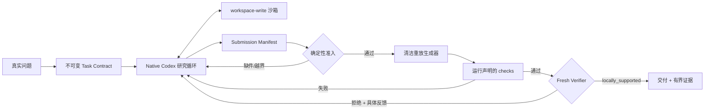

# Thin Modeling Agent

`modeling_agent` 是本仓库唯一产品。目标不是证明流程完整，而是提高 Agent
面对真实、未见建模问题时提出、证伪、修正和交付模型的能力。

## 第一性原理

真实建模至少包含四件不能相互替代的事：

1. 自由提出问题分解、模型、反例和实验；
2. 用计算或观察淘汰错误候选；
3. 只把可复核结果提升为证据；
4. 在证据不足时继续探索、换向或停止。

因此，0.3 的默认链路只保留三类权威事实：

- `contract`：目标、交付义务、声明边界和预算；
- `execution`：原生研究尝试、生成器重放和检查结果；
- `evidence`：有界声明、artifact 清单和独立复核 verdict。

没有固定阶段队列，没有模型族白名单，也没有为每个状态增加证书、签名或版本目录。

## 0.3 Native Sidecar：默认架构



张弛边界如下：

| 放开 | 收紧 |
|---|---|
| 问题如何分解 | Codex 只在任务工作区内执行 |
| 使用什么模型、数学表示、代码和算法 | 交付义务与声明边界在结果前冻结 |
| 何时增加、修改或放弃分支 | 可复现声明必须列出生成器、输出和检查 |
| 失败后补丁、重试或换方向 | 生成者不能批准自己的最终声明 |

这是“控制提交、证据和副作用”，不是“控制 Agent 怎样思考”。

Sidecar 不观察或规定研究过程中的每一个状态。它只在 Codex 提交
`submission_manifest.json` 后执行五个小关口：

1. 合同哈希、必需文件和相对路径合法；
2. manifest 声明、artifact、生成器和检查结构完整；
3. Python 生成器在受限清洁环境中成功重放；
4. 声明的关键输出与重放输出逐字节一致，检查成功；
5. 新 verifier 上下文只批准 artifact 实际支持的局部声明。

任何失败都转成具体反馈，最多进入 `max_attempts` 次有界修复。预算耗尽时保留现有
论文和 artifact，但状态明确为 `stopped` 或 `unverified`，不伪装成成功。

## 0.2 Structured Loop：消融保留

旧 `run` 模式仍保留可修订 Problem Graph、`working`/`claim` 证据、逐步工具观察和
节点撤销语义。它适合研究“显式结构化循环是否有增益”，但不再强加给默认建模链路。
如果冻结消融不能证明它比 Native Sidecar 更好，就不继续为它增加组件。

## 运行

```powershell
python -m modeling_agent native `
  --workspace D:\runs\my-problem `
  --objective "在这里给出完整的真实建模问题" `
  --max-attempts 2 `
  --max-seconds 1800
```

默认链路的源事实和轨迹只保存在：

```text
<workspace>/
  .modeling-agent/task-contract.json
  .modeling-agent/native-state.json
  .modeling-agent/native-events.jsonl
  submission_manifest.json
  paper/final.md
```

`--contract` 可在首次运行时覆盖默认合同。合同落盘后保持不可变，改变实验条件必须
使用新工作区。停止的任务可以在同一工作区继续，历史尝试不删除。

结构化对照模式仍可显式运行：

```powershell
python -m modeling_agent run `
  --workspace D:\runs\structured-control `
  --objective "同一个冻结问题" `
  --max-steps 12 `
  --max-tool-calls 30 `
  --max-seconds 1800
```

## 三臂消融

先冻结同一问题、模型和预算：

```powershell
python -m modeling_agent ablation-init `
  --output D:\runs\experiment\ablation.json `
  --objective "未见任务原文"
```

三个实验臂分别为：

1. `raw_codex`：一次原生回答；
2. `thin_harness`：0.2 的结构化 Problem Graph 循环；
3. `native_sidecar`：0.3 的原生研究循环加最小重放和复核。

必须在看结果前冻结任务、预算、评分规则、简单基线和独立评分者。工作流完成率
不是建模质量；主要比较答案质量、相对基线增益、证伪质量、复现性、失败恢复、
人工干预和成本。

## 当前能力边界

- Native 研究循环依赖 Codex `workspace-write` 沙箱；Windows 嵌套运行显式使用
  `unelevated` 受限 token 回退，Sidecar 再做路径检查；
- 单次原生研究循环的工具调用数目前只能事后观测，不能由 Sidecar 中途硬截断；
- 只有 manifest 声明的 Python 生成器获得逐字节重放保证；
- “独立复核”是新的模型上下文，不等于外部科学同行评议；
- 通用机械检查只能证明 artifact 的有限性质，不能自动证明机制、因果或外推；
- 当前实现证明了合同、重放、修复和复核语义，尚未证明它优于裸 Codex；
- 默认关闭联网、插件、浏览器、依赖安装和任务目录外写入，也不授权现实世界行动。

## 增长规则

只有当未见任务消融显示稳定缺口时才增加组件。优先改提示、工具可读性和评分
协议；只有重复出现且无法由现有机制表达的问题，才进入内核。新增后必须再次
比较“裸模型 / 结构化 THIN / Native Sidecar”，不能用更多代码或更多内部测试
代替能力提升。
