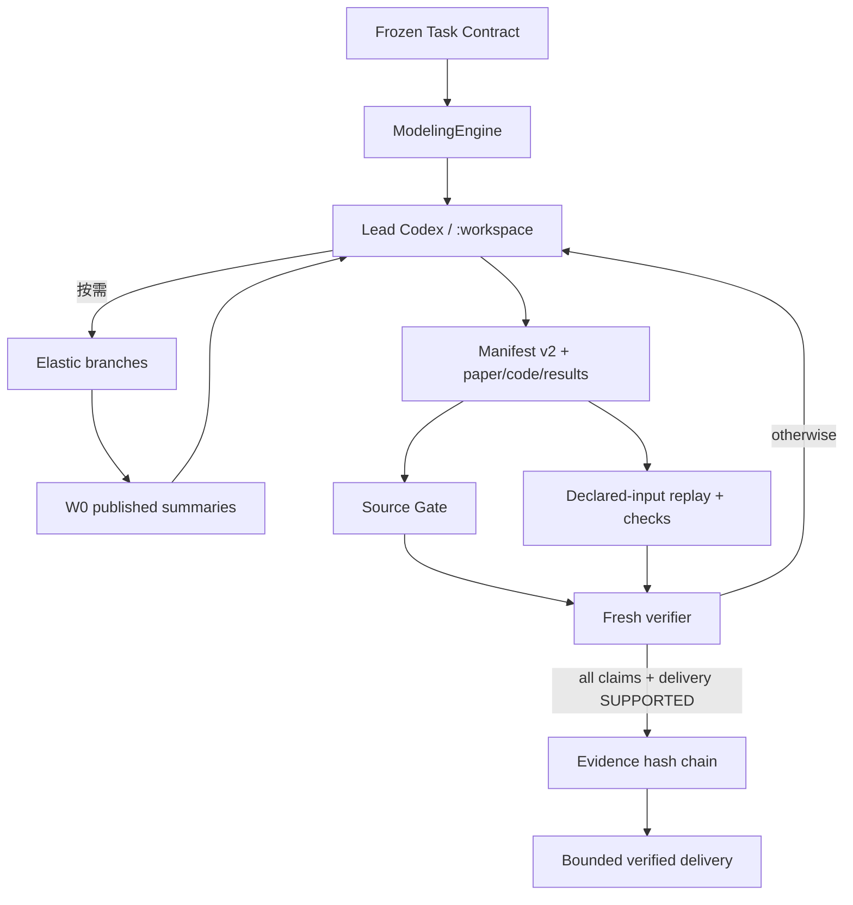

# THIN Modeling Agent 0.4 架构

## 1. 目标函数

目标是解决开放、未见、真实的数学建模问题，并对“哪些结论可以提交和相信”保持保守；不是证明某套工作流被完整执行。

第一性原理分工：

- Codex 负责问题定义、表示选择、模型生成、搜索、代码、计算、试错、竞争路线和换向；
- Harness 负责预算、任务本地权限、单写入者、耐久状态、来源绑定、机械否决、独立复核、Evidence 承认、撤销和停止；
- 控制提交、证据和副作用，不限制模型的思考空间；
- 生成者不能批准自己的 claim 或 final delivery；
- 外部资格和现实行动始终由外部评审或人负责。

## 2. 单一生产循环



CLI 只有 `solve`、`status` 和 `eval`。S0–S6、永久 Planner/Scientist/Critic、模型族白名单、通用工作流引擎都不在生产语义中。

## 3. 最小模块

| 模块 | 职责 |
|---|---|
| `engine.py` | 单循环、恢复、临时分支、预算、Gate 编排、撤销和投影 |
| `model.py` | Codex CLI、权限/网络模式、本地 Schema 复验和 trace receipt |
| `research.py` | W0 工作记录、派生 Problem Graph、分支包与波次摘要 |
| `sources.py` | source candidate、精确 URL trace、source→claim 复核记录 |
| `verification.py` | Manifest、claim obligations、清洁重放、机械否决、fresh review |
| `storage.py` | 安全路径、原子写、JSONL、单写入锁、Evidence 哈希链 |
| `tools.py` | 有界文件工具、OS-sandboxed Python、机械检查 |
| `ablation.py` | 冻结组件消融与 append-only 结果 |

权威事实只有：

1. `work/research/records.jsonl`：模型可写的 W0 工作知识；
2. `.modeling-agent/events.jsonl`：操作观察；
3. `.modeling-agent/evidence.jsonl`：Harness 独占的 claim/revocation 链。

Problem Graph、状态页和 delivery 都从这些事实与工件完整性派生，不另建可冲突的状态平面。

## 4. 权限与执行边界

Lead 和 branch 的运行根分别是 `work/` 与独立 branch work。Codex CLI 使用自定义 `modeling-workspace-only` 权限配置：继承 `:workspace` 的写保护，同时设置 `:root=deny`、`:minimal=read` 并关闭临时目录访问。每个实际工作根在启动模型前必须通过两个真实命令 canary：工作根文件可读，父目录随机标记不可读。canary 内容泄露、允许访问失败或 sandbox helper 失效都会 fail closed。Fresh verifier 使用 `:read-only`、禁用 shell 工具，并且只接收完整有界 packet。

独立重放不在研究工作区原地运行。每个 generator 获得新的临时工作根，只复制：

- Task Contract 与 Manifest；
- 该 generator 脚本；
- 显式 `input_paths`；
- 已由前序 generator 生成且被显式声明为输入的输出。

重放复用同一个 workspace-only profile 和双 canary，再通过 `codex sandbox` 启动 Python。没有可用 OS 沙箱、父目录仍可读或 canary 本身不能运行时 fail closed；AST 审计、`python -I` 和清洁环境只是纵深防御，不再被称为安全边界，也没有宿主 Python 回退。

同一 run 由非阻塞 OS 文件锁保证单写入。Lead/branch 调用前后对 Harness 权威目录做快照；即使调用抛错，检测到的越权修改也会恢复并记录。

当前宿主是否真的具备这些能力必须用现场 canary 验证。代码配置正确、单元测试通过或 CLI 存在，都不等于该机器的原生沙箱可用。

## 5. 来源边界

`research-search` 中的搜索摘要和模型记忆始终是 W0。最终 claim 引用的来源必须写成 candidate，并由 fresh Source Gate：

- 对精确 URL 发起可观测 web query；
- 绑定 exact locator、短摘录、source kind；
- 明确 `supports_claim_ids` 与冲突；
- 对 causal/mechanistic claim 至少要求一个 supported primary source；
- 将每次复核保存为版本化、带哈希的记录。

Source Gate 当前没有保存原始 HTTP 响应字节或 WARC，因此 E1 表示“可追踪的 fresh 模型来源复核”，不是长期网页归档或事实真理。精确 query、record hash 和独立 reviewer 提高保真，但不能消除网页变化、解析错误或 reviewer 判断错误。

## 6. Claim 与 delivery 合同

每个 claim 声明：

```text
id, statement, claim_type, scope, dependencies,
artifact_paths, source_ids, required_check_ids,
baseline, falsifiers, decision_critical, requested_authority
```

支持 `factual`、`computational`、`predictive`、`causal`、`mechanistic`、`decision`。规则限制什么可以被承认，不限制 Codex 可以提出什么。

Task Contract 用 `delivery_artifact` 指定唯一最终交付文档；Manifest 必须把它声明为 `paper`，并给出 `final_claim_ids`。Fresh verifier 对每个 claim 和整个 delivery 分别返回 verdict。所有 paper 工件必须完整进入总量有界的 review packet；无法完整装入或格式不可读时返回 `NOT_RUN`。只要任一 claim、依赖或 delivery 不是 `SUPPORTED`，本轮不写 Evidence。W0 不能进入 Evidence；每个 claim 的 authority 由 requested、claim review、overall review 和依赖的最弱 authority 共同封顶，E5 永不由本 Harness 授予。

Verifier packet 中的论文、代码、来源和 metadata 都被明确标记为不可信数据，不能成为 evaluator 指令。Verifier receipt 必须表明 fresh role、read-only、tool-free、ephemeral、offline delivery，并绑定 trace hash。

## 7. Provenance、撤销与恢复

每条 admitted claim 保留：

- 完整 artifact inventory：输入、generator、check、结果、论文、Manifest；
- Task Contract、source trace 和 fresh-verifier trace；
- source record 路径、hash 与 snapshot hash；
- mechanical replay/check 事实；
- verifier review、receipt 与 receipt hash；
- contract/manifest hash、final answer 与 final claim IDs；
- dependency 与 authority。

Evidence 是带 `sequence`、`previous_record_hash` 和 `record_hash` 的有序 JSONL 链，run state 保存 count/head 锚。编辑、删除、截断或重排报告 `corrupt`。任何 reviewed artifact、source、合同或复核 trace 变化使 claim 及其下游依赖变为 `stale`；恢复时追加 revocation，旧 delivery 立即降为 `revoked/W0`，再由新尝试重新资格化。

W0 研究记录损坏只会产生 Problem Graph 投影诊断，不会改变已承认 Evidence。

## 8. 预算与并行

`max_attempts`、累计 wall time、累计 branch 数和 wave 数保存在 run state。每个 Lead、branch、source reviewer、replay、check 和 verifier 都只获得剩余 wall budget；截止时间之后返回的结果不能入证。

恢复默认继承冻结预算。扩大预算必须显式 `--amend-budget`，只允许非递减修改并写事件。模型标识在一个 run 内冻结。外部调用前先持久化 active attempt；若进程在下一检查点前中断，恢复时会消耗该 attempt，并按已过时间、至多其冻结调用预算计入累计 wall time。

并行只用于有信息价值的临时竞争路线。分支不共享实时可写内存，只在波次结束后发布 W0 摘要；一个分支失败不会删除其他路线。

当前 0.4 尚未把 token/cost/tool-call 总量接入 `solve` 的硬预算；`eval` 中的这些字段属于冻结实验合同，而不是已实现的运行时配额。

## 9. 明确不建设

- 固定 S0–S6 流水线；
- 永久角色群；
- 模型族白名单或 Method Pack Registry；
- 通用 Workflow Engine；
- Neo4j、向量数据库或 Graph UI；
- Agent 间实时共享可写内存；
- Lease、Receipt 证书栈或重复状态平面。

## 10. 资格边界

单元测试证明代码语义，不证明 Agent 优于裸 Codex。真实能力必须在冻结私有未见任务上比较：盲评建模质量、来源蕴含、复现率、错误成功率、正确弃权、换向质量、成本和人工介入。

在当前主机上，还必须分别通过：

1. Codex CLI 模型目录与身份启动；
2. `:workspace` 父目录 secret canary；
3. `codex sandbox -P :workspace` 写逃逸与断网 canary；
4. 一次全新的端到端资格任务。

任何一项未运行或失败，都必须报告为宿主/资格缺口，不能由内部测试替代。
