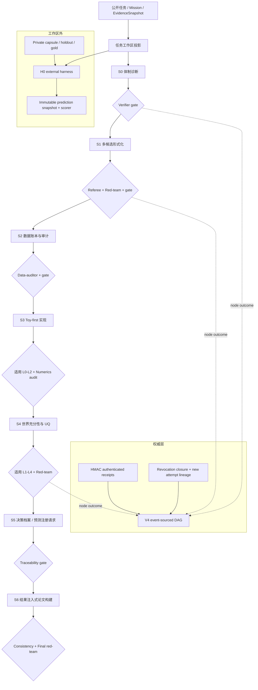

# FMA V5：Graph-native S0–S6 数学建模工作区

状态：已实现控制面与合成协议夹具；领域科学验证和真实能力测量仍需任务适配器与外部新题。

## 1. 第一性原理

一个独立解决复杂数学建模问题的系统，至少要同时守住五件事：

1. **问题绑定**：它回答的是冻结问题，而不是写到一半悄悄换题。
2. **候选竞争**：一次建模只是一次抽样；至少要保留多候选、失败诊断和改向能力。
3. **现实约束**：每个数、变换、假设和适用范围都可追溯。
4. **可证伪验证**：执行成功、结构正确、数值正确、世界充分性、UQ 和诚实性是不同证据。
5. **权限分离**：提出者不能批准自己；流程通过不能变成科学资格，科学资格也不能自动变成现实行动。

因此 V5 没有把附件中的目录和 `stamp` 当作系统本体。目录是 Agent 可理解的持久工作面，V4 Graph 才是状态机，外部认证收据才是跨阶段权限。

## 2. 总体架构



每个阶段对应 `work node → evaluation node`。下一阶段用
`requires_success` 依赖前一 gate。上游返工调用 V4 `revoke_node`，其传播闭包撤销旧 gate
和全部下游；重做会产生新的 DAG 节点，并用非门控的 `supersedes` 保存谱系。历史不删除，
恢复不靠聊天记忆。

## 3. 关键组件、能力与功效

| 组件 | 能力 | 功效与边界 |
|---|---|---|
| `TaskWorkspaceSpecV50` | 冻结 mission/evidence/profile/evaluator/budget/权限 | 防止中途换题或换评测；明确禁止 external action 和 private acceptance |
| `StageArtifactManifestV50` | 对阶段精确文件集合做路径、字节和前置 gate 绑定 | 任一上游字节变化立即使证书 stale |
| V4 `GraphLoopStoreV40` | 内容寻址工件、事件哈希链、frontier、执行者权限、撤销闭包 | 复用已验证权威，不复制另一套状态机 |
| `AdapterExecutionReceiptV50` + `CheckResultV50` | 把领域 adapter 的实际调用、代码哈希、输入 manifest、状态与计算证据闭合；区分 scientific computation / integrity / presence / judgement | L0–L4 不能由调用方直接报 PASS；缺 adapter 固定为 `NOT_RUN` 并阻断 |
| `IndependentReviewReceiptV50` | 绑定新上下文、不同 run、精确输入、trace、输出、结论 | 阻止主 Agent 自审和旧评审重放到新快照 |
| `GateCertificateV50` | 绑定政策、清单、检查、评审、前序证书、图节点和外部 HMAC | 手写 stamp、改 verdict 后重算普通 SHA 均无权威 |
| `RawDataBaselineV50` + `DataLedgerV50` | harness 先冻结 `data/raw`，再绑定来源、许可、raw/transform/processed 路径与哈希 | 原始树变更、目录绕行、ledger/processed ID 不闭合都会阻断；合成值强制挂接敏感性义务 |
| `CodeManifestV50` | 绑定 source tree、环境、replay receipt、Fermi 与 toy oracle 的实际文件哈希 | S3 不能再用不存在的引用或任意环境字符串取得结构门 |
| `paper.py` | 从 `results/values.json` 注入 LaTeX，拒绝模板硬编码数字，clean `pdflatex` 构建并绑定四类哈希 | 当前拒绝未绑定图，而不是伪称图已溯源；只证明构建一致性 |
| `ExternalHarnessV50` | fresh public workspace、首次预测冻结、holdout 后揭示、外部评分、消融臂结构检查 | 证明注册与评分时序；真实双臂执行器未绑定前，任何机制消融都不能标为有效 |
| 单写者锁 + tip-bound cache | 跨进程写入时锁内重读事件 tip；读取侧按 event/artifact revision 物化索引 | 防并行 writer 破坏哈希链，并把小型全链 gate 从分钟级降到秒级；最终 `verify` 仍可全链重放 |
| `scaffold.py` + 3 个 P0 skills | 生成 Agent 可读的任务树、宪法和方法/验证入口 | 让长任务可冷启动恢复，但模板本身不产生结果 |

## 4. 验证金字塔的严格语义

- L0–L2：执行重放、结构/不变量、toy oracle、收敛等真实计算。
- L3：Markov 充分性、残差结构、基线对打、跨模型重叠预测。
- L4：全局敏感性、系综分歧、外推支持域和完整 UQ。
- L5：数据账本、论文数字/图/假设一致性。

V5 通用内核目前真实完成的是：结构化协议、来源/哈希/路径/事件完整性、检查注册与
`NOT_RUN` 语义、领域执行收据、S3 replay/Fermi/toy 哈希闭包、部分现有 V1–V4 verifier
的可接入接口、论文构建一致性。它没有用“报告
存在”代替 Markov、Sobol、守恒、MMS 或 UDE/SINDy。某项科学检查只有在冻结
`ValidationPlan` 判定适用、领域 adapter 实际执行、计算证据被提交且 verifier 收据通过时
才可 PASS。

## 5. 外置 Harness 的实际强度

H0 把 public task 投影进 fresh workspace，把 private capsule、holdout、canary 和 scorer
保留在外部根目录。第一次合法 `predictions/registered.json` 会按原始字节冻结；之后才
允许 reveal/score。评分只读冻结快照。注册后修改原文件会得到
`integrity_valid=false` 与 `quality_score=0`，同时保留原始快照的机械指标，区分作弊失败与
能力失败。

当前 Windows 主机没有容器/VM 级隔离，因此协议固定：

```text
secrecy_mode = logical_projection_plus_canary
host_secrecy_attested = false
capability_claim_permitted = false
```

这能验证控制协议，不能证明一个拥有整机文件权限的 Agent 物理上绝不可能读取私有目录。

## 6. 已完成与未完成

已完成：

- 完整工作区 scaffold、任务宪法、Makefile facade 和 3 个 P0 skills；
- S0–S6 两节点阶段子图、frontier、精确快照、认证门禁、stale 检测和级联返工；
- 检查/评审的类型、独立性、证据类和 `NOT_RUN` 语义；
- 领域 adapter 实际执行收据，以及 raw baseline、数据账本、S3 replay、结果/UQ/决策 traceability 的机械检查；
- 真实 LaTeX 注入与 PDF 构建一致性；
- 外置 H0 的公开/私有投影、预测冻结、后揭示评分、篡改归零和事件链；
- 跨进程事件单写者保护与 tip-bound 重放缓存；
- synthetic fixture 的全链路控制验证。

仍需真实工作才能完成：

- 对新现实任务运行 Codex/其他模型并取得独立评审 transport receipt；
- 按模型族接入守恒、极限、收敛、MMS、Markov、Sobol、ensemble 和 extrapolation adapter；
- 新的仓库外 MM-Bench/paper reproduction/live task、S0–S6 gold 阶段包及人工标定；
- 真正执行控制/处理双臂并冻结 nuisance identity 的机制消融 runner；
- 图文件到生成脚本/输入的 figure manifest（当前遇到 `includegraphics` 会 fail closed）；
- 容器/VM/低权限用户的物理私有隔离；
- 活预测未来揭晓、真实外部有效性和人类最终决策；
- 任何“能自主解决任意前沿建模问题”的能力结论。

## 7. 使用入口

外部生成至少 32 字节密钥，并把路径放在任务工作区之外：

```powershell
$env:FMA_V5_AUTHORITY_KEY_FILE = "D:\secure\fma-v5.key"
python -m fma.v5 init `
  --workspace D:\tasks\example `
  --workspace-id example `
  --objective "Build and falsify a report-only model" `
  --mission-hash <64-hex> `
  --evidence-snapshot-hash <64-hex>
```

随后用 `submit → checks → 独立 review/domain receipts → gate` 推进。`status` 每次都从图、
工件和认证链重算；`invalidate` 用于上游返工；`paper` 构建结果注入式 PDF。

这套 V5 的设计精髓不是“让流程看起来完整”，而是让每个仍未解决的科学问题都以一个
不可被文字掩盖的、可定位、可补齐的证据缺口留在 Graph 中。

上传方案的逐条 `implemented / partial / deferred` 开发追踪保留在
`evidence-archive-v7.0` 标签中的 `V5_REQUIREMENTS_TRACE.md`。冻结 synthetic
control fixture 的运行证据属于本地历史实验归档，不进入精简公开源码树；
公开仓库只保留可重建该流程的协议、实现和契约测试。
