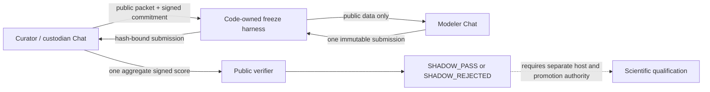

# Two-chat blinded modeling protocol

## Purpose

This protocol measures whether the modeling agent can select, recover, and
freeze a useful forecast without seeing held-out outcomes. It does not treat
chat separation as external-host isolation or scientific qualification.

## Authority and information split

### Curator / custodian Chat

- selects a new real scalar dynamical time series;
- freezes the public/private temporal split and score contract before release;
- keeps source identity, transformation parameters, target values, canary, and
  private keys out of the modeling workspace;
- publishes only the public prefix, target coordinates, thresholds, capsule
  commitment, public keys, and custody attestation;
- performs at most one aggregate evaluation after an immutable submission;
- cannot model, revise a submission, promote, or grant qualification.

### Modeler Chat

- reads only the named public campaign directory and FMA source;
- has no network, source-search, other-campaign, private-directory, environment,
  process, or custodian-thread access;
- compares multiple model skeletons using public chronological validation;
- records failed candidates and performs graph-native recovery;
- locks the selected family, refits once on all public observations, and emits
  exactly one finite prediction for every registered target;
- cannot read private outcomes, score itself, resubmit, or grant qualification.

### Harness

- verifies hashes, signatures, target coordinates, submission count, and
  chronology;
- reserves the evaluation budget before decryption;
- makes failures after reservation fail closed, preventing private-feedback
  retries;
- exposes only aggregate metrics and a signed outcome receipt;
- preserves `scientific_qualification=false` without a separate external host
  and promotion authority.

## Implemented campaign

- Campaign: `i32-shadow-177747afada8fc62a6ed`
- Custodian task: `019f9987-cc87-77c3-bf31-687834fd48b4`
- Modeler task: `019f9994-6562-7a63-bbcc-1211f8c27a86`
- Public observations: 28 daily scalar observations
- Private targets: four horizons, h1 through h4
- Evaluation budget: one submission and one aggregate evaluation
- Isolation: encrypted context-blind custody on the same host
- External-host isolation: not established
- Promotion authority: absent

The local repository was converted into a minimal Git transport snapshot at
commit `c36a5fbd8abee5beae53cb6e9717882a3`. Transfer to `RedbambooPC` was attempted
but the remote Codex app server was unavailable. The campaign therefore ran as
a same-host blinded-context shadow evaluation and not as external
qualification.

## Result and learned control

The modeler rejected the autonomous scalar-ODE assumption, compared thirteen
public candidates, and recovered to a robust five-point local-level median.
That candidate improved aggregate public rolling normalized MAE from
`0.536501` for persistence to `0.439013`.

The one private aggregate evaluation passed the absolute normalized RMSE and
MAE limits but failed to beat the frozen persistence baseline. The final
outcome is `SHADOW_REJECTED`.

For future unseen tasks, private evaluation eligibility should require all of
the following on public data:

1. `public_scientific_acceptance=true`;
2. improvement over persistence across prespecified recent and expanding
   time blocks, not only pooled rolling error;
3. a positive lower confidence bound or other frozen stability margin for the
   candidate-minus-baseline advantage;
4. complete horizon-wise robustness evidence;
5. abstention when the reduced state is scientifically insufficient.

These controls apply prospectively. They must not be used to revise or
re-evaluate this consumed campaign.

