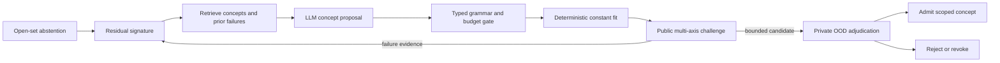

# 大迭代 20 研究笔记：从 open-set 弃权到骨架演化

状态：`RESEARCH_NOT_PROTOCOL`。本文件不是预注册确认协议，不授权实验晋级。

检索日期：2026-07-22。

## 为什么 V3.11 仍不是终局

V3.11 的能力是从冻结目录中选择 topology，或在 pendulum sentinel 上正确回答“目录外”。这解决了变量名泄漏和错误强配，却没有完成用户最初提出的“找到骨架和演化方式”：它不会根据失败残差提出目录中不存在的新算子，也不会把一次成功的子结构变成可撤销、可迁移的长期概念。

下一能力不是无界地让 LLM 猜公式，而是把 open-set 失败变成一个受治理的搜索循环：

```text
failure signature
-> data-aware residual analysis
-> retrieved / composed concept proposals
-> typed expression grammar
-> constant optimization
-> accuracy-complexity Pareto challenge
-> public OOD and perturbation tests
-> private adjudication
-> admit | revise | revoke concept
```

## 前沿方法中可借用的部分

### AI Feynman 2.0

一手来源：[NeurIPS 2020](https://proceedings.neurips.cc/paper_files/paper/2020/hash/33a854e247155d590883b93bca53848a-Abstract.html)。

可借用：accuracy/complexity Pareto frontier、用可检验的函数结构或对称性缩小搜索。不能迁移：其 Feynman 数据结果不证明 noisy dynamical WorldPack 上的恢复能力。

### LaSR

一手来源：[NeurIPS 2024](https://proceedings.neurips.cc/paper_files/paper/2024/hash/4ec3ddc465c6d650c9c419fb91f1c00a-Abstract-Conference.html)，DOI `10.52202/079017-1419`。

可借用：LLM 不只生成表达式，还从高质量 hypotheses 抽象概念库，并把概念与标准 evolution operators 混合使用。不能迁移：benchmark 增益不等于概念在新机制、噪声和 OOD 初值上可信。

### DrSR

一手来源：[arXiv:2506.04282](https://arxiv.org/abs/2506.04282)。

可借用：先做 data-aware structural description，再从成功/失败历史提取可复用 idea；生成前的数据理解和生成后的反思是两个不同通道。不能迁移：论文当前是预印本，其跨域 benchmark 主张需要独立复现。

### SR-Scientist

一手来源：[arXiv:2510.11661](https://arxiv.org/abs/2510.11661)。

可借用：长时程 agent 使用数据分析器、方程 evaluator 和 experience buffer，自主决定探索顺序；常数由专用优化器拟合。关键限制：最终按 observed-data performance 选最好式子会鼓励反复适配公开 evaluator；论文还在聚合时丢弃最差 5% prediction，并用 LLM 初评加人工复核 symbolic equivalence。FMA 不应复制这些可信性边界。

### RESTART

一手来源：[ICLR 2026 OpenReview](https://openreview.net/forum?id=z9TKJhLVKj)。

可借用：用 unexplained residual 诊断结构错误，短期定向 refinement 与长期结构库分离。其报告的 benchmark/OOD 优势仍需本地复现，不能直接作为 promotion 证据。

## V3.12 候选架构

| 组件 | 模型责任 | Harness 责任 |
|---|---|---|
| `ResidualSignature` | 描述周期性、饱和、非对称、相互作用等候选模式 | 从公开 residual 复算统计量；隐藏 probe 不可见 |
| `ConceptProposal` | 提出 `sin(ωx)`、`x log x`、饱和比值等 typed concept 和理由 | 解析 allowlisted grammar、维度/数值域/复杂度、拒绝任意代码 |
| `EvolutionOperator` | add/replace/factor/compose 一个概念 | 限制编辑距离、候选数、tool calls 和常数个数 |
| `ConstantOptimizer` | 无 | 对固定 skeleton 做确定性 multi-start numerical fit |
| `PublicChallenge` | 决定下一探索动作 | 独立 blocked-domain/trajectory/OOD 持出、扰动稳定性、Pareto frontier |
| `ExperienceBuffer` | 读取成功和失败摘要 | 保存全部尝试而非只存 top-k；绑定数据与 evaluator 版本 |
| `ConceptLedger` | 提议复用 | 只有新 private WorldPack 可 admission；反证可 revoke 和级联失效 |

最小执行循环：



## 首个可证伪实验

对照必须是同一公开数据、同一 expression-evaluation 预算、同一常数优化器：

- baseline：V3.11 固定 topology catalog，只能弃权；
- candidate：固定通用 primitive grammar，加 residual-guided concept proposal/evolution；
- open-set 至少包含两个算子族，不能只有开发者已知的 pendulum `sin`；
- 开发与确认机制、seeds、表示变换分开；
- 主指标不是训练拟合，而是 private OOD trajectory loss、symbolic/topology equivalence、复杂度、负迁移和错误 admission；
- 公开 evaluator 的重复查询要计入预算，experience buffer 不能看 private score；
- 若候选只在 pendulum 恢复 sine、对第二类 open-set 失败，则只承认目标特例，不 admission 为通用 evolution skill。

## 暂不做的事

- 不直接接入任意 Python code execution 作为 equation proposal；
- 不在同一轮同时加入部分观测、不规则采样和隐变量；
- 不让 LLM 或 public evaluator批准 concept admission；
- 不把表达式数值等价自动冒充机理/因果等价；
- 不因某篇 agent 论文自称“autonomous scientist”而放宽 private confirmation。
