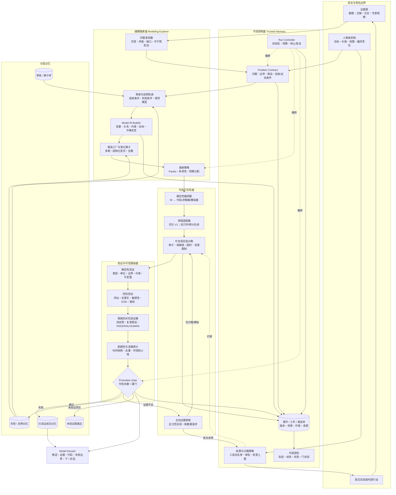
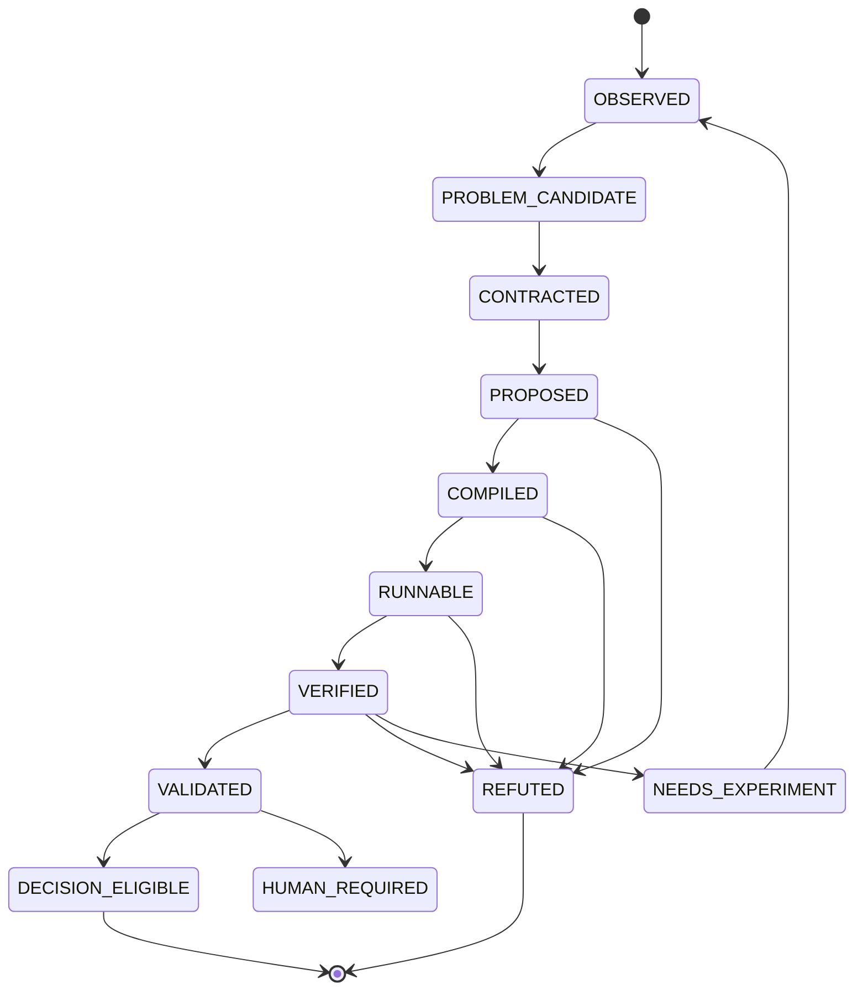

# 前沿数学建模 Agent V1 架构

> 文档状态：V1 架构草案  
> 更新时间：2026-07-19  
> 暂定名：Frontier Modeling Agent（FMA）

## 0. 结论先行

FMA V1 不应做成“多个专家角色互相聊天，然后写一份报告”，而应做成一个**可信控制面驱动的模型发现闭环**：

1. AI 可以从现实证据中发现并定义问题，不要求人先写好题目；
2. AI 用“模型骨架 + 演化算子”构造多个可追溯候选；
3. 候选必须先进入统一的模型中间表示（Model IR），再由确定性工具编译、运行和检查；
4. 生成与验证相互隔离，LLM 不能自己宣布自己正确；
5. 只有通过分层证据门的候选才能进入长期成功记忆；
6. 证据不足时，Agent 的下一动作不是继续写作，而是设计最能区分候选的实验或数据请求；
7. Agent 可在沙箱内高度自主，真实实验、外部行动和最终决策由权限策略决定是否需要人类批准。

因此，V1 的核心不是“更强的对话模型”，而是下面这条链：

**现实证据 → 问题契约 → 骨架检索 → 结构化候选 → 可执行实验 → 独立验证 → 可信晋级 → 记忆/新实验**

---

## 1. 从第一性原理推导架构

### 1.1 系统真正要优化什么

前沿问题没有标准答案，不能用“答案像不像参考答案”评价。FMA 的首要目标应是：

> 在给定数据、工具、算力、时间和行动权限下，最大化单位预算产生的**经验证建模进展**。

一次有效进展至少是以下之一：

- 一个达到 `VALIDATED` 的可复现模型候选；
- 一个明确反驳了某类模型的反例；
- 一个显著缩小候选空间的证据；
- 一个能够最大化候选区分度的下一实验；
- 一个证据充分的 `NO_RESULT` / 暂不可判定结论。

V1 不把“报告写完”“数值更高”或“评审 LLM 觉得合理”当作成功定义。

### 1.2 必然得到的架构约束

| 现实事实 | 推论 | 必须出现的架构机制 |
|---|---|---|
| 前沿问题没有已知答案 | 不能依赖答案匹配或语言说服力 | 可执行测试、反例、基线、持出验证 |
| 现实问题通常没有被完整定义 | 问题定义本身也是搜索任务 | 问题发现器、问题契约、契约版本化 |
| 同一现象可能有多种合理解释 | 不能太早押注单一模型 | 多骨架候选、Pareto 前沿、分歧保留 |
| 自然语言、数学式和代码会发生语义漂移 | 报告与实现可能不是同一个模型 | 统一 Model IR、确定性编译、IR—代码追踪 |
| LLM 擅长提议，但也会为自己的错误辩护 | 生成者不能兼任最终裁判 | 隔离的验证器、隐藏测试、硬规则优先 |
| 验证信号可能被过拟合或泄漏 | 高分不等于真实有效 | 评测防火墙、时间切分、去重与泄漏审计 |
| 新证据可能推翻旧结论 | 状态不能只存在聊天上下文 | 事件溯源、不可变工件、候选谱系 |
| 现实实验和决策有成本与责任 | 自主性必须服从权限，而不是模型意愿 | 沙箱、预算、审批门、可审计行动记录 |
| 人的注意力稀缺 | 人不应成为每一步的操作员 | AI 负责闭环执行，人只处理权限和责任门 |

---

## 2. 从优秀开源 Agent 中吸收什么

这里区分“可借鉴机制”和“不能直接照搬的假设”。项目热度不是采用理由；是否解决 FMA 的结构性问题才是。

| 开源系统 | 已实现的关键机制 | FMA 借鉴 | FMA 不照搬 |
|---|---|---|---|
| [mini-SWE-agent](https://github.com/SWE-agent/mini-swe-agent) | 极小的 Model—Agent—Environment 循环，强调接口和环境比角色数量重要 | V1 保持一个最小逻辑控制循环；领域能力放进环境和工具 | 不把自由 Shell 当主要建模接口；模型语义必须经过 IR |
| [OpenHands Software Agent SDK](https://github.com/OpenHands/software-agent-sdk) | Agent、工具、工作区和远程/临时执行环境分离 | 工作区隔离、临时沙箱、工具协议、可替换模型适配器 | 不给模型默认的宽泛机器权限 |
| [LangGraph](https://github.com/langchain-ai/langgraph) | 长时有状态工作流、持久执行、恢复、人类中断和轨迹可见性 | 持久状态机、检查点、暂停/恢复、人工授权节点 | 架构不绑定框架；V1 可先用普通 Python + SQLite 实现 |
| [MM-Agent](https://github.com/usail-hkust/LLM-MM-Agent) | HMML 分层建模库、问题感知与方案感知检索、Actor–Critic 式改进 | 分层骨架库；同时检索适用条件、失败条件和演化关系 | 检索到经典模型不等于模型成立；不直接把长文库塞入提示词 |
| [AutoFormulator](https://github.com/jumpynitro/AutoFormulator) | 逐步构造优化模型，使用树搜索、剪枝和自评排序 | 部分模型状态、结构化增量、等价候选剪枝 | V1 不预设 MCTS 一定优于简单 beam/fresh sampling；先做消融 |
| [ORPilot](https://github.com/GuangruiXieVT/ORPilot) | 访谈式问题澄清、类型化状态、Pydantic IR、确定性 IR→求解器编译、会话恢复 | 问题契约、Model IR、编译器、求解器适配器、节点级可观测性 | IR 必须在生成前/生成中约束语义，不能只是代码生成后的记录 |
| [AIDE](https://github.com/WecoAI/aideml) / [AI Scientist-v2](https://github.com/SakanaAI/AI-Scientist-v2) | 候选/实验树、指标反馈、并行根节点、有限调试深度 | 候选谱系、预算化搜索、失败分支终止、并行候选 | “论文写完/被弱评审接受”不是科学正确性；不能让开放代码脱离沙箱 |
| [FunSearch](https://github.com/google-deepmind/funsearch) | 固定可执行骨架，只演化关键函数；系统评价器过滤错误；多样性种群 | 骨架与关键可变部分分离；确定性评价器；仅保存合格候选；多样性保护 | 很多真实建模问题没有单一、廉价、无漏洞的评分函数，不能只优化一个分数 |
| [LLM-ACES](https://github.com/scientific-discovery/LLM-ACES) | LLM 提议算子集合，符号回归负责搜索，主动选择高信息量初始条件 | LLM 负责缩小结构搜索空间；候选分歧驱动主动实验 | 真实世界通常没有可随意调用的 ground-truth oracle，实验必须经过成本与权限门 |

另外核对了 [AutoGen](https://github.com/microsoft/autogen)。它的 Core / AgentChat / Extensions 分层、类型化消息和事件运行时值得借鉴，但官方当前已将 AutoGen 置于维护模式，并建议新项目转向 Microsoft Agent Framework。因此 FMA 不把 AutoGen 作为新架构基座，也不采用“自由群聊决定下一步”的控制方式。

由这些系统共同给出的最强信号不是“多 Agent”，而是：

- 环境和接口设计决定 Agent 能否行动；
- 结构化状态决定长任务能否可靠延续；
- 确定性评估决定搜索能否积累；
- 候选多样性决定能否跳出局部最优；
- 沙箱、预算和记录决定自主执行是否可控。

### 2.1 代码级证据边界

这些仓库不能被当作已经解决“全自主可信建模”的现成产品：

- FunSearch 官方仓库明确没有开放论文系统使用的语言模型、沙箱和分布式基础设施；公开代码主要用于理解演化机制；
- ModelingAgent 官方 README 也提示预览版仍可能报错，工具使用和指令遵循并不稳定；
- AI Scientist-v2 官方明确警告会执行 LLM 生成代码，且开放探索相较模板化版本成功率更低；
- ORPilot 的 typed IR/编译器非常值得借鉴，但当前直接代码生成路径和普通子进程执行不能被误认为“所有候选都 IR-first”或“已经有强 OS 沙箱”；
- LLM-ACES 的主动实验建立在可查询 ground-truth ODE oracle 上，现实应用必须把它替换成受成本、伦理和权限约束的实验接口。
- 真正复用代码前还要单独审计许可证；论文可读、仓库可见，并不自动等于代码可被合并进产品。

所以本设计吸收的是**机制**，不是把任一仓库直接包装成前沿建模 Agent。

---

## 3. FMA V1 总体架构图



### 3.1 如何读这张图

- **上半部是提出什么值得研究、如何表示与搜索**；
- **下半部是候选是否经得住现实和反例**；
- **可信控制面拥有执行权，LLM 只有提议权**；
- 人类不是默认的问题定义器或流水线操作员，而是目标、权限和责任的拥有者；
- 真正的闭环不是“生成—自我反思—再生成”，而是“生成—执行—反驳—晋级/淘汰—获取新证据”。

---

## 4. 关键组件：能力与功效

### A. 现实入口与问题定义

| 组件 | 核心能力 | 功效 | V1 最小实现 |
|---|---|---|---|
| 问题发现器 | 从残差、异常、相互矛盾的证据、未满足目标和文献空白中提出问题假设 | 不再要求人先给出一份完美题目；让“定义问题”也可被评估和演化 | 接收数据/文献摘要，输出结构化 `ProblemHypothesis[]` 和依据 |
| Problem Contract Builder | 把问题假设操作化为边界、目标、变量、干预、约束、假设、证伪条件和预算 | 防止 Agent 在求解过程中悄悄改题；让不同候选共享同一验收边界 | Pydantic/JSON Schema；每次变更生成新版本并记录理由 |
| 证据快照器 | 冻结数据、文献版本、查询范围、时间和许可 | 保证复现，并为新颖性/泄漏审计提供时间边界 | 内容哈希 + manifest + 来源 URL/文件路径 |

### B. 可信控制面

| 组件 | 核心能力 | 功效 | V1 最小实现 |
|---|---|---|---|
| Run Controller | 驱动原子化的 Proposal → Authorized Action → Observation 状态机；分配 token、时间、算力、实验和失败预算；暂停与恢复 | 杜绝无限自循环；任务崩溃后可从检查点继续；批准等待本身也是持久状态 | 普通 Python 状态机 + SQLite 事件表即可，暂不依赖复杂分布式框架；外部副作用带 idempotency key |
| Context Builder / Model Router | 只装载当前步骤需要的契约、技能、工具和候选摘要 | 减少上下文污染；模型可替换；避免把隐藏评测塞给生成者 | 单一主模型适配器起步，验证器使用独立上下文 |
| 权限与沙箱策略 | 对工具、网络、文件、资源和外部行动做能力授权 | 将“模型想做什么”与“系统允许做什么”分离 | 临时工作区、白名单工具、CPU/内存/时间上限、外部行动审批 |
| 事件/工件/谱系库 | 保存类型化 Action/Observation/Decision 事件、IR、代码、数据、环境、父子关系和验证结果 | 可追责、可复现、可回滚，也能学习哪些演化有效 | append-only JSONL/SQLite + 内容寻址的 artifact 目录；保存决定和工件，不保存私有思维链或秘密 |
| 可观测性 | 展示候选树、门状态、预算燃烧、工具错误和失败簇 | 让人审计系统为何相信某个模型，而不是只看最终文字 | run/candidate/trace ID；结构化日志；简单 HTML/CLI 报表 |

### C. 模型知识与搜索

| 组件 | 核心能力 | 功效 | V1 最小实现 |
|---|---|---|---|
| 问题签名器 | 将现实问题映射为动态/随机/网络/优化/博弈等结构特征，而非只做主题分类 | 提高跨领域迁移质量；避免仅因关键词相似而套模型 | 多标签结构签名 + 置信度 + 未知项 |
| 骨架库 | 保存模型结构、适用条件、假设、失败模式、可变槽位、测试和邻接骨架 | 把经典模型变成可演化结构，而不是公式百科 | 先做 20–30 个高质量优化骨架，不追求大而全 |
| 骨架与反例检索器 | 同时检索成功结构、相似失败案例和相邻模型 | 既获得迁移起点，也减少重复犯错 | 结构元数据过滤 + embedding/rerank；评测集隔离 |
| Model IR Builder | 用统一类型系统表达变量、关系、目标、约束、观测和不确定性 | 成为自然语言、数学、代码和验证之间的单一真源 | 先支持 LP/MILP/仿真辅助优化；IR 必须可独立审阅 |
| 演化算子注册表 | 对边界、抽象层、机制、状态、约束、目标、观测、噪声、算法做显式变异 | 让“创新”成为可追踪的结构变化；可统计何种变化真正有效 | 每次变异输出 operator、diff、理由和预期可证伪后果 |
| 候选工厂 | 生成多个独立根候选及其结构化后代 | 防止单一路径自洽；保留竞争性解释 | 检索根 + fresh-sampling 根并存；候选带 parent ID |
| 搜索策略 | 在有效性、鲁棒性、新颖性、复杂度和成本之间做 Pareto 选择 | 不用一个易被投机的总分替代科学判断 | 小型 diversity-aware beam；MCTS/多岛搜索必须通过消融后再加 |
| 等价/重复检测器 | 基于规范化 IR、符号等价和行为指纹发现重复候选 | 把预算用于真正不同的假设 | canonical IR hash + 小型探针集输出指纹 |

### D. 可执行实验

| 组件 | 核心能力 | 功效 | V1 最小实现 |
|---|---|---|---|
| 确定性编译器 | 将 IR 编译为求解器代码、模拟代码和测试夹具 | 同一 IR 产生同一实现；减少自然语言到代码的漂移 | Optimization IR → Pyomo/OR-Tools 之一；编译器不调用 LLM |
| 领域适配器 | 统一不同领域的编译、运行、诊断和验证协议 | 核心 Agent 不必知道每个科学库的细节 | V1 只交付 OptimizationAdapter；V1.1 再做 DynamicsAdapter |
| 可复现实验沙箱 | 固定依赖、种子、资源和输入；捕获 stdout、错误、指标与工件 | 错误不会污染主机，结果可重跑 | 容器/微虚机优先；锁文件；超时；只读输入；临时写区；禁默认网络；普通 subprocess 不算安全边界 |
| 实验管理器 | 维护 train/validation/test、重复实验、基线和消融 | 防止一次运行或单个指标冒充证据 | manifest 驱动的实验矩阵 + 结果表 |
| 主动证据获取器 | 找到候选预测分歧最大的情境，提出最有信息量的实验/数据请求 | 把“模型不确定”转化为下一步行动 | 先支持沙箱内模拟与历史数据重采样；真实实验输出审批单 |

### E. 验证与可信晋级

| 组件 | 核心能力 | 功效 | V1 最小实现 |
|---|---|---|---|
| 确定性验证器 | 检查 schema、类型、单位、维度、变量域、边界、守恒、约束和求解状态 | 第一时间过滤“能说但不成立”的候选 | 插件式规则；任何 hard fail 都不能被 LLM 覆盖 |
| 经验验证器 | 执行持出、反事实、极端值、敏感性、噪声、OOD、基线和校准测试 | 判断模型是否只拟合已有数据，及结论是否稳健 | 验证清单由领域适配器提供，结果进入多维可信向量 |
| 隔离的对抗验证器 | 不读取生成者的自我辩护，只根据契约、工件和证据寻找反例 | 降低同一上下文中的确认偏误 | 独立 prompt/context；输出 `PASS/FAIL/HUMAN`、反例和待执行测试 |
| 新颖性/泄漏审计器 | 时间快照、文本/结构去重、训练与评测隔离、谱系追踪 | 防止记忆了答案或污染持出集却被当成发现 | 评测数据独立凭证；生成流程不可检索；所有访问留痕 |
| Evidence Synthesizer | 汇总证据而不把所有维度粗暴平均 | 让“哪里可靠、哪里未知”保持可见 | 可信向量 + 硬门；不允许只有一个总分 |
| Promotion Gate | 根据状态、硬门、风险级别和复现包决定晋级 | 阻止“运行成功”被误写成“模型有效” | 纯策略代码；策略版本与每次决策一起保存 |

### F. 记忆与输出

| 组件 | 核心能力 | 功效 | V1 最小实现 |
|---|---|---|---|
| 骨架/算子记忆 | 跨任务复用模型结构与有效变换 | 提高迁移和搜索效率 | 人工审核种子库 + 经验证条目追加 |
| 成功记忆 | 只保存达到 `VALIDATED` 且有复现包的候选 | 防止低质量结果污染未来检索 | 绑定问题签名、证据快照、环境、验证向量和失效边界 |
| 失败/反例记忆 | 保存无效条件、反例、失败算子和诊断 | 失败变成可复用知识，而非被聊天上下文遗忘 | 与成功记忆分库，但同时参与检索 |
| 未验证隔离区 | 暂存有趣但证据不足的洞见 | 保留探索价值，又不把猜测伪装成知识 | 默认不可作为事实检索，只能作为待验证假设 |
| Model Dossier | 输出问题契约、候选谱系、IR、代码、环境、证据、失败边界与下一实验 | 让人能够复现、审计和据此决策 | Markdown + JSON bundle；报告从工件生成，不是独立写作分支 |

---

## 5. 三个核心数据结构

### 5.1 Problem Contract

```yaml
problem_contract:
  id: pc_001
  version: 3
  evidence_snapshot: ev_2026_07_19_a
  problem_hypothesis: "..."
  system_boundary: "..."
  target_or_decision: "..."
  observables: []
  interventions: []
  constraints: []
  assumptions:
    known: []
    uncertain: []
    forbidden: []
  acceptance_tests: []
  falsification_tests: []
  permitted_actions: []
  budget:
    wall_time_s: 0
    token_limit: 0
    compute_limit: "..."
    experiment_limit: 0
  owner_and_authority: "..."
```

作用：冻结“当前究竟在解决什么”，并允许在新证据出现后创建新版本，而不是悄悄改写旧问题。

### 5.2 Model IR

```yaml
model_ir:
  candidate_id: c_014
  parent_ids: [c_006]
  skeleton_id: network_flow_v2
  evolution_operators: [add_capacity_decay, robustify_demand]
  entities_and_indices: []
  variables:
    state: []
    decision: []
    latent: []
    observed: []
  parameters_and_priors: []
  relations_or_dynamics: []
  objective: []
  constraints: []
  observation_model: []
  uncertainty_model: []
  initial_and_boundary_conditions: []
  units: []
  validation_obligations: []
  provenance_links: []
  compiler_target: optimization_v1
```

作用：让问题陈述、数学结构、实现和验证指向同一对象。IR 不是报告摘要，而是可编译、可比较、可审计的模型定义。

### 5.3 Validation Vector

```yaml
validation:
  structural: pass
  semantic: pass
  computational: pass
  empirical_holdout: 0.81
  robustness: 0.67
  identifiability: warning
  calibration: 0.74
  novelty_and_leakage: pass
  reproducibility: pass
  decision_readiness: human_required
  counterexamples: []
  unresolved_assumptions: []
```

作用：可信性是一个向量而不是平均分。`structural=fail` 不能被较高的拟合指标抵消；`identifiability=warning` 也必须在最终 dossier 中保持可见。

---

## 6. 候选状态机与晋级规则



状态定义：

- `PROPOSED`：存在完整 IR，但尚未证明可编译；
- `COMPILED`：IR 通过 schema/静态语义检查并确定性编译；
- `RUNNABLE`：在受限环境中执行完成；
- `VERIFIED`：通过类型、单位、约束、不变量和实现一致性等硬检查；
- `VALIDATED`：在持出、扰动、基线和独立复现中得到预先规定的支持；
- `DECISION_ELIGIBLE`：满足具体应用风险政策，可进入决策流程；
- `REFUTED`：有可复现反例或违反硬约束；
- `NEEDS_EXPERIMENT`：现有证据不能区分候选；
- `HUMAN_REQUIRED`：需要价值选择、真实实验许可或不可逆行动授权。

关键规则：

1. `RUNNABLE` 绝不自动等于 `VALIDATED`；
2. 硬验证失败不能由 LLM 评审翻转；
3. 只有 `VALIDATED` 候选进入成功记忆；
4. `REFUTED` 候选进入失败记忆，并保留反例；
5. 证据不足不是失败，必须转成明确的下一实验；
6. 任何真实世界行动都另行经过权限门，不由候选状态自动触发。

---

## 7. V1 主循环

```text
1. 冻结证据快照
2. 发现问题假设，并形成可版本化 Problem Contract
3. 生成问题签名，检索骨架、相邻模型和失败案例
4. 建立多个独立根候选：检索根 + fresh-sampling 根
5. 将每个候选写成 Model IR，并记录结构差异
6. 确定性编译，在沙箱内运行
7. 执行硬验证、经验验证、对抗验证和泄漏审计
8. Promotion Gate 决定：晋级、淘汰、隔离或请求新证据
9. 对未解决候选进行结构化演化；对重复/无望分支停止投入
10. 预算耗尽、候选通过或边际信息增益过低时停止
11. 生成 Model Dossier 或 NO_RESULT，并保存完整复现包
```

### 7.1 V1 的默认搜索策略

V1 使用**多根、小束宽、显式多样性**，不直接上复杂多 Agent 或大规模 MCTS：

- 3 个检索得到的不同骨架根；
- 1 个不读取成功案例的 fresh-sampling 根，作为独立发现基线；
- 活跃候选上限建议从 6–8 个起步；
- 每条失败路径最多修复 2 次，之后需要结构性变化或终止；
- 父候选按可信向量、行为多样性、复杂度和成本做 Pareto 选择；
- 每轮保留少量随机探索预算，避免所有候选收敛到同一骨架；
- 同时比较“从外部组件字典重新组合”和“沿父候选演化”，用评测决定哪种更有效。

这些数字是启动参数，不是理论最优值；必须通过基准和消融调整。

### 7.2 演化算子分类

| 算子类别 | 示例 |
|---|---|
| 边界变化 | 扩大/缩小系统边界、改变时间尺度、引入层级 |
| 抽象变化 | 个体→群体、连续→离散、确定性→随机性 |
| 机制变化 | 加入反馈、时滞、饱和、网络耦合、博弈响应 |
| 变量变化 | 增删状态变量、潜变量、控制变量、观测代理 |
| 目标变化 | 单目标→多目标、期望→风险、静态→滚动目标 |
| 约束变化 | 软/硬约束、机会约束、鲁棒集合、逻辑约束 |
| 观测变化 | 测量误差、缺失机制、采样过程、选择偏差 |
| 不确定性变化 | 参数分布、模型集合、情景树、贝叶斯层级 |
| 求解变化 | 精确→近似、分解、代理模型、启发式/混合算法 |

每个算子必须说明：改了什么、为什么、预期改变哪个可观测结果、什么证据可以否定它。

### 7.3 失败与降级策略

| 故障 | Harness 行为 | 禁止行为 |
|---|---|---|
| LLM 输出不符合 schema | 保存原输出；做有限次数结构修复；仍失败则淘汰该步 | 静默猜字段或把无效文本当 IR |
| 编译/运行失败 | 分类为 schema、语义、依赖、资源或数值错误；仅允许有针对性的有限修复 | 无限 retry，或通过删除测试“修好” |
| 验证器不可用 | 候选最多停在上一状态，运行标记 partial | 让生成者替代验证器并晋级 |
| 数据/API 暂不可用 | 记录证据缺口，转为 `NEEDS_EXPERIMENT` 或可恢复等待 | 用想象数据填补 |
| 预算耗尽 | 生成包含未决候选和下一步价值评估的 checkpoint dossier | 为完成叙述而伪造结论 |
| 进程崩溃 | 从最后已提交事件恢复；副作用用 idempotency key 去重 | 重放时重复购买、发送或启动真实实验 |
| 候选长期无进展 | 停止该分支，触发 fresh root 或返回 `NO_RESULT` | 只改提示词措辞继续自我循环 |

---

## 8. 自主性与人类责任的边界

FMA 的边界不是“AI 能不能做”，而是“行动是否可回滚、是否有外部后果、谁拥有授权”。

| 级别 | 行动 | 默认权限 |
|---|---|---|
| A0 | 读取已授权证据、发现问题、提出假设 | 自动 |
| A1 | 在沙箱中写代码、求解、仿真、构造反例、生成本地工件 | 自动，受预算限制 |
| A2 | 调用已许可的只读数据库/API、执行低成本额外计算 | 策略自动或额度审批 |
| A3 | 购买数据、启动昂贵云任务、联系外部人员、改变真实实验 | 人类/机构批准 |
| A4 | 部署模型、执行医疗/金融/安全/公共决策等不可逆行动 | 明确责任人批准 |

这意味着：

- 问题发现和问题契约可以主要由 AI 完成；
- 可信检查也可以大比例由 AI + 确定性工具完成；
- 人类不必逐步盯着 Agent，但必须拥有外部权限和最终行动责任；
- `DECISION_ELIGIBLE` 表示“证据足以进入决策”，不表示系统自动执行该决策。

---

## 9. 记忆、污染与评测防火墙

### 9.1 三层运行记忆

- **Hot**：当前契约、活跃候选、最近工具结果、剩余预算；
- **Warm**：本次运行的完整谱系、检查点、失败簇和候选摘要；
- **Cold**：跨任务骨架库、已验证成功、失败反例、经审核算子统计。

### 9.2 记忆晋级规则

```text
未验证洞见  → quarantine
可运行结果  → 当前 run 工件
被反驳结果  → failure memory + counterexample
经持出和复现验证 → validated success memory
```

长期记忆条目必须绑定：

- 问题签名与适用边界；
- 证据时间快照；
- 数据、代码、环境和随机种子哈希；
- 可信向量；
- 已知反例与失效模式；
- 原候选谱系和验证器版本。

### 9.3 评测防火墙

- hidden test、未来时间片和测试问题答案不进入生成检索；
- 搜索只使用训练/验证证据；最终 held-out 只对已经冻结的 finalist 执行一次，结果决定晋级但不回流本轮搜索；
- 评测凭证由 harness 持有；最终审计完成前，生成模型看不到 held-out 输入、输出或摘要；
- 成功记忆按时间快照冻结，重跑历史任务时不得读取未来条目；
- 文本相似、IR 结构相似和行为相似分别去重；
- 所有记忆命中记录在 trace 中，便于判断结果来自迁移还是独立发现。

---

## 10. 如何证明这个 Agent 真有用

### 10.1 评测阶梯

1. **单元与合成微例**：每个 IR 字段、编译器和验证器都有已知正反例；
2. **经典 Build/Revise/Explain**：从文本建模、在新约束下修订、解释 IR 与结果；
3. **隐藏扰动**：改变单位、边界、噪声、约束和数据分布，检查是否误晋级；
4. **历史重发现**：只提供截止时间前证据，验证能否恢复后来已知的模型改进；
5. **开放问题影子模式**：只给建议和实验，不直接产生外部行动。

### 10.2 主要指标

优先级从高到低：

1. **错误晋级率**：已知无效候选被晋升为 `VALIDATED` 的比例；
2. **复现率**：独立环境能否重建被晋级的结果；
3. **持出有效性**：预测、决策或解释在未见条件下是否优于基线；
4. **证据校准与弃权质量**：低把握时是否正确请求实验或输出 `NO_RESULT`；
5. **成本归一化进展**：每单位时间/算力得到多少经验证候选或有效反例；
6. **多样性与覆盖**：是否探索到行为上不同的合理骨架；
7. **泄漏事件**：目标应为零，并要求可审计证明。

### 10.3 必须比较的基线与消融

基线：

- 单次直接 LLM；
- 带检索但无演化；
- 独立 fresh sampling；
- 经典非 LLM 求解/系统识别方法；
- 在可行时加入人类专家基线。

消融：

- 去掉 Model IR；
- 去掉独立验证器；
- 去掉失败记忆；
- 去掉多样性保护；
- 去掉主动证据获取；
- 父候选演化 vs 外部组件字典重组。

V1 上线到真实开放问题前，至少要求：

- 红队已知反例集中没有候选越过硬门；
- 所有被晋级候选均有独立环境复现包；
- 在预先注册的持出任务上显著优于直接 LLM 和检索基线；
- 预算、停止、恢复、审批和泄漏审计均有自动化测试。

### 10.4 评测红线

- LLM 评审只能提出质疑、反例和待执行测试，不能作为唯一的 0/1 正确性评分器；
- 候选选择集、调参集和最终审计集必须分离；
- 所有 seeds、失败运行和被淘汰根都要报告，不能只展示人类或 LLM 最后挑出的最佳一次；
- 论文/基准重现任务要审计数据与测试重叠、时间泄漏和近重复；
- “无运行错误”“生成了结果文件”“评审认为像论文”都不是 `VALIDATED` 的充分条件；
- 报告生成必须晚于证据冻结，写作模型不能反向修改实验事实。

---

## 11. V1 的实现边界

### 11.1 推荐的首个垂直切片

架构保持领域通用，但第一个真正做通的适配器应是：

> **OptimizationAdapter：LP/MILP + 情景/鲁棒扩展 + 仿真辅助验证**

原因：

- IR 容易类型化；
- 约束、可行性、目标和求解状态有较强的确定性检查；
- 可以系统构造合成正反例；
- ORPilot、AutoFormulator 和 MM-Agent 提供了可比较基线；
- 适合先验证“骨架—演化—执行—晋级”闭环本身是否成立。

第二个适配器再做 DynamicsAdapter（ODE/差分方程 + PySR/PySINDy + 主动初值/实验），用于验证架构能否跨越“优化”和“机制发现”两类任务。

### 11.2 V1 明确不做

- 不做开放式“专家群聊社会”；
- 不默认自动发表论文或对外发送结果；
- 不把长上下文聊天记录当数据库；
- 不把代码能运行当模型可信；
- 不允许生成者读取隐藏评测；
- 不自动将每次成功写入长期记忆；
- 不在没有基准证明前建设分布式多 Agent 平台；
- 不承诺解决所有前沿问题，允许严格的 `NO_RESULT`。

### 11.3 什么时候才增加多 Agent

只有当评测证明单循环出现稳定瓶颈时，才增加并行 worker：

- 候选生成吞吐成为瓶颈 → 增加无共享上下文的 Explorer workers；
- 验证成本成为瓶颈 → 增加并行确定性 evaluator workers；
- 领域工具差异明显 → 增加适配器 worker，而不是人格角色；
- 需要独立复现 → 在隔离环境增加 Reproducer worker。

这些 worker 共享的是 schema、事件和工件，不共享未经验证的“共识聊天”。

---

## 12. 建议的代码边界

```text
fma/
  core/
    controller.py          # 状态机与主循环
    budget.py              # token/时间/算力/实验预算
    permissions.py         # 工具与外部行动权限
    events.py              # append-only 事件
  schemas/
    problem_contract.py
    model_ir.py
    candidate.py
    validation.py
  discovery/
    problem_miner.py
    contract_builder.py
  retrieval/
    signatures.py
    skeleton_store.py
    failure_store.py
  search/
    candidate_factory.py
    operators.py
    selector.py
    deduplicator.py
  compilers/
    optimization.py
  executors/
    sandbox.py
    experiment_manager.py
  validators/
    structural.py
    semantic.py
    empirical.py
    robustness.py
    leakage.py
  verifier/
    adversarial_verifier.py
  experiments/
    active_acquisition.py
  memory/
    promotion.py
    artifact_store.py
  reports/
    dossier.py
  adapters/
    optimization/
    dynamics/              # V1.1
evals/
  microcases/
  build_revise_explain/
  hidden_perturbations/
  temporal_rediscovery/
runs/
  <run_id>/
    manifest.json
    events.jsonl
    artifacts/
```

---

## 13. 实施顺序

### 阶段 1：可信最小闭环

- Problem Contract schema；
- Optimization Model IR；
- 确定性编译器；
- 沙箱和事件存储；
- 结构/语义/可行性验证器；
- 10–20 个合成正反例。

交付标准：不用 LLM 也能对手写 IR 完成编译、运行、验证、复现和晋级。

### 阶段 2：加入建模智能

- 问题签名和小型高质量骨架库；
- 主模型生成多根 IR；
- 演化算子和小型搜索策略；
- 独立对抗验证器；
- 候选谱系和失败记忆。

交付标准：在隐藏扰动任务上显著优于单次直接 LLM，并且不提高错误晋级率。

### 阶段 3：主动科学闭环

- 候选分歧分析；
- 主动数据/实验选择；
- 评测防火墙；
- DynamicsAdapter；
- 历史重发现任务。

交付标准：在同等实验预算下，比被动收集数据更快排除错误候选或识别正确结构。

### 阶段 4：按证据扩展

- 并行 evaluator/explorer；
- 远程执行环境；
- 新领域适配器；
- 高风险场景的机构级审批和审计。

只有前面基准证明存在吞吐或领域瓶颈，才进入这一阶段。

---

## 14. 当前最关键的四个设计决策

1. **主状态对象不是聊天，而是 `Problem Contract + Model IR + Candidate Lineage + Validation Vector`。**
2. **V1 是单一逻辑 Explorer 加隔离 Verifier，不是固定角色的多 Agent 团队。**
3. **生成结果没有写入成功记忆的权力；Promotion Gate 才有。**
4. **第一版先做 OptimizationAdapter 的可信垂直切片，再扩展到动力学与其他前沿建模领域。**

如果这四点成立，后续换模型、换搜索算法、增加并行 worker 都只是局部升级；如果这四点不成立，模型越强、Agent 越多，系统只会更快地产生难以验证的结果。
